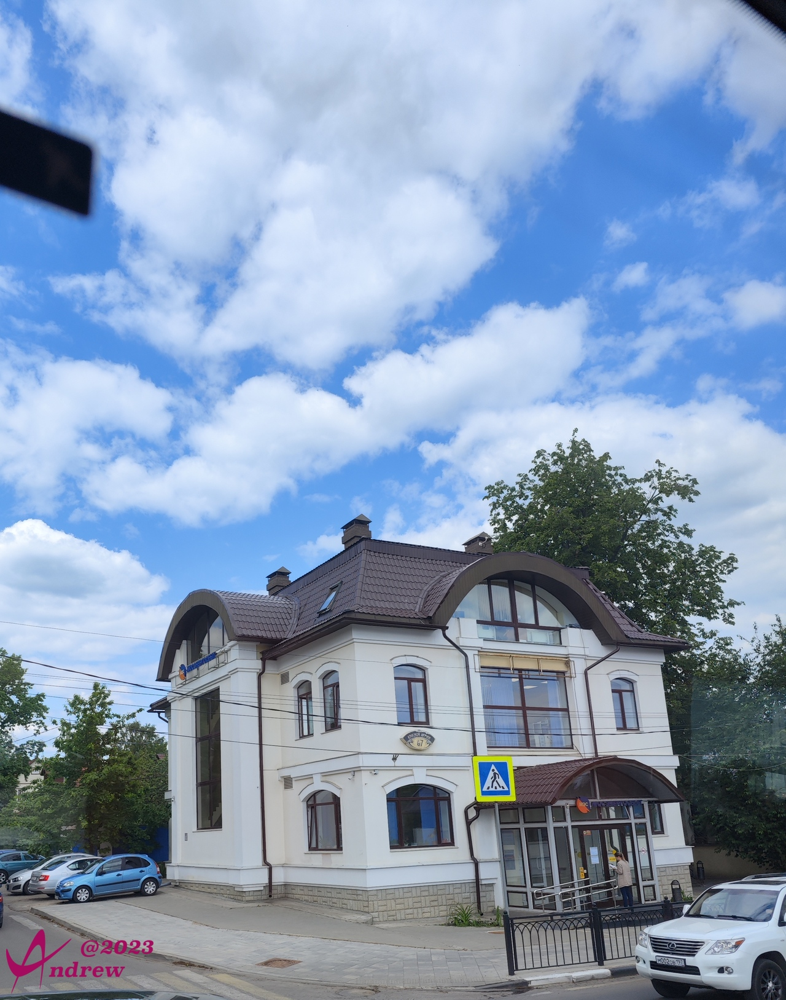
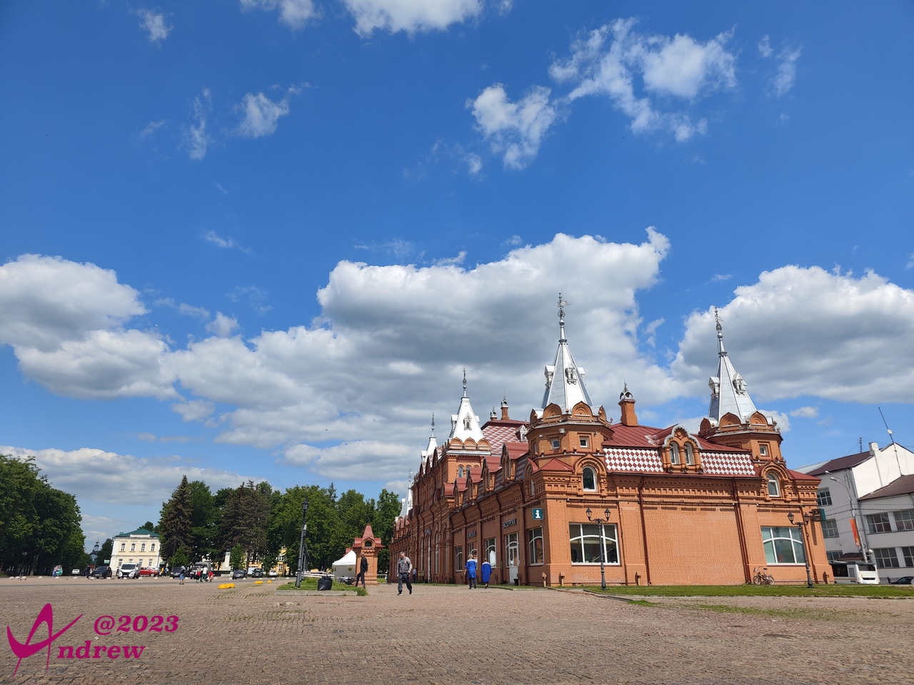
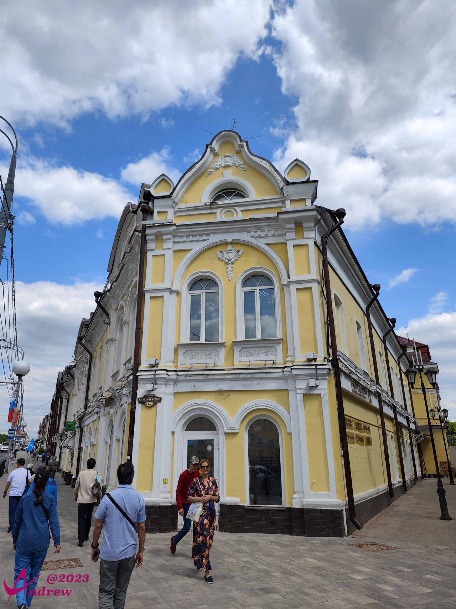
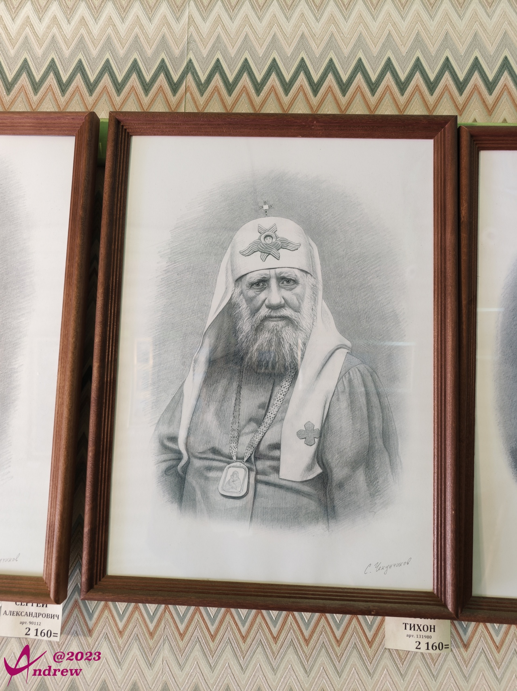
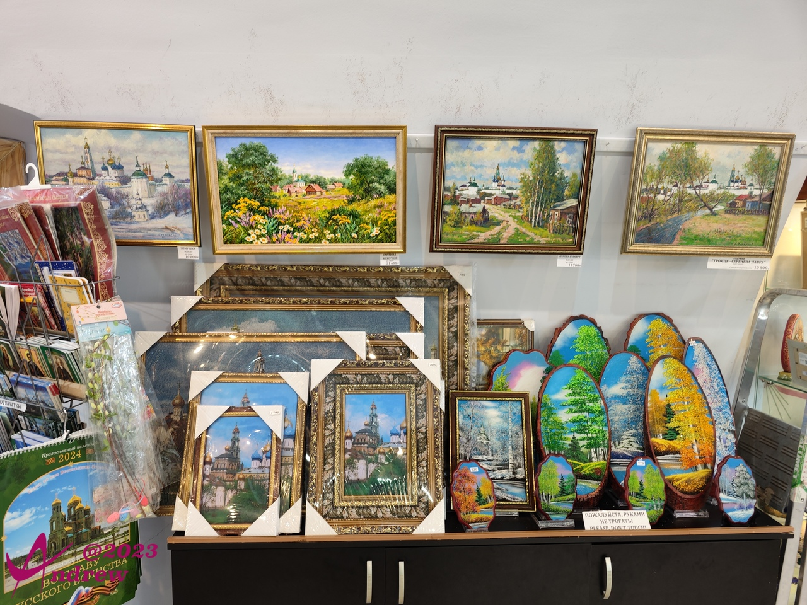
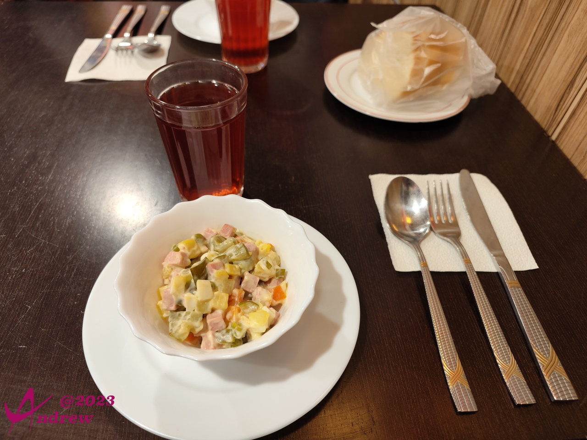
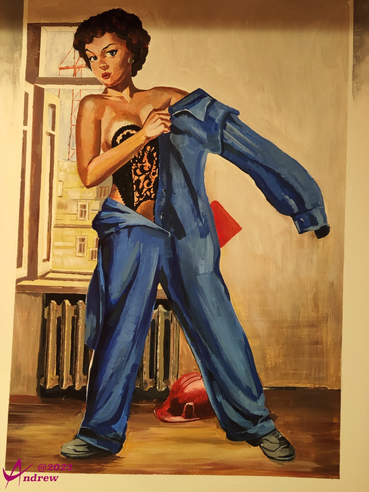

# 谢尔盖耶夫镇
谢尔盖耶夫镇位于莫斯科北部71公里。  
镇子不大，因为圣三一修道院坐落于此而繁荣。镇内有不少专门为旅游者服务的门店。  
从莫斯科出发向东北方向，游览数座古老城镇，最后再返回莫斯科的路线被称为“大金环线”，是一条著名的历史文化旅游路线。谢尔盖耶夫镇就是其中的第一站。金环线上的古镇也被称为“金环古城”。  
  
  
  

既然是为旅游者服务为主业，纪念品当然必不可少，除了全球可见的义乌生产，俄罗斯特色的商品也一样琳琅满目：  
  
  
  

三一修道院前的广场上有很多鸽子，自由自在盘旋飞舞的样子吸引了众多游客：  
<video width='100%' controls>
    <source src='videos/VID_20230530_121508.dest.mp4' type='video/mp4'>
</video>

游览结束的时候，在镇上的小饭店吃了简餐。俄餐属于典型的西餐，一道道菜上来，一道道吃，为了不被杯盘狼藉的画面破坏心情，这里只放一张餐前沙拉的照片。  
  

小饭店墙上的画作幽默而风趣，还有完全不同于东亚人隐忍含蓄的奔放。  
  
  
  
