# 圣三一修道院
三一修道院全称为：谢尔盖圣三一修道院，是俄罗斯东正教教会的精神中心，俄罗斯最重要的寺院。据说，这是东正教传入俄罗斯之后的第一座修道院，标志着东正教成为俄罗斯国教的起点。  
修道院在1345年，由修道士谢尔盖·拉多涅日斯基（谢尔盖圣）创建。其后也经过多年不间断的扩建。  
院内有许多在时代和风格上都不同的建筑物。现为莫斯科和全俄牧首公署所在地，其重要性可见一斑。  
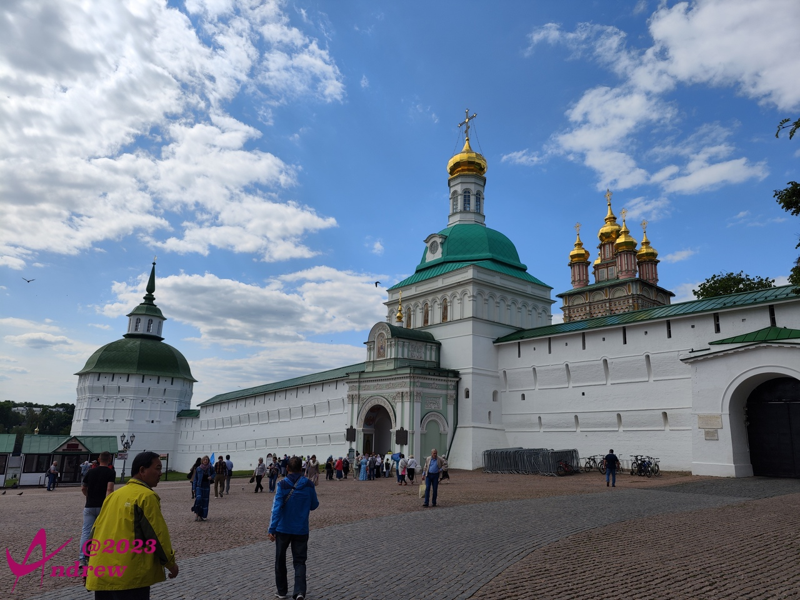  
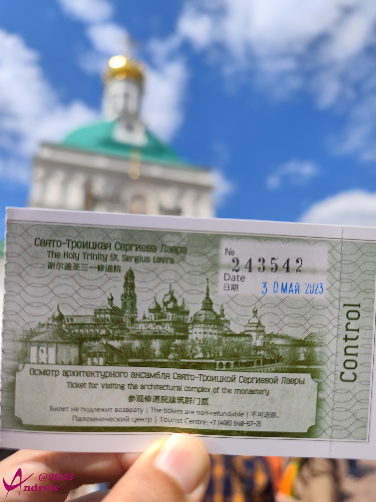  

修道院及教堂内有大量名家壁画作品，比如俄罗斯著名画家安德烈·鲁布廖夫的画作。  
修道院入口处的壁画记录了谢尔盖圣的几个广为流传的生平事迹。  
壁画维护精心，色彩鲜艳，五彩斑斓。  
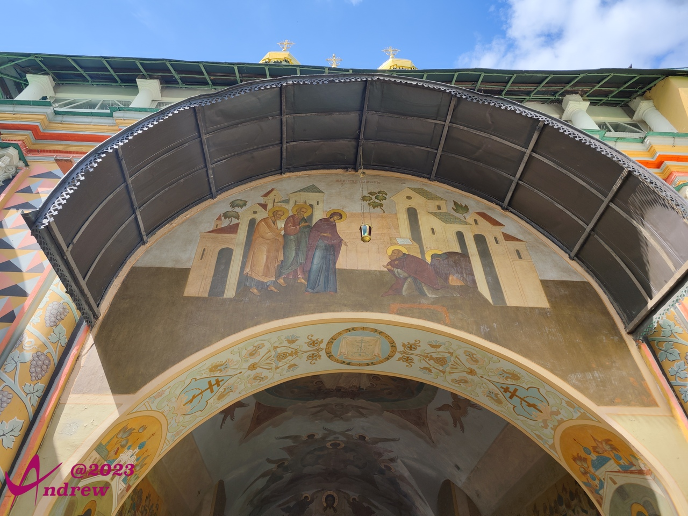  
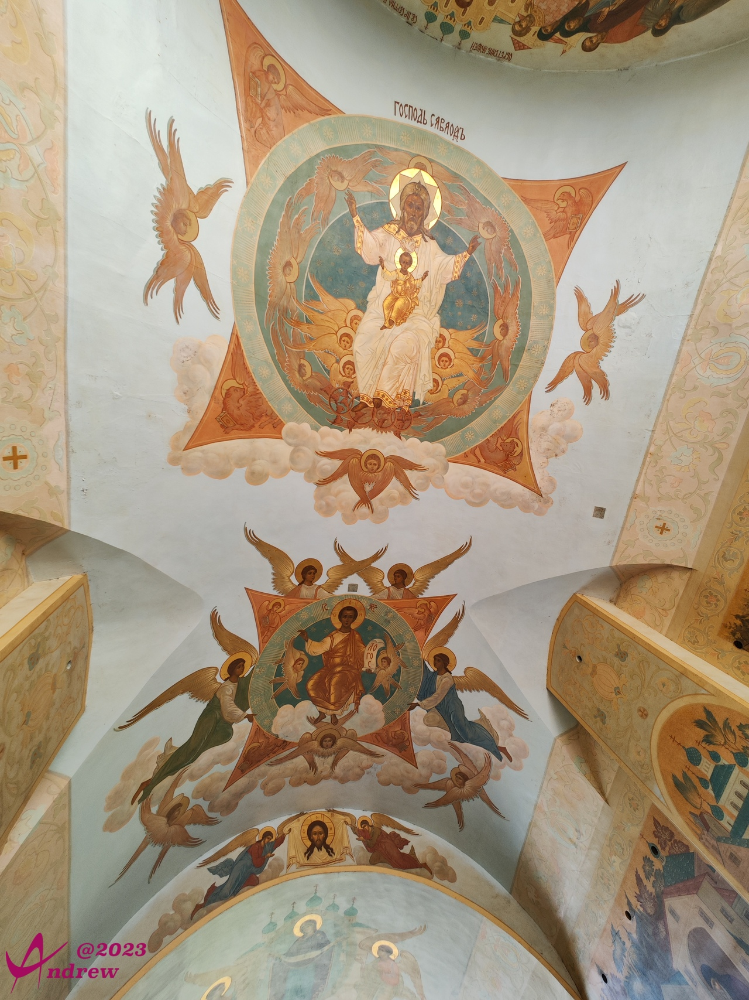  
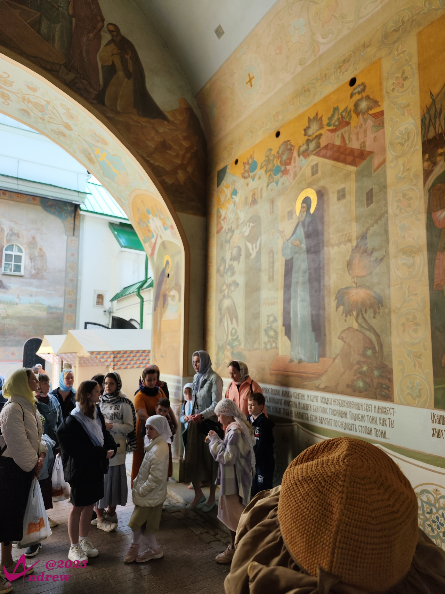  

修道院由多所教堂组成，还配套有多座修道士、工作人员生活的建筑。整个建筑群错落有致，环境整洁美观。除了少数国外的游客，更多是俄罗斯本地人在此参观、礼拜、祭奠。  
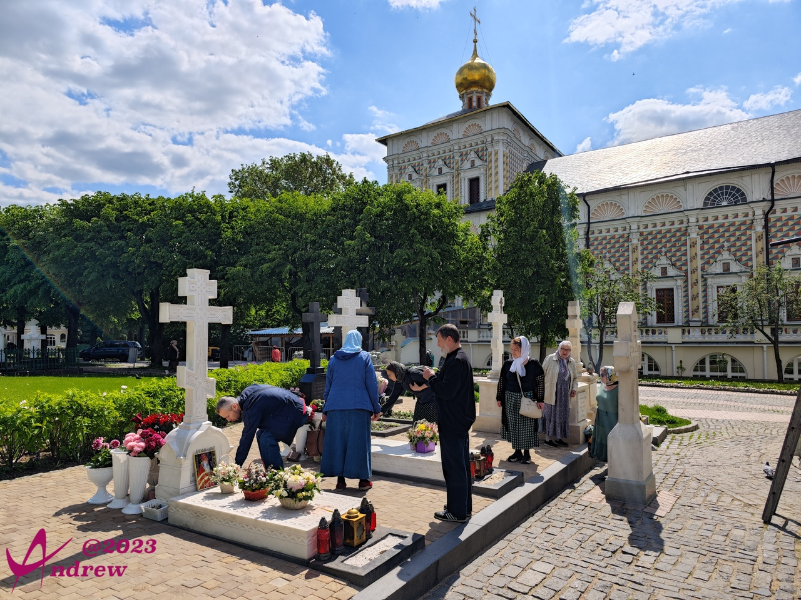  
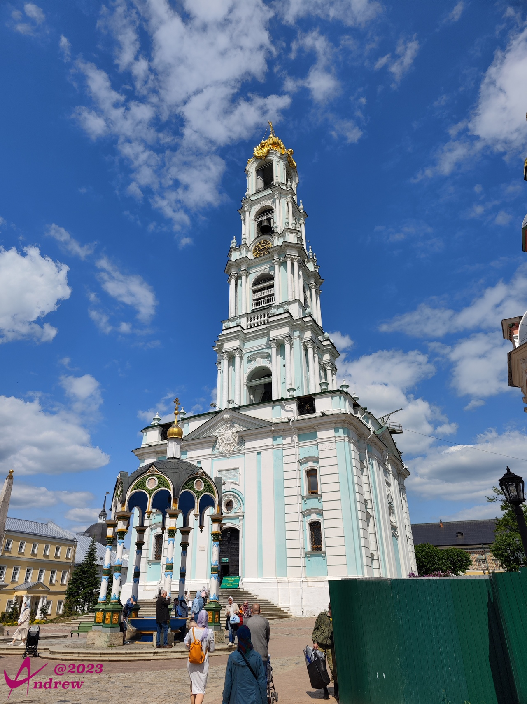  

修道院中最重要的建筑是圣母大教堂，谢尔盖圣的棺木就安置在教堂里。可惜因为维修，整个建筑被防护网完全覆盖，我没能留下建筑宏伟的外观照片。（下图只是修道院一角，其中被部分覆盖的并不是圣母大教堂，被完全覆盖的圣母大教堂在下面的全景图中能看到）  
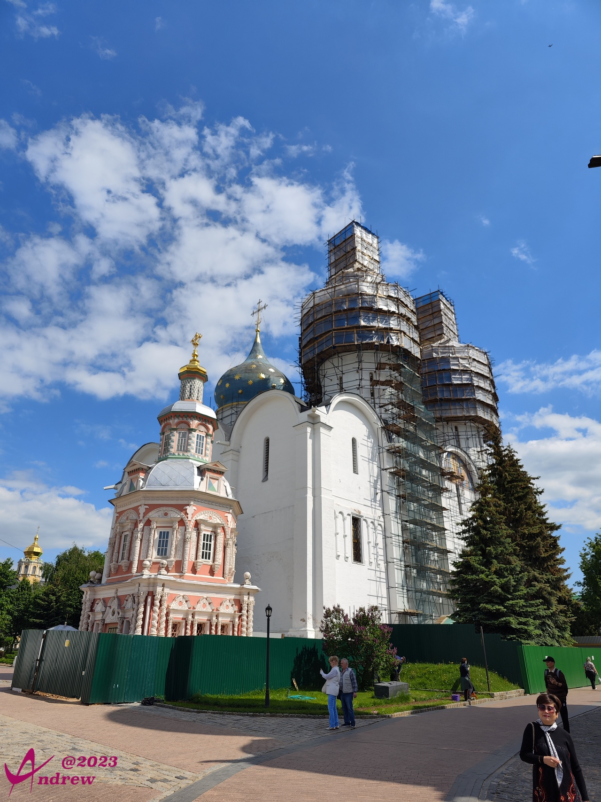  
圣母大教堂的北侧是鲍利斯·戈东诺夫沙皇家族的墓地。但是因为俄罗斯人都认为是他引起了俄罗斯的混乱，所以他没能被安葬在教堂里面。作为皇族，没能在教堂内安葬，用中国的说法是无法享受后代香火供奉，被视为一件很不体面的事情。  

教堂内有大量的珍贵文物、法器、壁画、油画等艺术品。装帧华贵炫目，大量的紫金镶嵌或紫金鎏镀让教堂呈现出一派富丽堂皇而又肃穆庄严。  
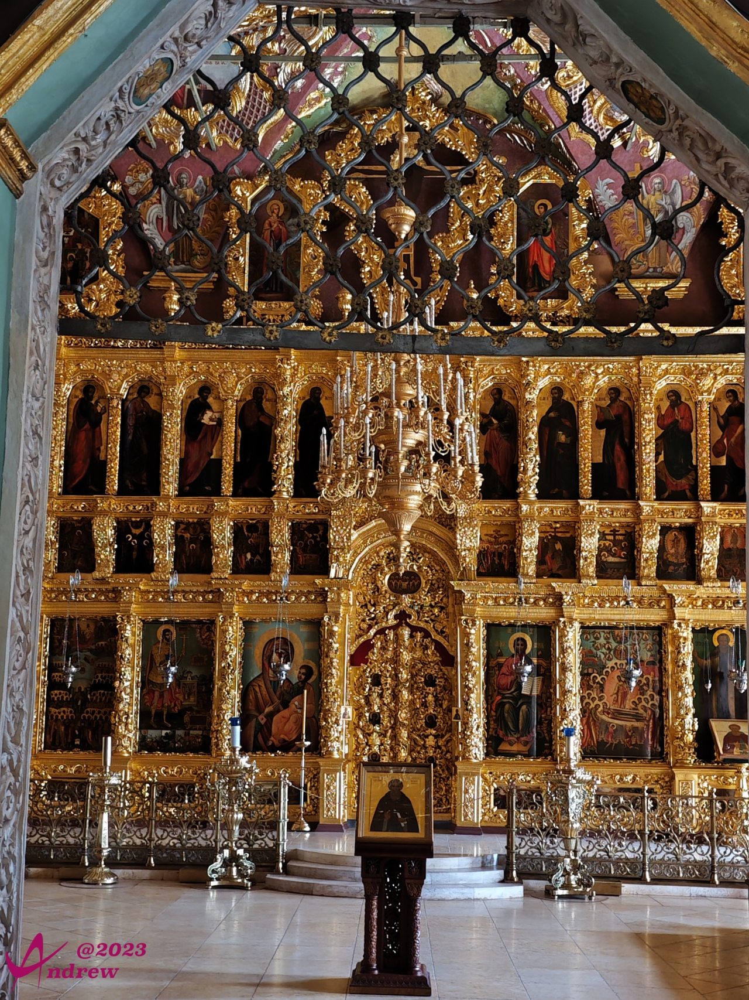  
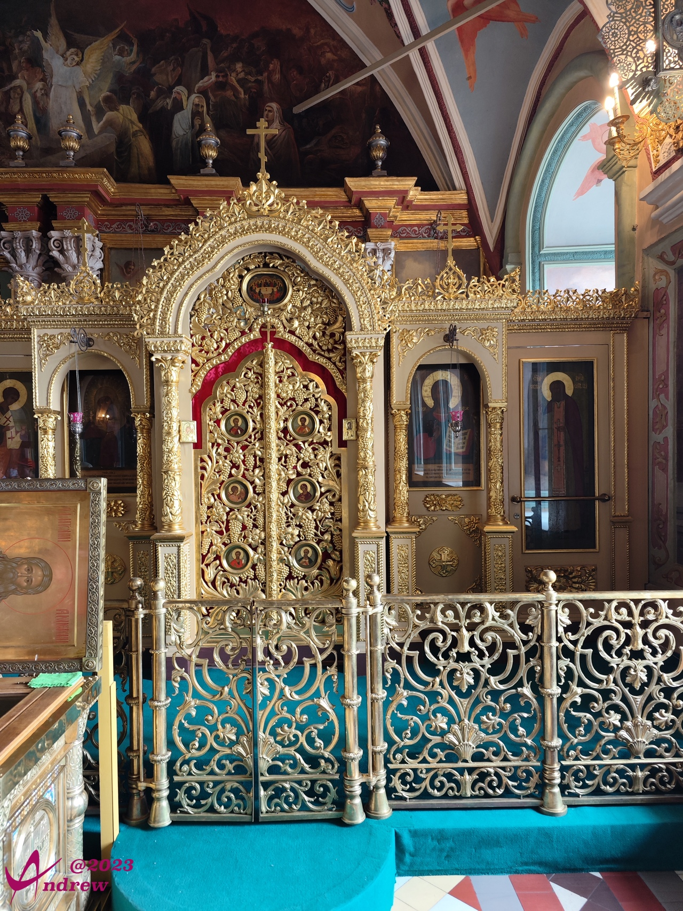  
附带说一句，在俄罗斯，教堂内部对于是否允许拍照，不同的教堂有不同的规则。  
大多数的规则是不允许用相机，可以用手机，不能使用闪光灯，不能使用自拍杆。三一修道院也是这样的规则。但完全不允许拍照的教堂也不在少数。  
教堂外面修道院内露天部分的雕像、壁画倒是都允许拍照的。  
除了拍照的规则，教堂内不能打电话及大声喧哗，男士不许戴帽子进入教堂，男女均不可衣冠不整，短裤、短裙都是不能接受的。  

教堂内的吊灯及天花板上绚丽的壁画：  
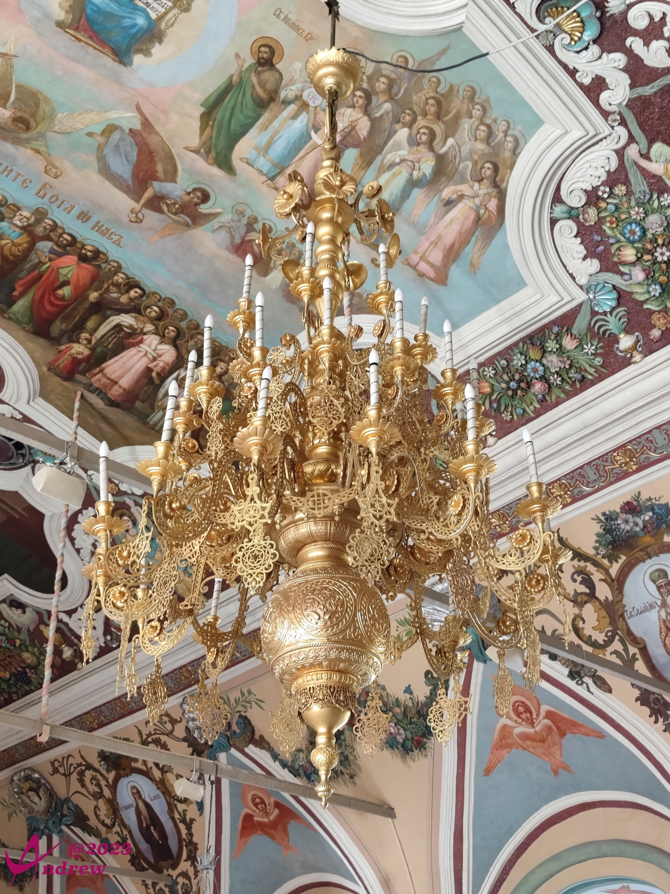  

下图是修道院广场的全景照片，加载可能比较慢，但只有全景才能更好的表现对于修道院的整体印象。
<iframe width="100%" height="500" allowfullscreen style="border-style:none;margin-top:-20px;" src="./js/pannellum.htm#panorama=../imgs/St.SergiusLavra.jpg&amp;autoLoad=true"></iframe>

北京的气温已经跃上35度，这里还只是初春。修道院内的青草树木透着新生的嫩绿，郁金香开得正艳：  
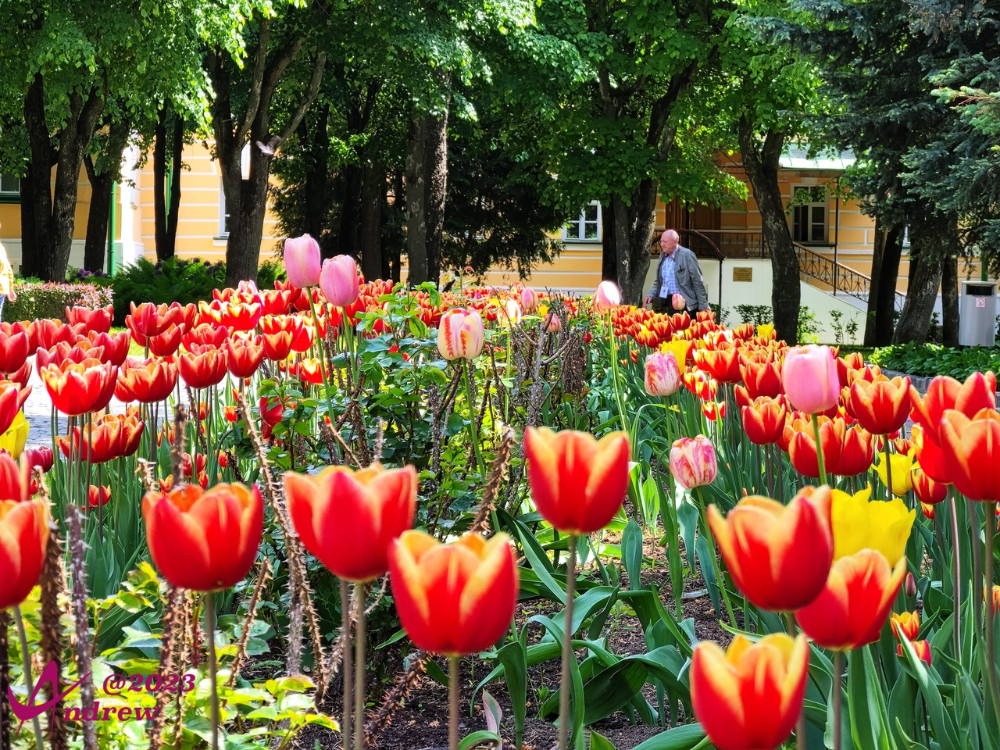  

院内的展厅也会不时开办一些艺术品的展览，游人络绎不绝。因为门票原因，及并非主要目标，没有入内参观。    
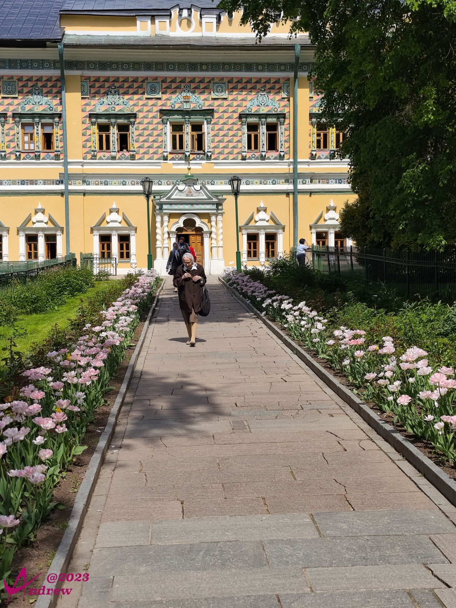  
