# 全俄展览中心
全俄展览中心原名国民经济成就展览馆。顾名思义，是用来展示国家成就的。  
展览馆建成于1959年初，同年6月对外开放，之后也不断有扩建和维护。  
世界上有很多大型的展览馆和博览园，比如世博会、园博会都不鲜见，但比较而言，这个仍然是我见过最大的。  
占地300公顷，超过80个展馆。各展馆形态各异，风情万种。但共同的是高大雄伟，并且装饰精美。  

入口大门：  
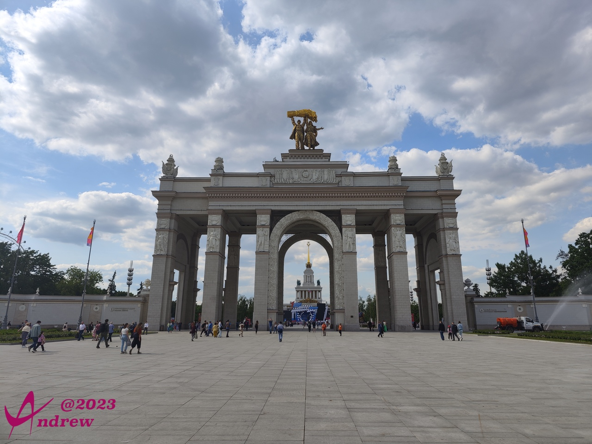  

主展馆前正在搭建舞台，估计到了晚上会有表演：  
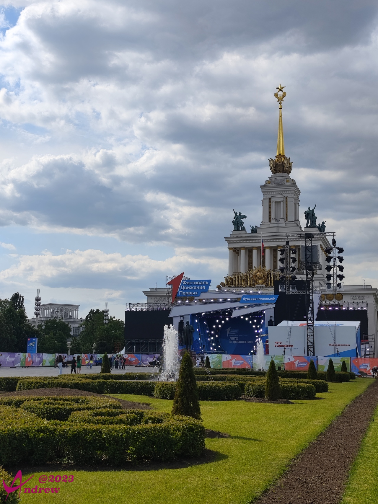  

作为一个高纬度国家，漂亮的绿植和花草需要更精心的打理：  
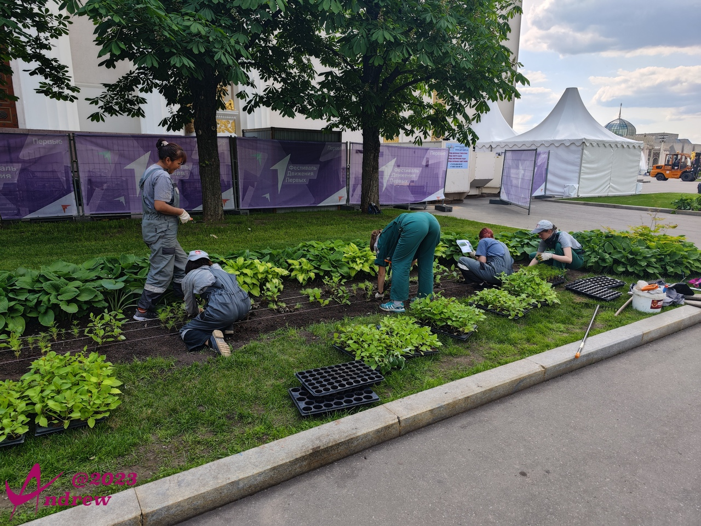  

从园区可以看到相邻的摩天轮和更远一点的莫斯科电视塔：  
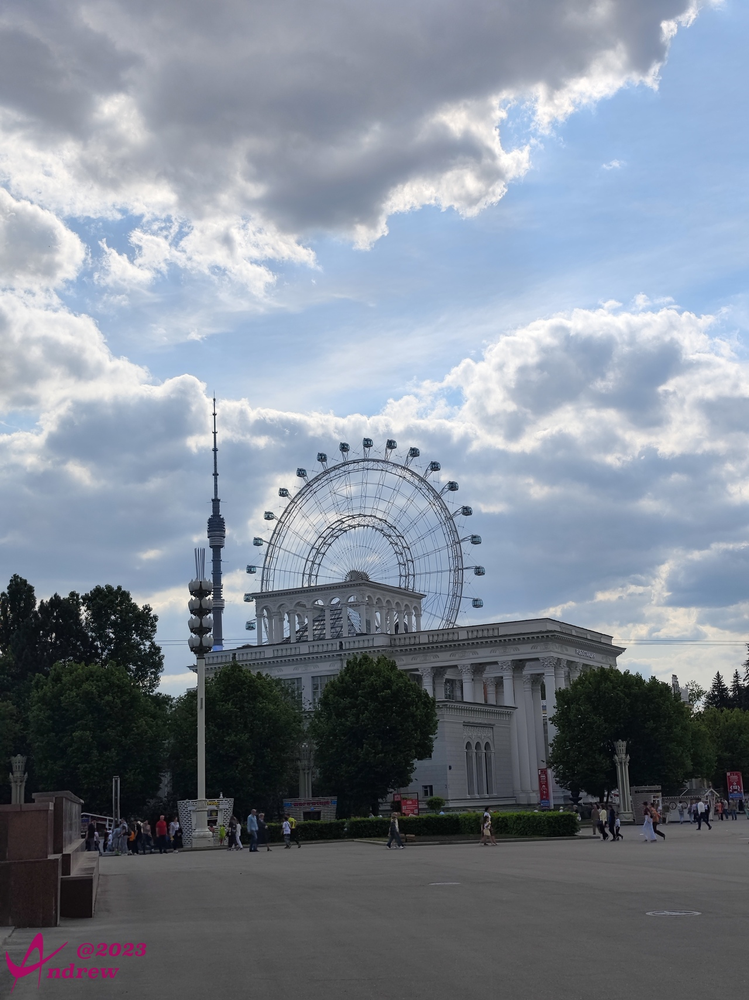  

坐落在园区中间位置的大喷泉绝对是吸睛亮点：  
<video width='100%' controls>
    <source src='videos/VID_20230530_152056.dest.mp4' type='video/mp4'>
</video>

当然，作为世界淡水蓄有量最高的国家，多大的喷泉也不能只有一座：  
  
你肯定注意到了，照片中只能作为背景出现的一座座建筑，就是一个个的展览场馆。  
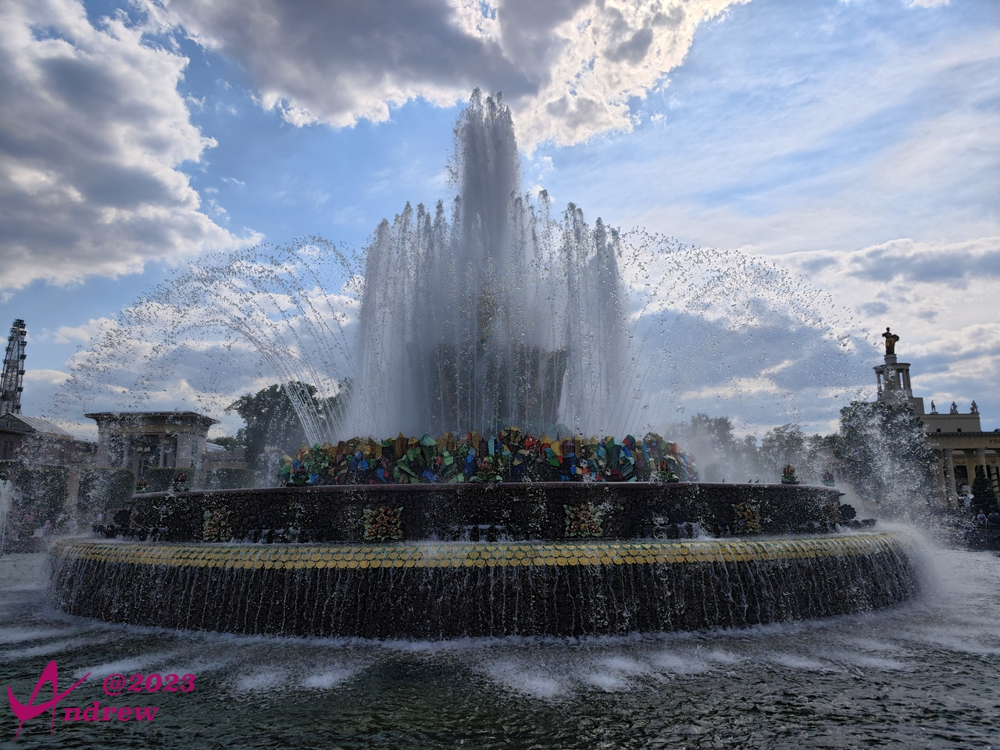  

当然总有些场馆精致到你不忍心让它当配角，高耸的金色五角星和镰刀锤头有没有让你感觉亲切？  
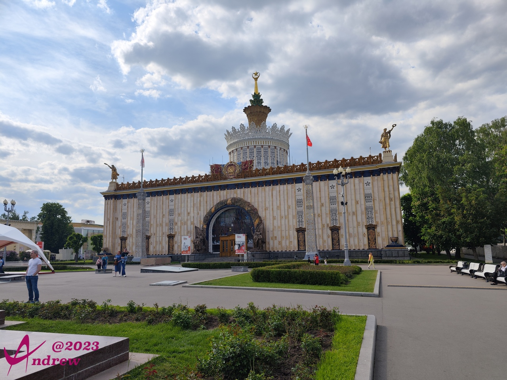  

宏大的场面，照例是全景的强项，顺便我也露一小脸。全民抗疫三年都不带口罩的国度，我这样的总是凤毛麟角，万人中醒目：  
<iframe width="100%" height="500" allowfullscreen style="border-style:none;margin-top:-20px;" src="./js/pannellum.htm#panorama=../imgs/allRussiaExhibitionCentre.jpeg&amp;autoLoad=true"></iframe>

然而宏大并不代表一切，细节才决定成败：  
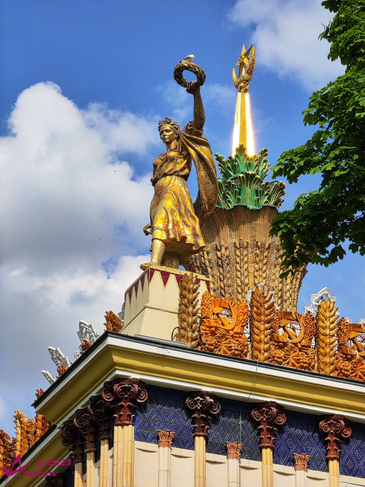  
花环上的鸽子，是这里随处可见的活体，并非雕塑的一部分。  
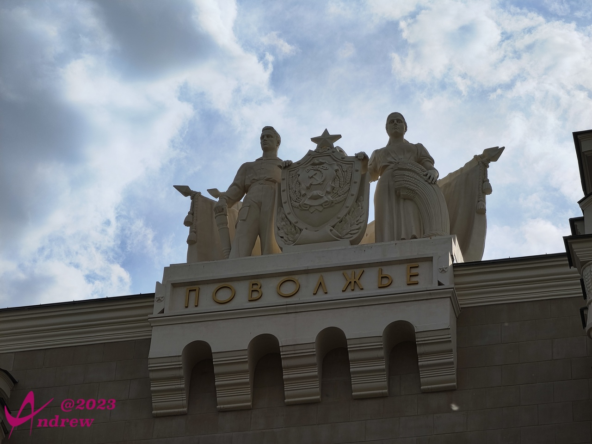  
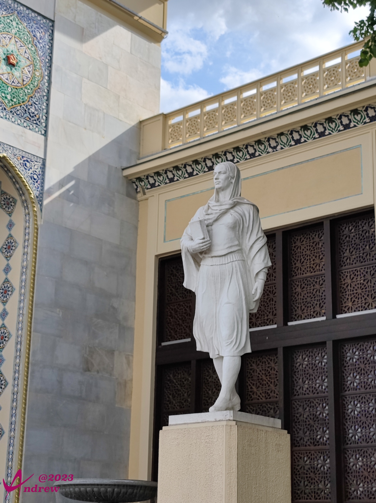  
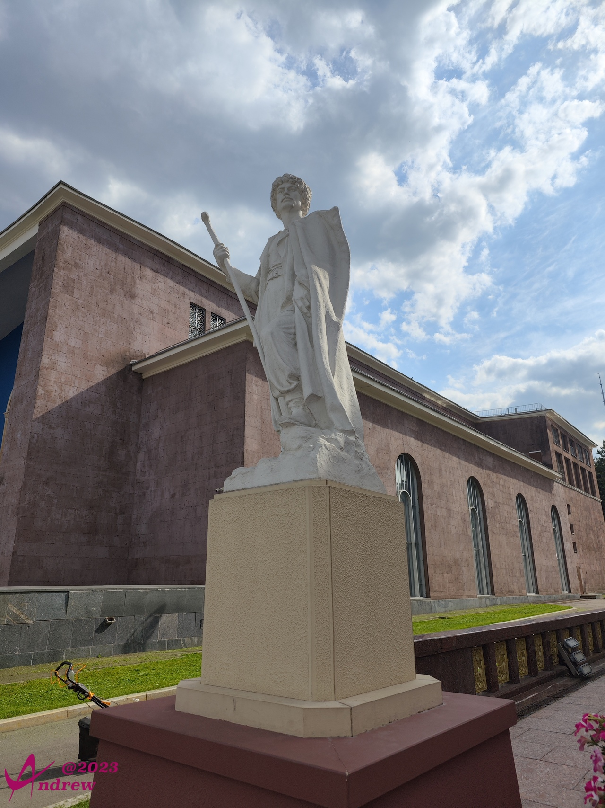  
  

1959年的场馆，也需要与时俱进，我相信他们也有类似的词：  
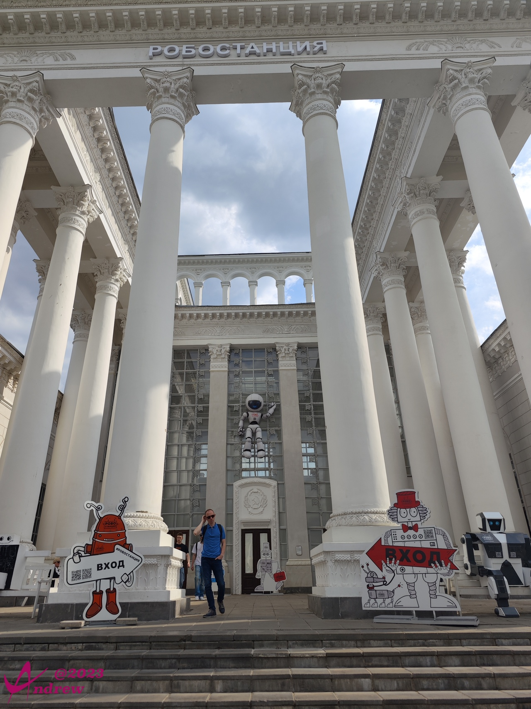  

如此大的展馆展园，还有一个意想不到的好处，那就是完全免费。
这让我这个奥运场馆、园博园、世博园都要凭票入场熏陶而来的人，极度不适。  
谁认识普京大大辛苦给带个话，这样的园子一张票2000卢布绝不算贵，个别场馆还得考虑单独附加购票。不不不，你别跟我提什么医疗、教育也免费的事情，人是不能太贪心的。  

参观完全俄展览中心回酒店的车程中，可以拍到路边跟楼差不多高的的镰刀锤头雕塑：  
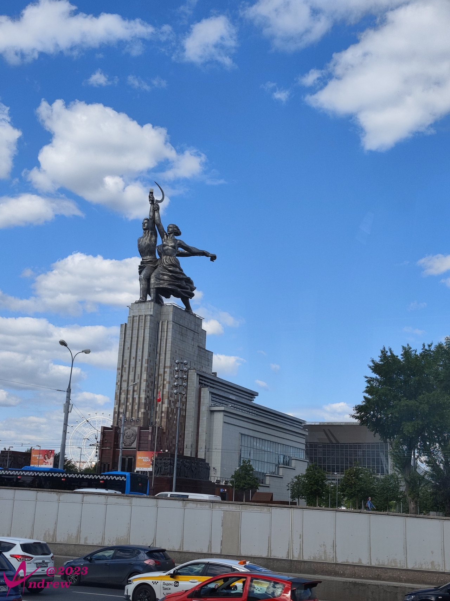  
有些痕迹，终究会长存。

