# 克里姆林宫

克里姆林宫是访俄的重要行程，然而一早就下起了雨。气温瞬间也降到了10度以下，没有一件有些厚度的外套，就只能拼脂肪层了。  
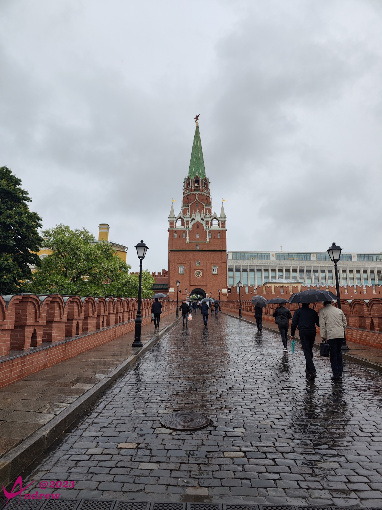  

入口塔楼顶部的红色五角星，据说是产于乌拉尔山的红宝石拼合而成，重达4吨。更难能可贵的是，红五星打造成风向标的形式，可以随风而动。  
在这个灰暗的天色下，手机长焦极不给力，借用一张别人的照片来看一下细节：  
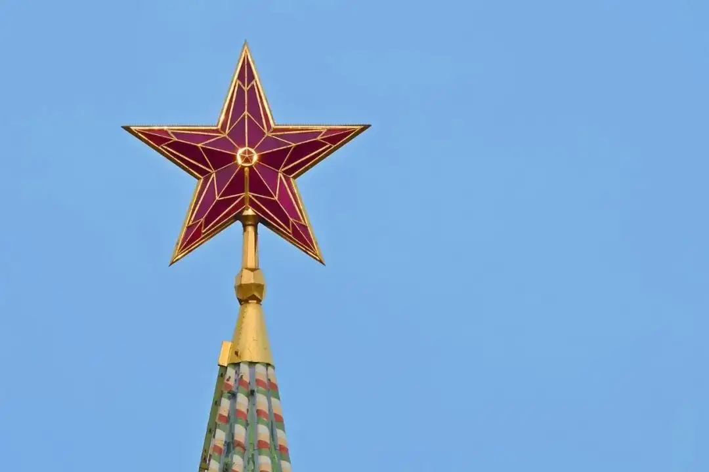

克里姆林宫军械库外装饰用的古炮：  
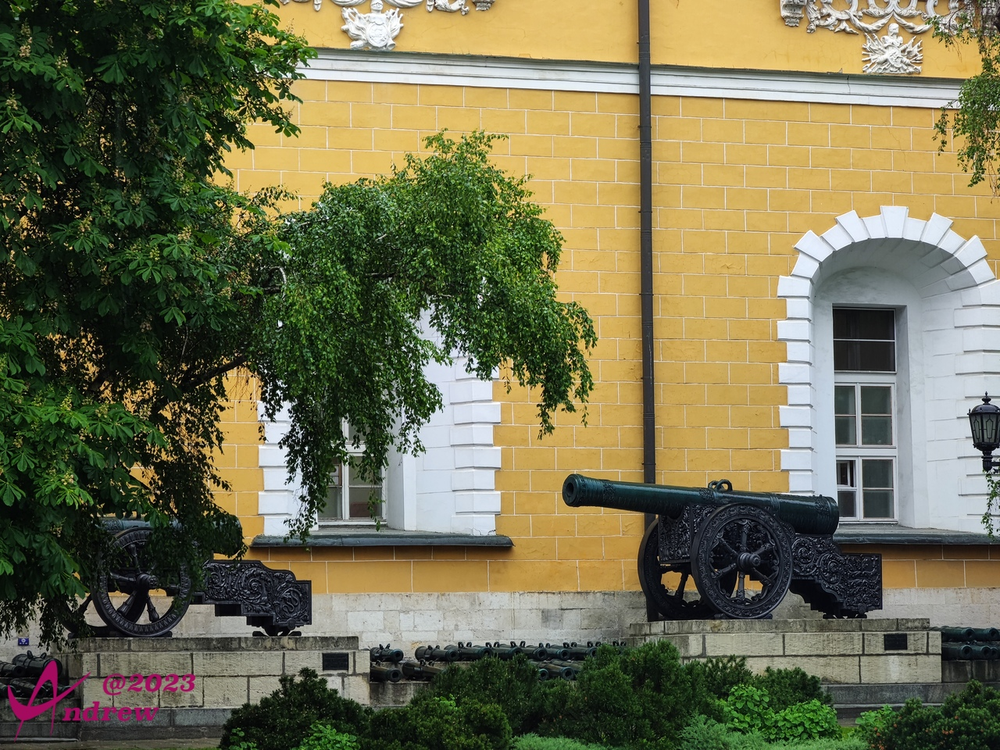  
军械库在地图上名称就是如此，但我实在无法理解这个面积远超总统官邸的楼难道真的只存军械？  

克里姆林宫大会堂楼顶的俄罗斯双头鹰国徽：  
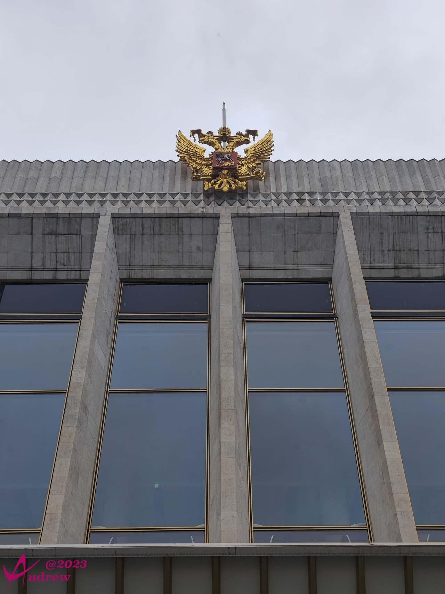  
虽然看上去面积要小一些，但克里姆林宫大会堂的样式，同中国人民大会的样式是有所相似的，据说是建设之前有借鉴中国的设计。  
所以在建国初期，的确中国大量的采用了前苏联的建设图纸，但双方还算的上互相借鉴，共同进步的。  

总统官邸和其上飘扬的总统旗，旗子升起，表示普京大大正在其中办公：  
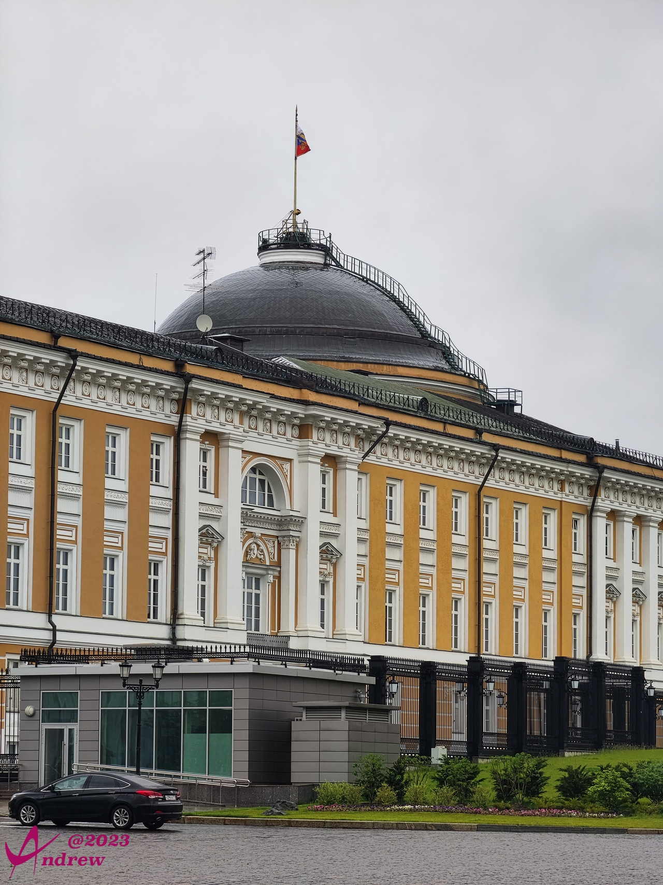  
顺便一提，在俄罗斯，国旗、总统旗、莫斯科市旗，以及一些古老家族的旗帜，都是不同的。  
总统府的门窗玻璃采用特殊的设计，里面能清晰的看到外面，但外面是看不到里面任何情况的。  

古代作为“核威慑”存在的炮王（唉，网友们已经毁了太多好词了），实际上一次也没有发射过。让我们共同祈祷从今以后直至千秋，核武也是共同的命运：  
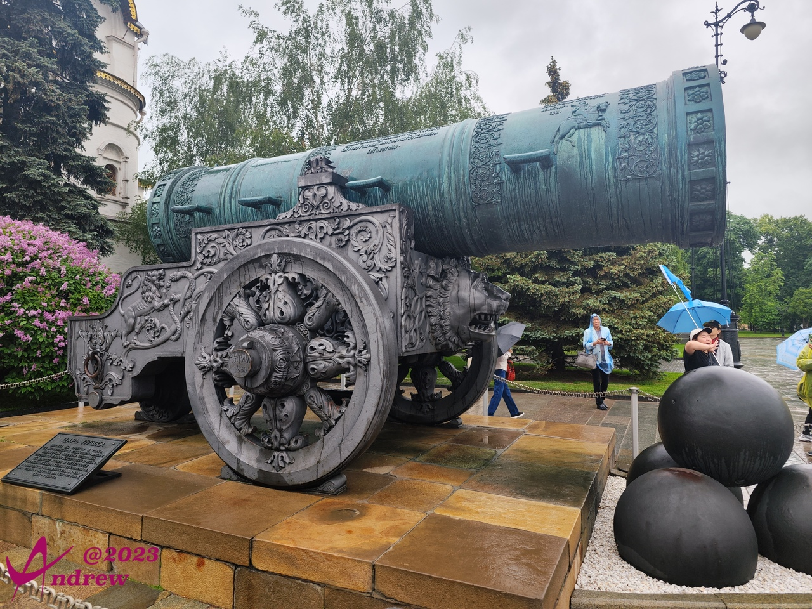  

炮王旁边的钟王，重达202吨，运气更是多舛。1737年铸造将要完成时工场（不是工厂）发生大火，救火时冷水泼在了尚在炽热的大钟上，导致裂缝随后碎裂，11吨重的一个碎片脱落。钟王和碎片埋在废墟中99年，直至1836年尼古拉沙皇下令挖掘出来，于克里姆林宫收藏。毕竟这个世界上，没有什么东西是真正完美的。  
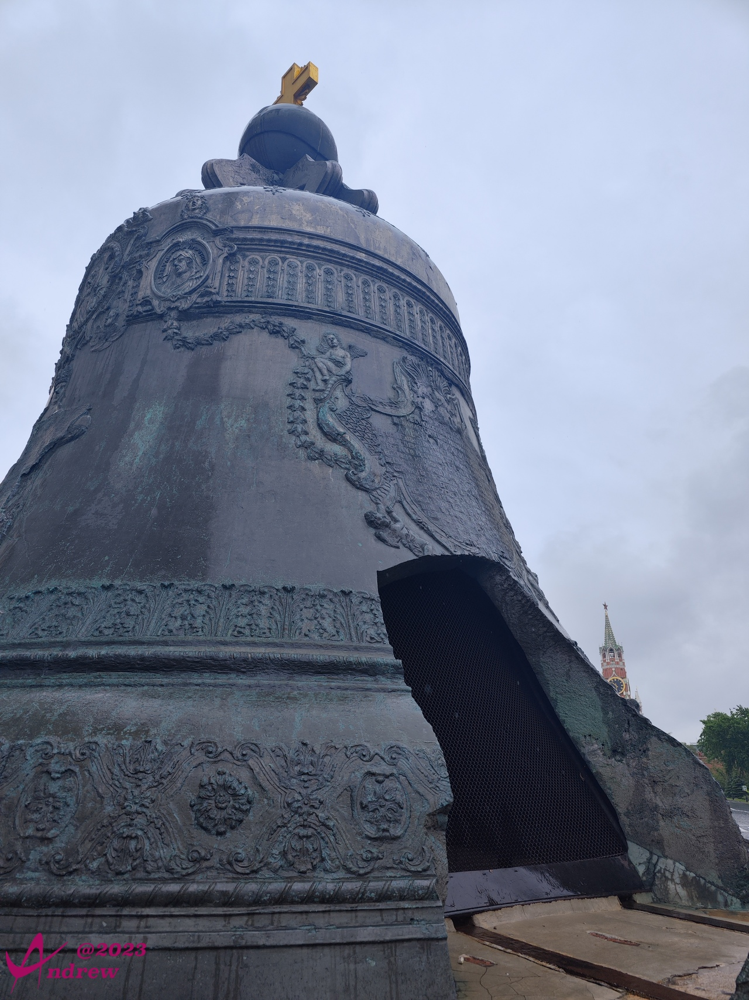  

天使报喜大教堂看名字就是中国人最喜欢的地方，沙皇大婚的时候，会在这里举行婚礼，并在其中居住一夜。  
其后黄色的建筑物是大克里姆林宫，为总统接待重要国际友人的场所。比如习大大仿俄时，普京总统就在此接待。正式的仪式是国际友人向前，普京在右侧蓝色扶手的楼梯上拾级而下，双方握手成礼。  
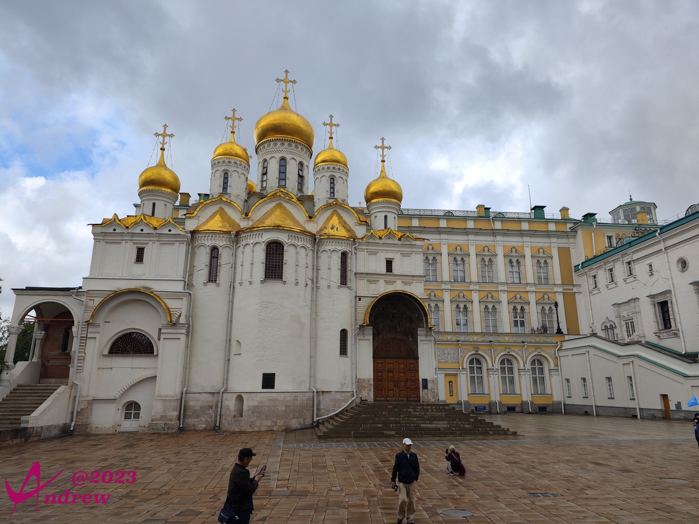  

下面的全景图是教堂内过厅的华丽场面，礼拜堂未能进入：  
<iframe width="100%" height="500" allowfullscreen style="border-style:none;margin-top:-20px;" src="./js/pannellum.htm#panorama=../imgs/AnnunciationCathedral.jpeg&amp;autoLoad=true"></iframe>

实际上圣母升天大教堂才是克里姆林宫最重要的建筑之一，也是整个俄罗斯国家最重要的大教堂。历代沙皇加冕会在此举行，也是莫斯科都主教和牧首的陵寝。  
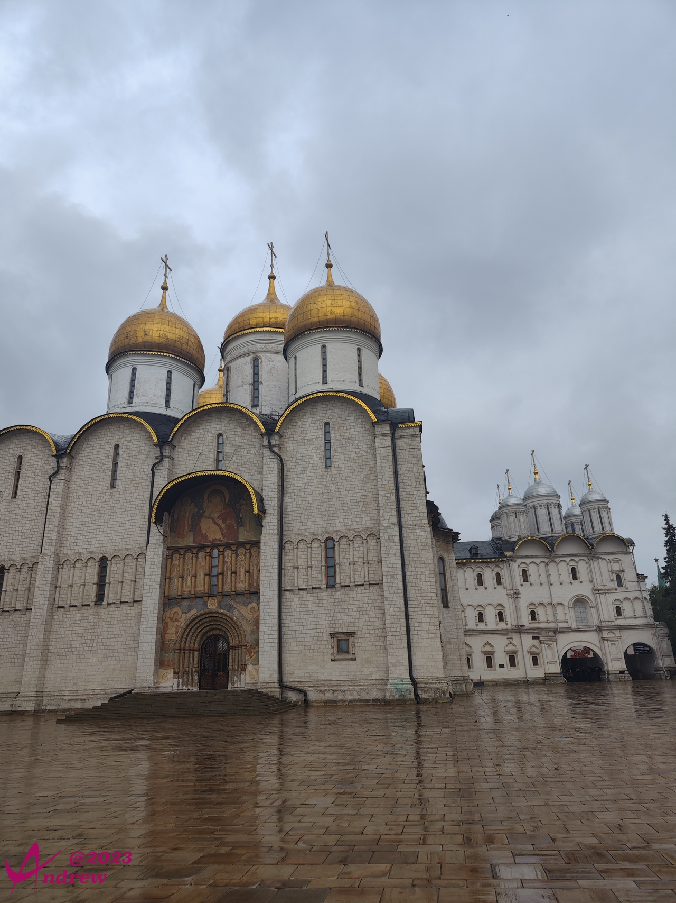  

教堂内的莫诺马赫宝座，是沙皇祈祷时的座位：  
  

费拉基米尔圣母圣像是馆藏最重要的文物，此教堂的修建就是为了供奉据说曾于古时显灵的圣象。照片中的是1514年的摹本（左侧神龛中）：  
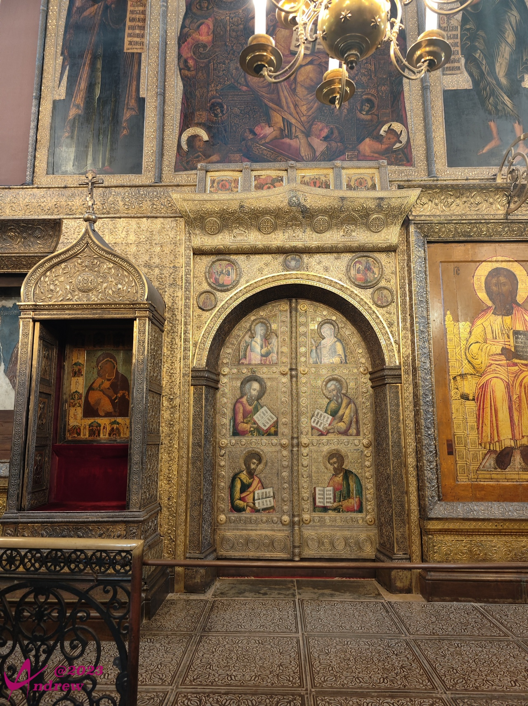  

在克里姆林宫眺望一墙之隔红场上的圣瓦西里升天大教堂和左侧的救世主钟塔，其上有同样规格的红宝石五角星风向标。  
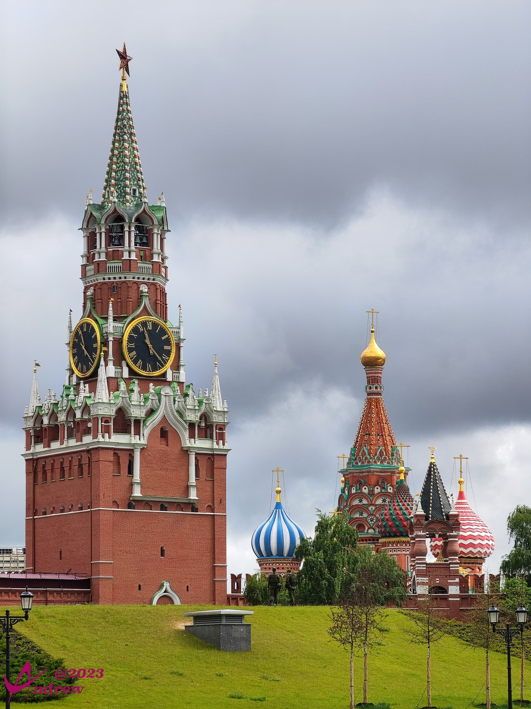  

从克里姆林宫出来，斜向对着的建筑是俄罗斯国家图书馆（前列宁图书馆）。馆前的雕像是俄国作家陀思妥耶夫斯基。（请原谅我角度太小实在错不开那块交通路牌）
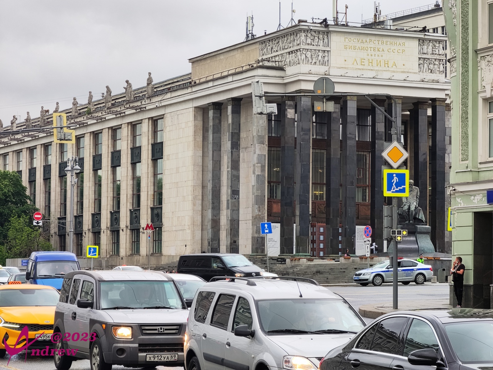  

> 倘若你想征服世界，你就得征服你自己。  
> 最要紧的是，我们首先应该善良，其次要诚实，再其次是以后永远不要相互遗忘。  
> 我不忧伤，也不泄气。生活终究是生活，生活存在于感受我们自身之中，而不在于外界。  

--摘自陀思妥耶夫斯基的语录，特别是《罪与罚》  

