# 红场
红场对于俄国，就好像天安门广场对于中国。  
以一幅全景图片开始，是对其最好的尊重。  
<iframe width="100%" height="500" allowfullscreen style="border-style:none;margin-top:-20px;" src="./js/pannellum.htm#panorama=../imgs/redSquare.jpeg&amp;autoLoad=true"></iframe>

红场入口的大门：  
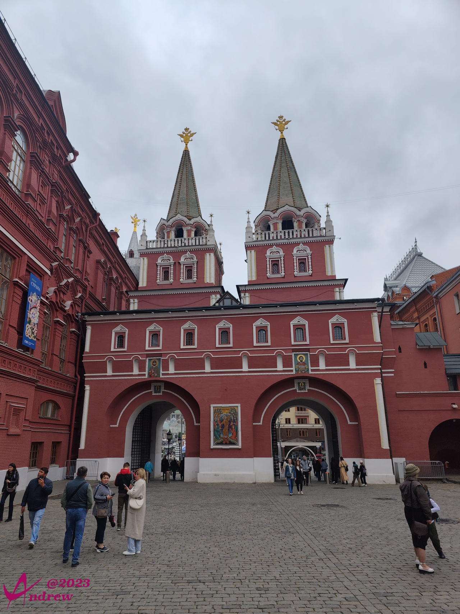  

朱可夫元帅铜像，其后是国家博物馆：  
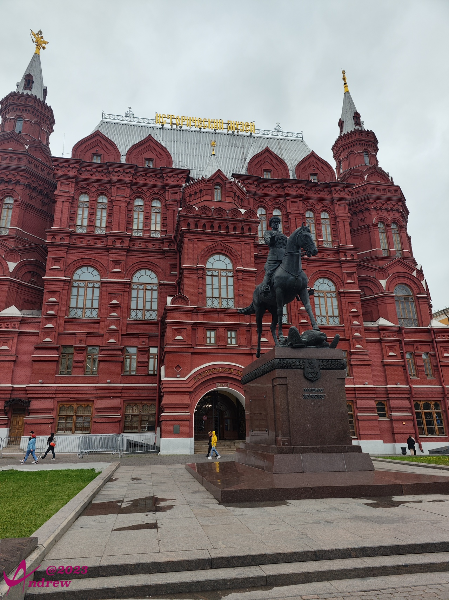  

二战无名烈士墓：  
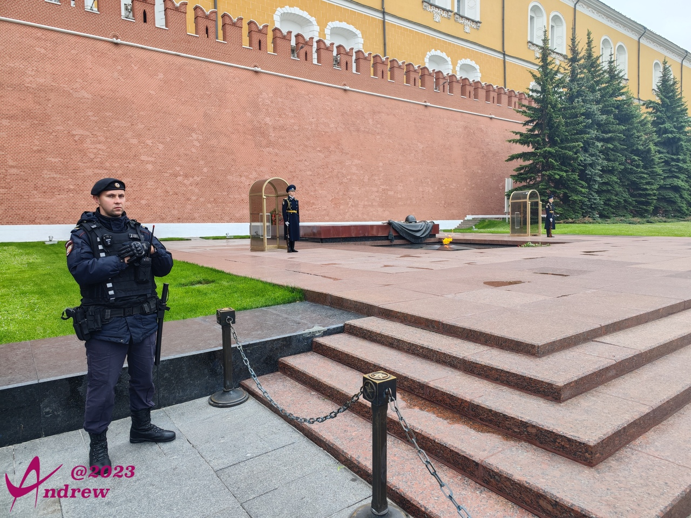  
不同于一般烈士墓的高大挺拔，红场的无名烈士墓碑看起来就像一个没有靠背的长条椅，碑身的右侧，覆盖着一面战旗，战旗上方放置着一面头盔和一束桂枝。这三者均以青铜雕刻而成，象征着无名烈士长眠于此，骤然间让人肃然起敬。  
在碑身正前方的地面上，雕刻着一个凸起的五角星。其正中，是一个熊熊燃烧的火炬，它自纪念碑开放之日起被点燃，几十年来从未熄灭，象征着烈士的精神之光永照人间。火炬所在的五角星四周下陷，形成一个壁龛。其中铭刻着俄文“имя твоё неизвестно подвиг твой бессмертен！”（你的名字无人知晓，你的功绩永世长存！）。  

无名烈士墓两边的两个护卫战士，每当整点的时候，会有换岗仪式。如同天安门广场的升旗仪式一样，吸引无数游人参观：  
<video width='100%' controls>
    <source src='videos/VID_20230531_135742.dest.mp4' type='video/mp4'>
</video>

红场一侧是GUM百货公司，也称国家百货商场：  
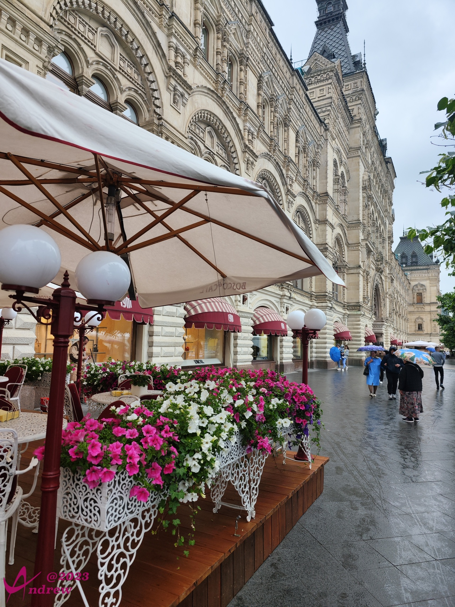  
  

近观圣瓦西里升天大教堂：  
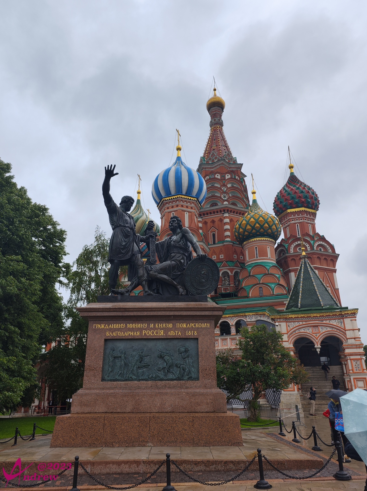  
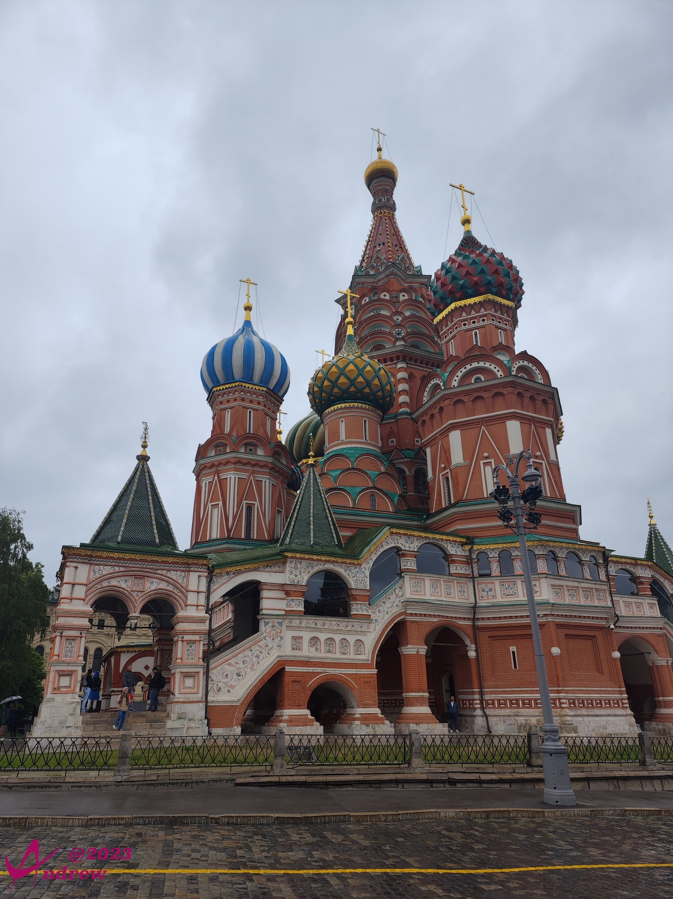  
照片顶部清晰可见飘落的雨滴，你肯定能体会我现在兴奋、遗憾而又不舍的纠结：  
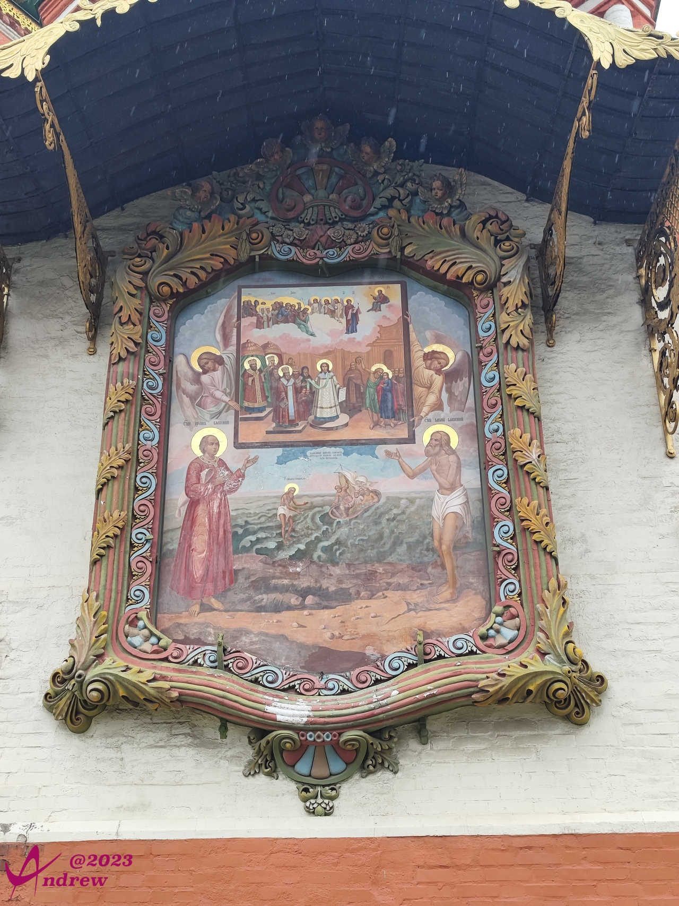  
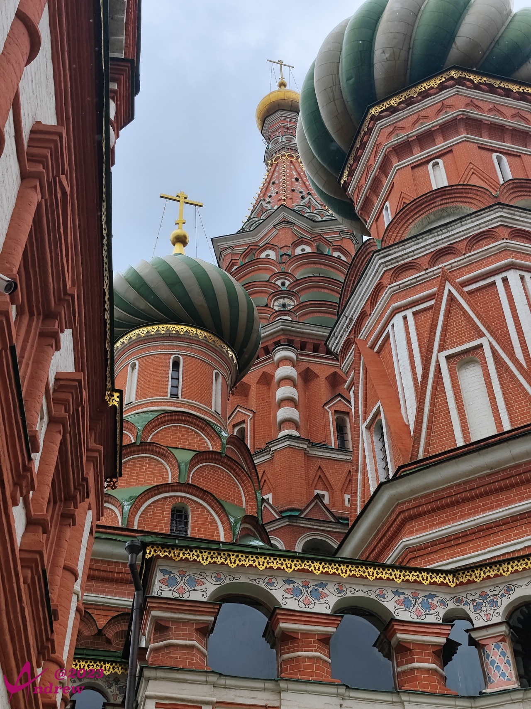  
圣瓦西里升天大教堂是俄罗斯的标志性建筑，就好像中国的天安门。  
其中包含八个小教堂，围绕着中央教堂，其上的九个穹顶，实际上每一个穹顶对应一个教堂。  
整个16世纪，圣瓦西里教堂一直是莫斯科最高的建筑。1600年建设的伊凡大帝钟楼打破了它的记录。伊凡大帝钟楼位于克里姆林宫教堂广场，在大克里姆林宫对面，本文内没有放置对应照片，因为感觉它的色彩太单一了。  
教堂前的青铜雕像，名为“米宁与波扎尔斯基纪念碑”，是双人青铜像，站立者是库兹马·米宁，坐着手持剑与盾的是德米特里·波扎尔斯基。他们两个人的来源讲起来会非常冗长。大致是1610年8月，莫斯科曾经被波兰人攻陷，1612年9月，下诺夫哥诺德商人米宁组织起一支志愿军，在波扎尔斯基的指挥下历时3个月打败波兰军队，结束了他们对莫斯科两年多的占领。解放出关押在监狱里的所有犯人，其中包括第二年缙绅会议推选为新沙皇的米哈伊尔·罗曼诺夫。持续三百多年的罗曼诺夫王朝统治由此开始。  

吉姆百货旁边的时光隧道，如果是晚上，星光璀璨映照着如织游人，会有时空穿梭之感：  
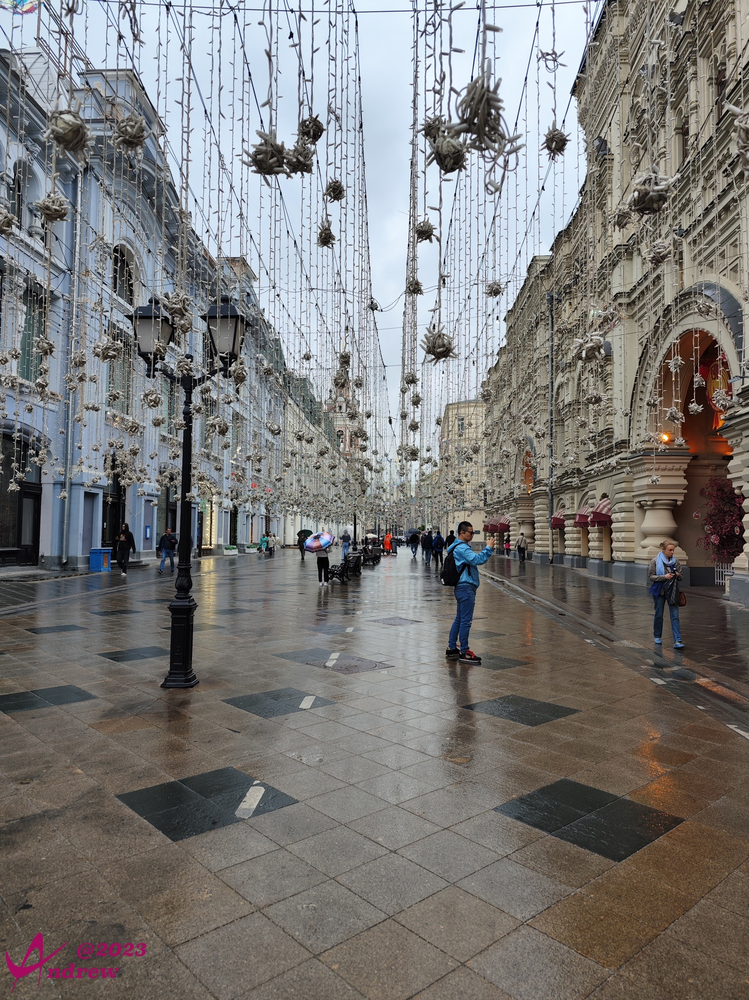  

吉姆百货内部装饰华丽，名店云集，不过商品价格，也挺华丽。我最终只是吃了一客冰激凌。就是照片中广告画上那个：  
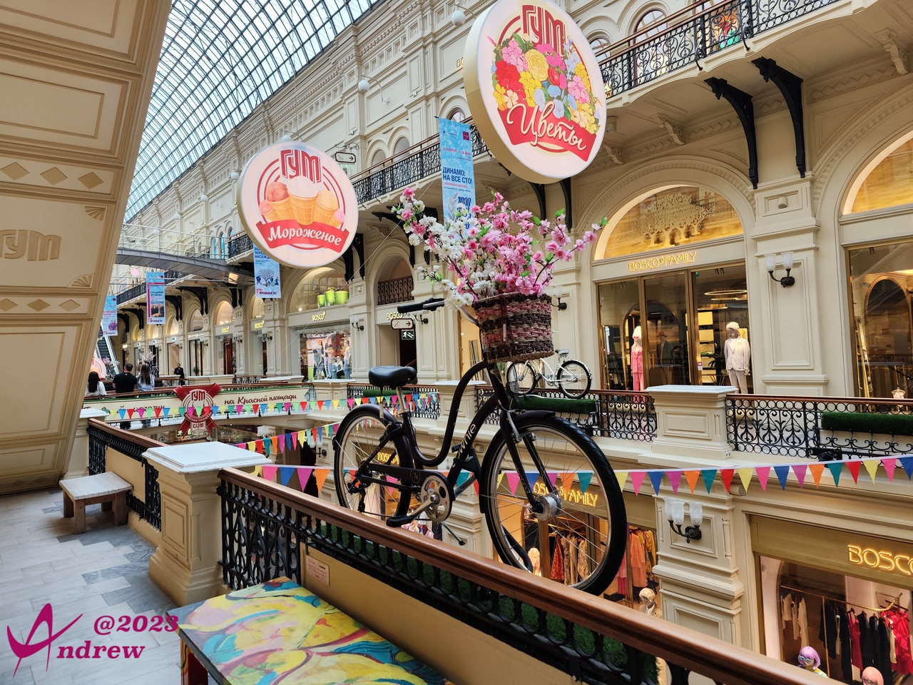  

吉姆百货一端的地下室有一个中世纪的厕所，据说马桶圈都是紫金的，原来是皇家专用。我过去看了看，考虑到200卢布上一次厕所，很有点不过日子，所以放弃了。  

全景图是在吉姆百货二层中间的一排拍摄的，对于只逛不买的人来说，看起来感受一下足够了：  
<iframe width="100%" height="500" allowfullscreen style="border-style:none;margin-top:-20px;" src="./js/pannellum.htm#panorama=../imgs/gumShop.jpeg&amp;autoLoad=true"></iframe>

广场上，经常还会有一些商店的促销活动，比如今天赶上的是来自北方的海鲜：  
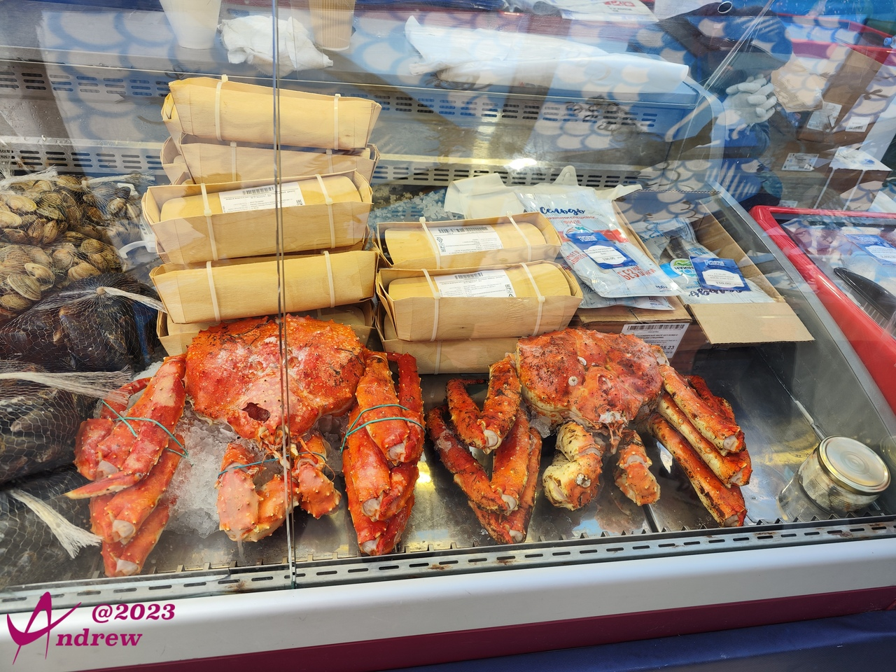  
离莫斯科最近的是波罗的海，但波罗的海作为一个被大陆包裹着的内海，大量的陆地河流冲刷和少量的洋流涌入，使得波罗的海含盐量非常低，基本接近淡水。所以波罗的海并没有海鲜出产，只有类似国内的一些河鱼。  

