## 地铁

由红场乘坐地铁，三站地就可以到达莫斯科胜利广场。  
战斗民族的地铁乘坐之前需要有心理准备。原因是莫斯科地铁在地下非常深，这导致进出站的扶梯即深且长，视觉观感非同一般的陡峭。扶梯速度也很快，大概是国内扶梯速度的三倍。照片实在难以表现那种如同临渊深探的心情：  
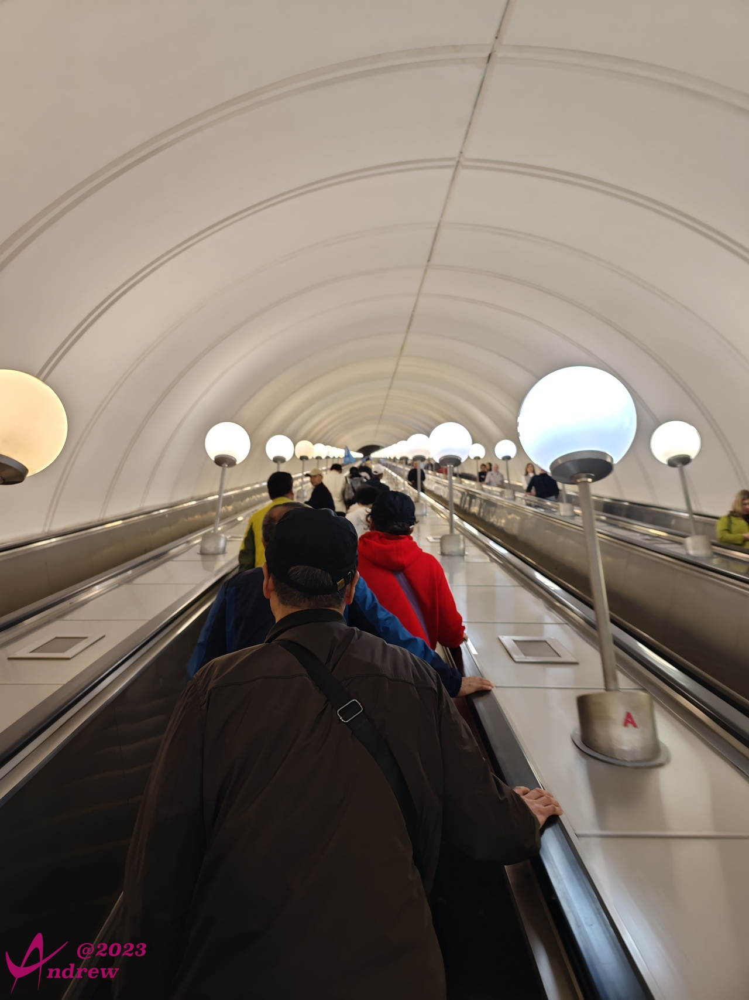  

地铁内壁画、雕塑也是随处可见，艺术家们似乎不肯放过一处空白。所以莫斯科地铁也被称为世界上最美的地铁：  
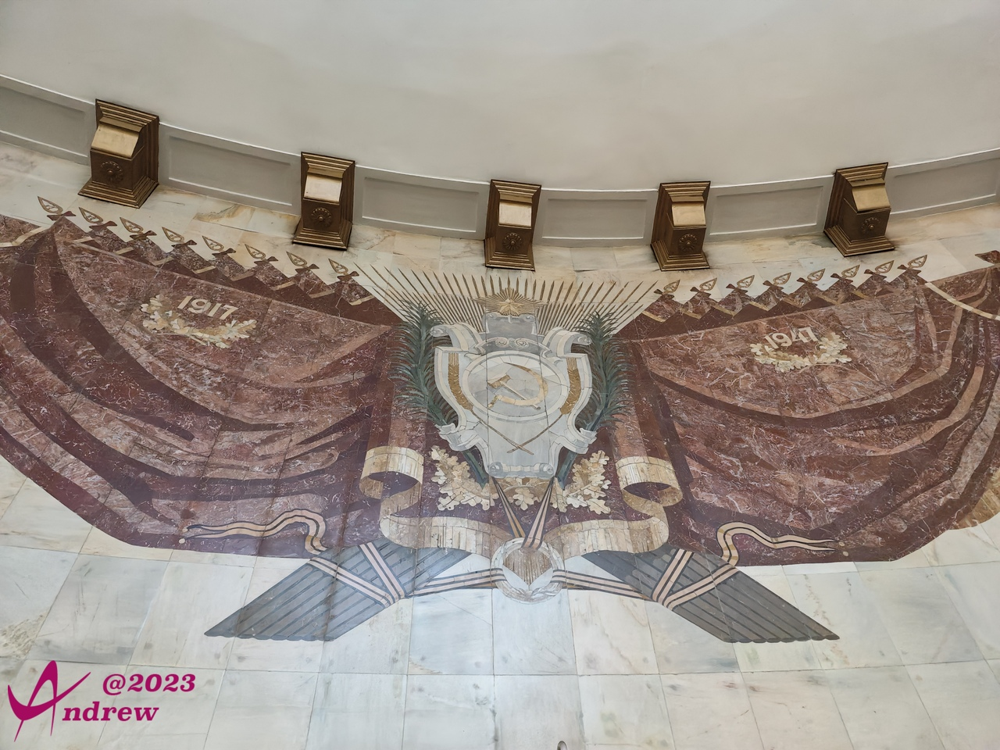  
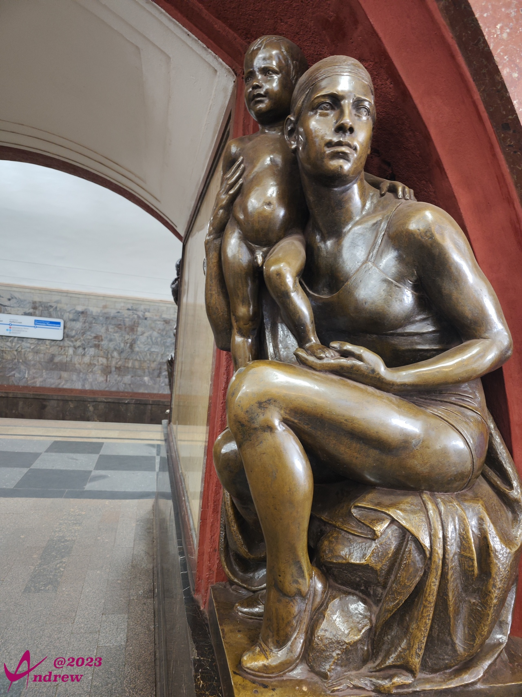  
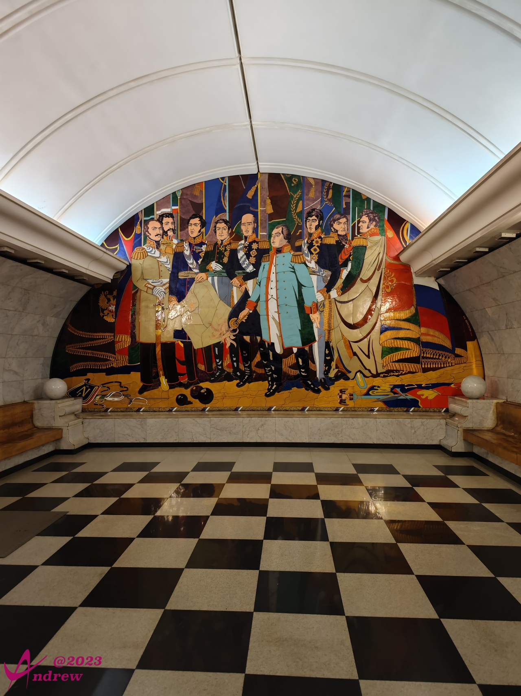  

车厢内布局跟国内大同小异，但不同的是人少得多：  
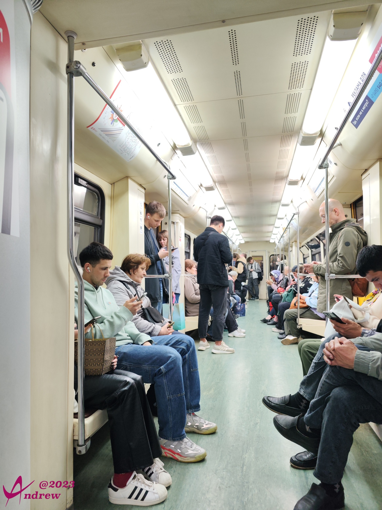  

## 凯旋门
从地铁站上来，第一个路口，刚好看到凯旋门之上的胜利女神架着铜马车：  
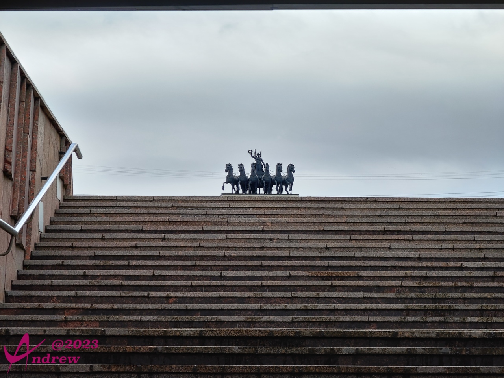  

最戏剧性的是，莫斯科凯旋门，跟巴黎凯旋门，是为了纪念同一场战役而修建的。莫斯科当然是为了纪念俄军打败拿破仑。  
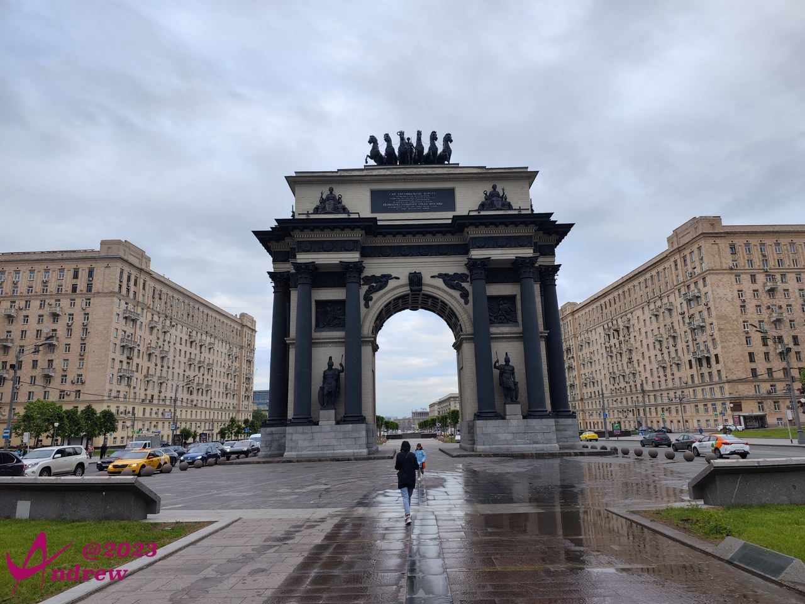  
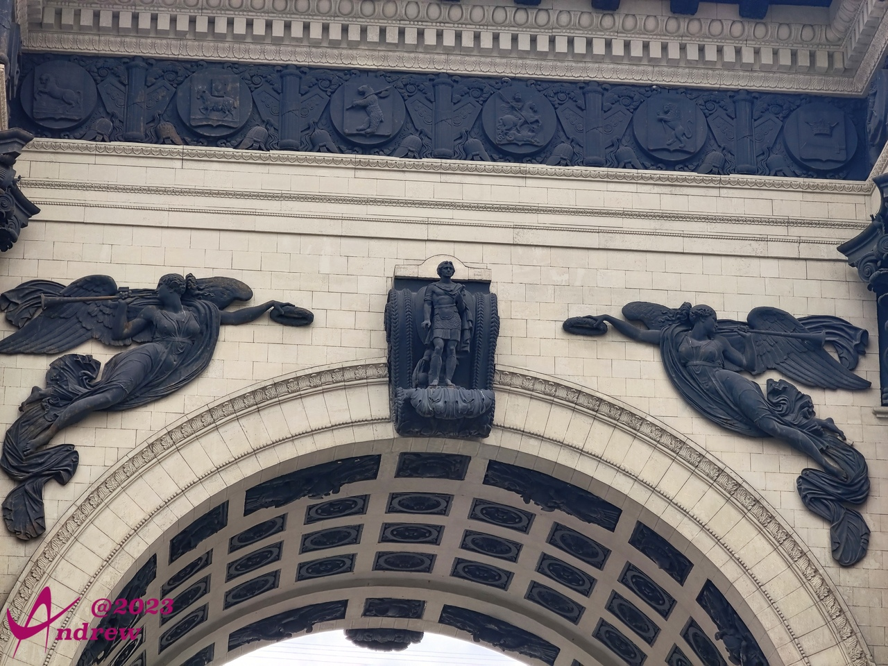  

## 胜利广场
继续沿着过街地道到下一个路口，上来就是胜利公园。  
其中的胜利广场占地135万平方米，相比较红场：9万平方米，天安门广场：44万平方米。是我见过最大的广场。由2660万块方砖铺成，象征卫国战争中死难的2660万人。  
下图为在广场中央拍摄：  
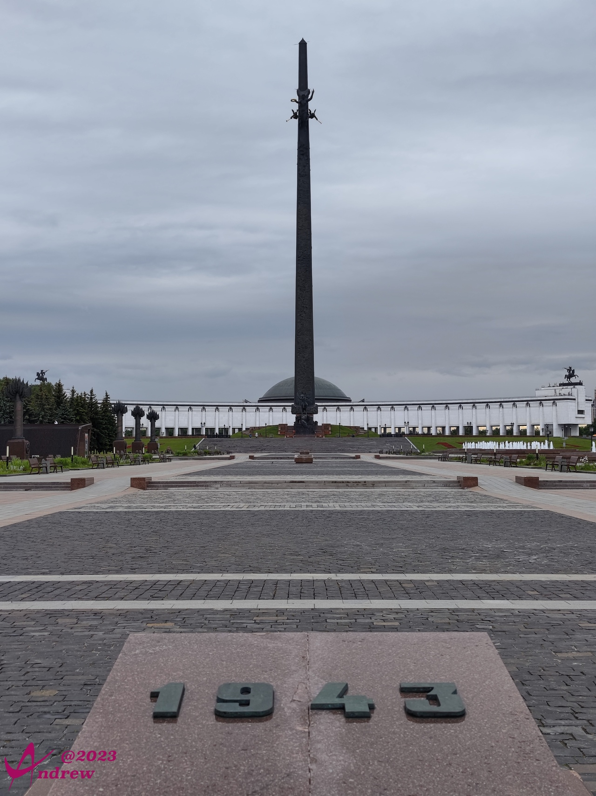  
图正中是胜利女神纪念碑，位于广场西侧。纪念碑高达141.8米，象征持续了1418天的卫国战争。纪念碑顶是胜利女神高举月桂花环，碑身形似利剑，雕刻有英雄人物浮雕，碑体下部是俄罗斯勇士格奥尔基持长矛英勇刺杀毒蛇的雕像。
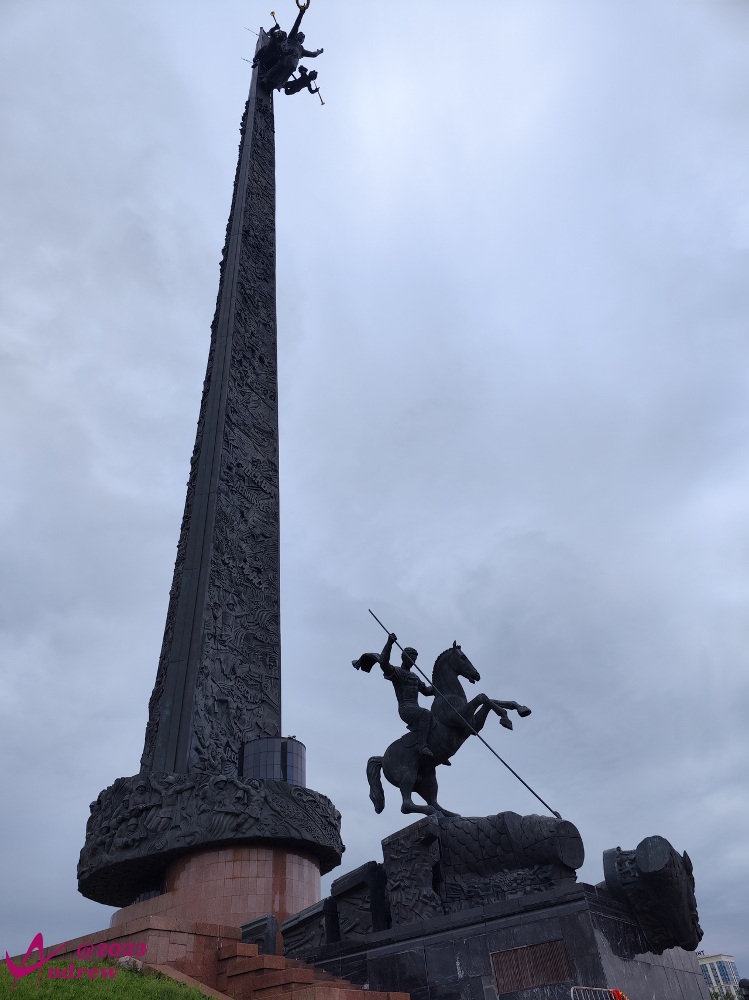  
纪念碑后面半圆形的建筑是中央博物馆，博物馆内纪念了莫斯科保卫战，列宁格勒反围困战,斯大林格勒战役，攻克柏林。荣誉厅的墙上,刻满了英雄的名字。纪念礼品中有中国人民解放军和张万年上将赠送的礼品。  

广场的一侧是常胜圣格奥尔基大教堂：  
  

胜利广场的卫国英雄雕塑：  
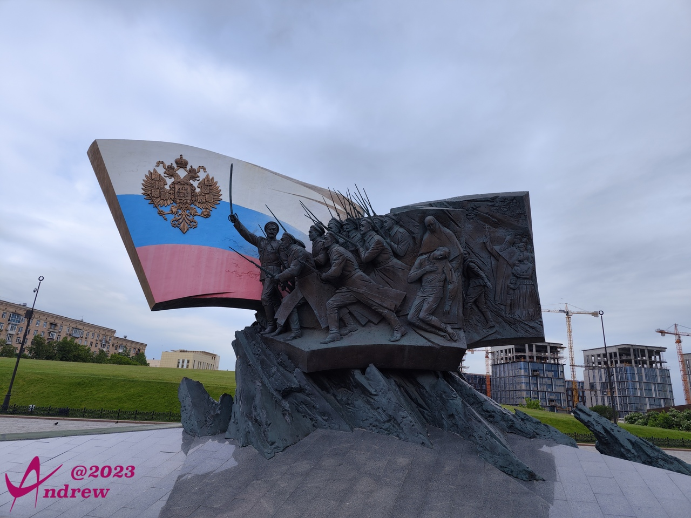  

胜利广场全景图：  
<iframe width="100%" height="500" allowfullscreen style="border-style:none;margin-top:-20px;" src="./js/pannellum.htm#panorama=../imgs/VictorySquare.jpeg&amp;autoLoad=true"></iframe>

