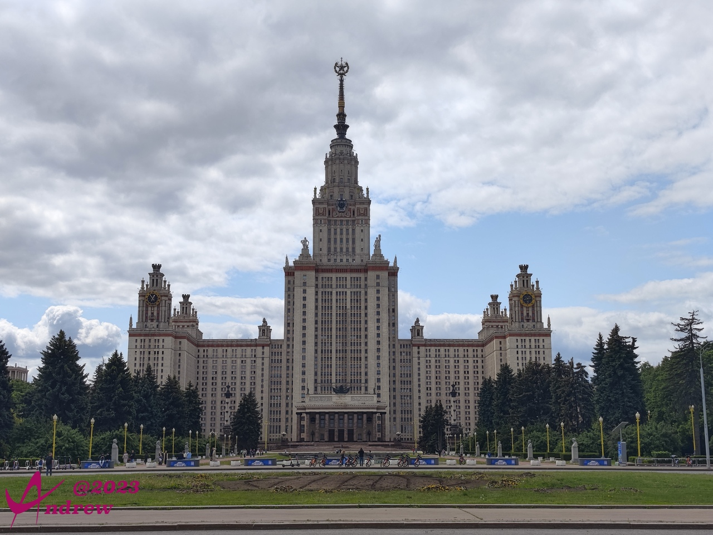
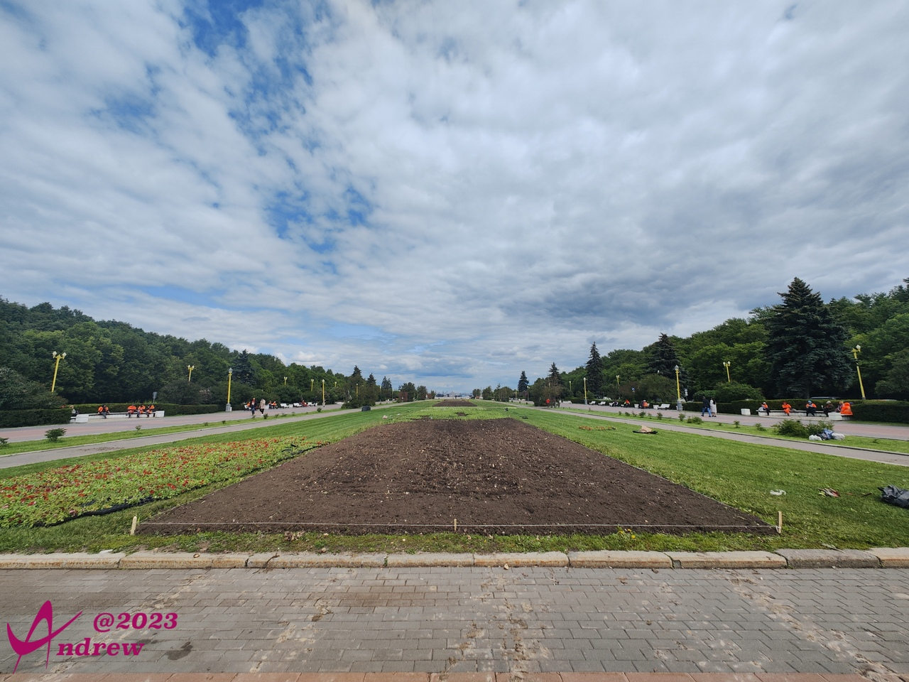
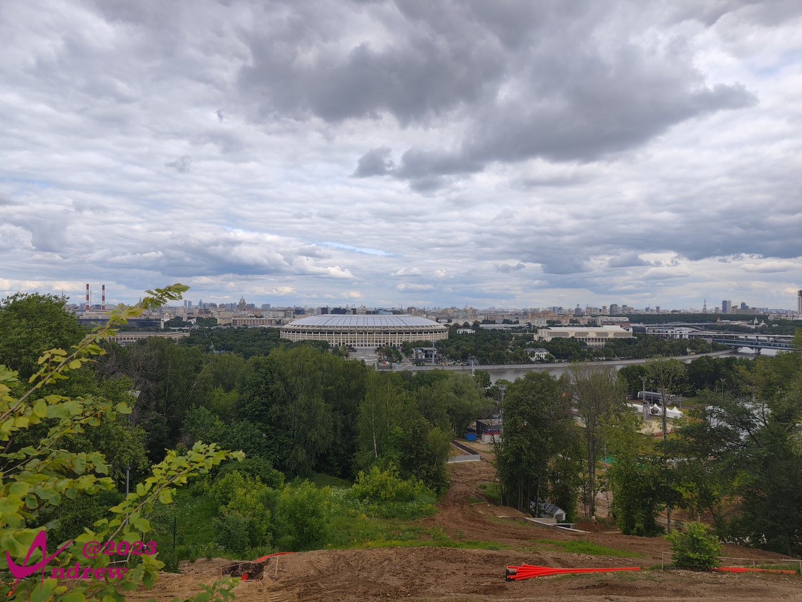

# 莫斯科大学

莫斯科大学位于麻雀山顶。东欧平原少山，仅仅海拔220米的麻雀山也成了珍藏。  
麻雀山以前其实叫列宁山，苏联解体后去列宁化，因山上麻雀数量很多，更名为麻雀山。  
莫斯科大学主教学楼是苏联时期斯大林下令修建的七所高层塔楼中最高的一座。完工于1953年，共有36层，最高处240米。  
  

这七座斯大林时期、“斯大林式”的高楼，结合了巴洛克式城堡塔、中世纪欧洲哥德式与美国1930年代摩天楼的特色。也被称做莫斯科七姐妹。  
从1948年起开始修建的七姐妹塔楼分别是：  
* 莫斯科大学主教学楼，建造时间：1949-1953
* 列宁格勒饭店，建造时间：1949-1953
* 劳动模范公寓，建造时间：1948-1952
* 重工业部大楼，建造时间：1949-1953
* 乌克兰饭店，建造时间：1950-1956
* 文化人公寓，建造时间：1950-1954
* 外交部大楼，建造时间：1948-1953

作为世界上国土面积最大的国家，俄罗斯的广场给人的感觉首先就是大。  
<iframe width="100%" height="500" allowfullscreen style="border-style:none;margin-top:-20px;" src="./js/pannellum.htm#panorama=../imgs/University.jpeg&amp;autoLoad=true"></iframe>

莫斯科大学是俄罗斯排名第一的学府，在世界也有极高的声望。在数学、物理学、生物学、地质学、化学以及其他科学领域所取得的成就举世瞩目，共有11 位诺贝尔奖获得者，约300名俄罗斯科学院、俄罗斯教育院院士。2020年QS世界大学排名中莫斯科大学位居第84。2020年的QS世界专业排名（前50）方面：语言学第24名，自然科学第21名，现代语言学第34名，物理和天文学第33名，数学第43名，旅行第45名，人文科学第47名。  

和大多欧美大学一样，莫斯科大学并不用围墙把校园同市区隔开。只是主楼的入口需要门禁。  
楼前宏大的广场上，有很多休闲的市民，和趁着气温转暖维护绿植的工作人员。  
  

莫斯科大学主楼隔着广场对面，在山边处有一个不大的观景台，可以眺望小半个莫斯科市区。  
图为不远处的卢日尼基体育场，是1980年俄罗斯奥运会的主会场。  
体育场前面靠近观景台一侧还有隐约可见的莫斯科河。  
  

