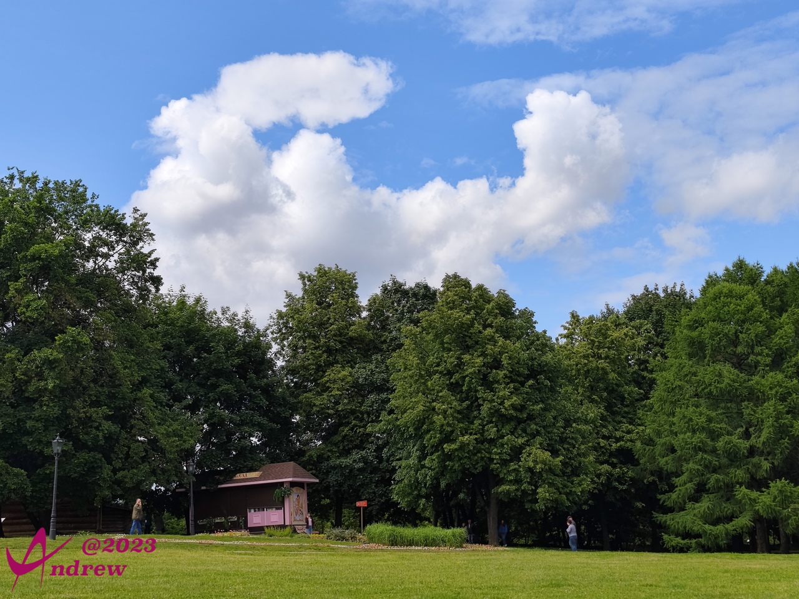
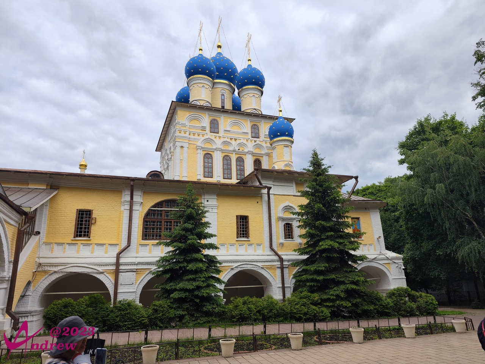
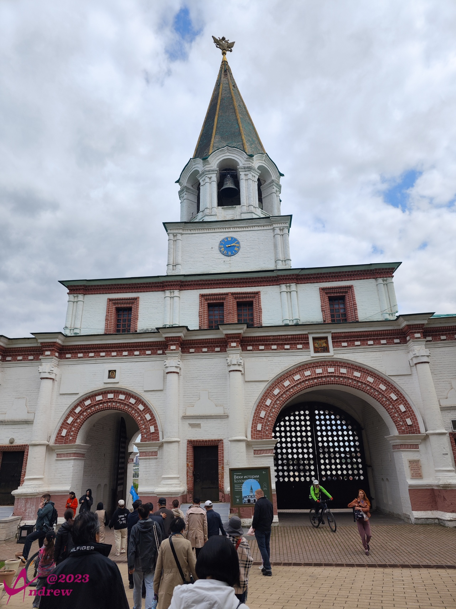
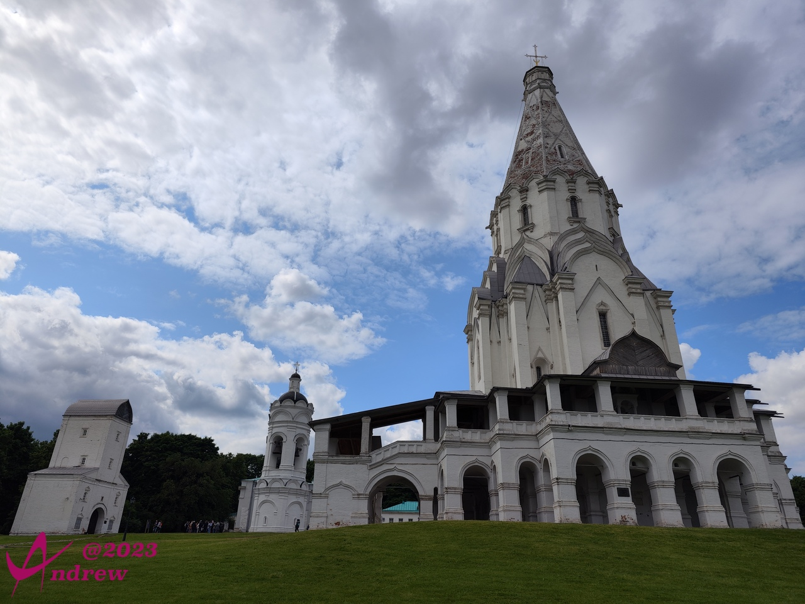
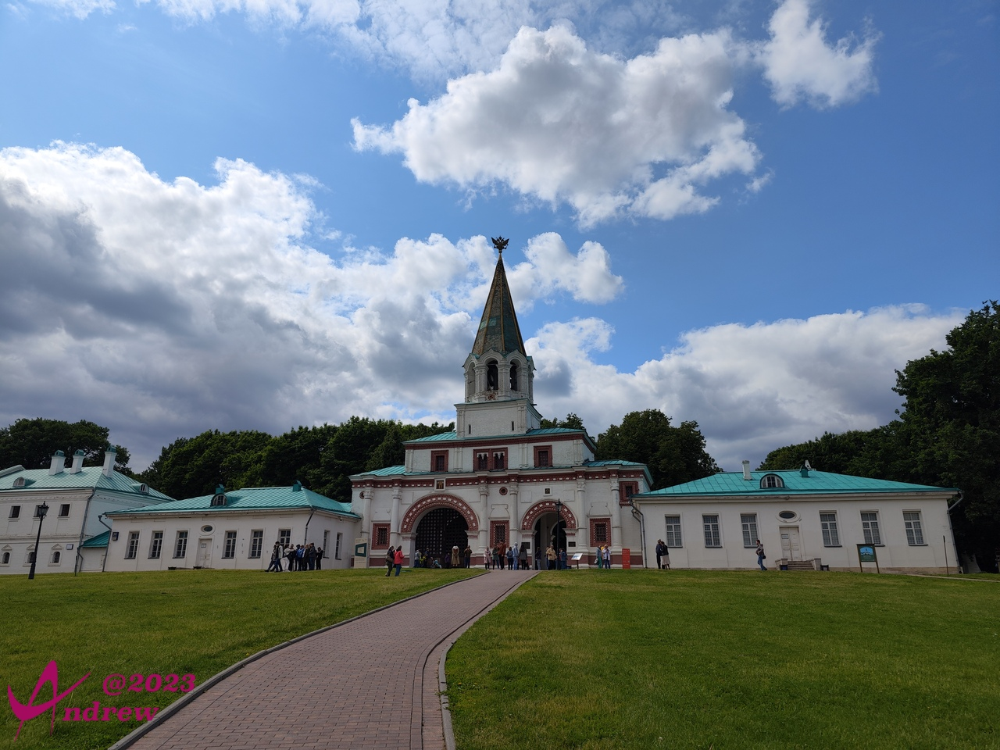
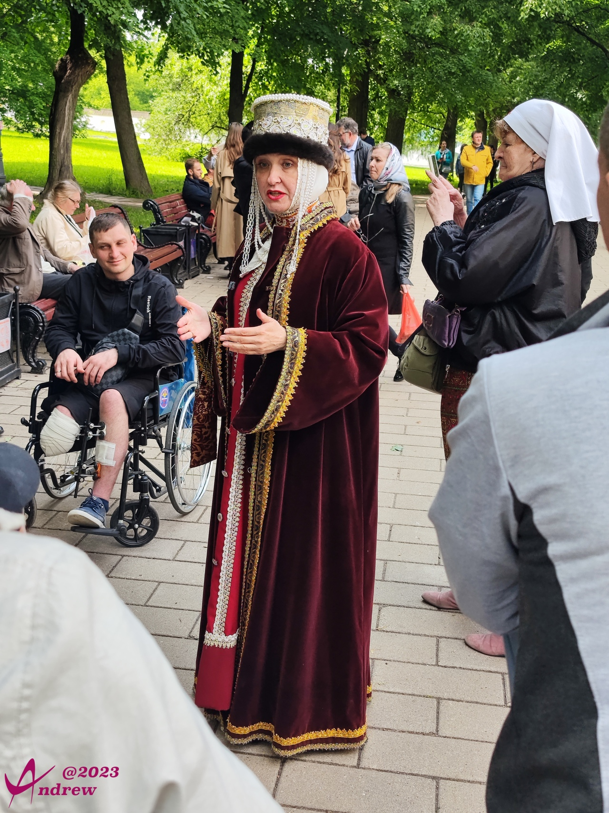
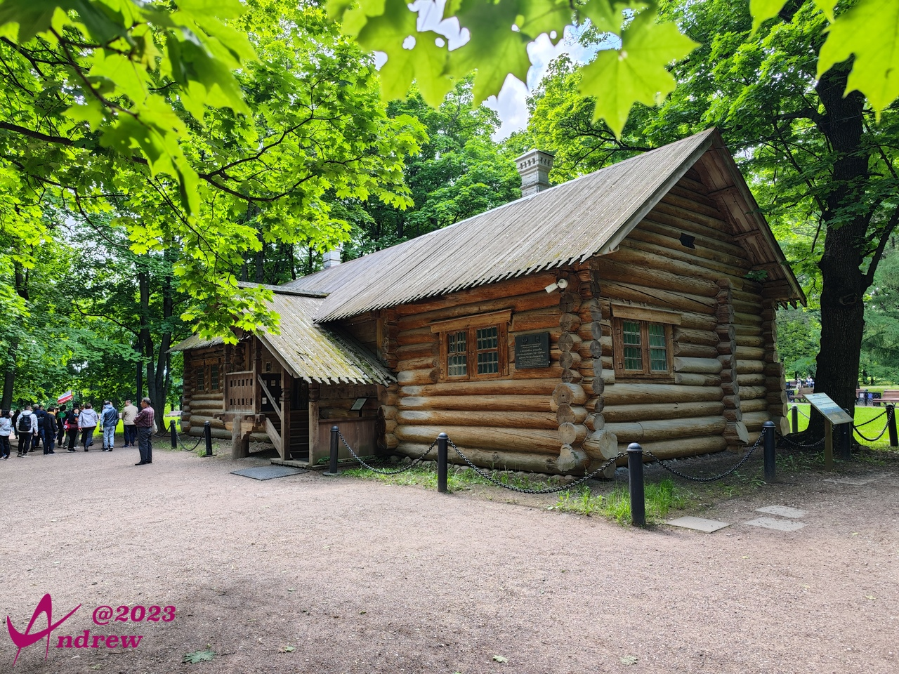
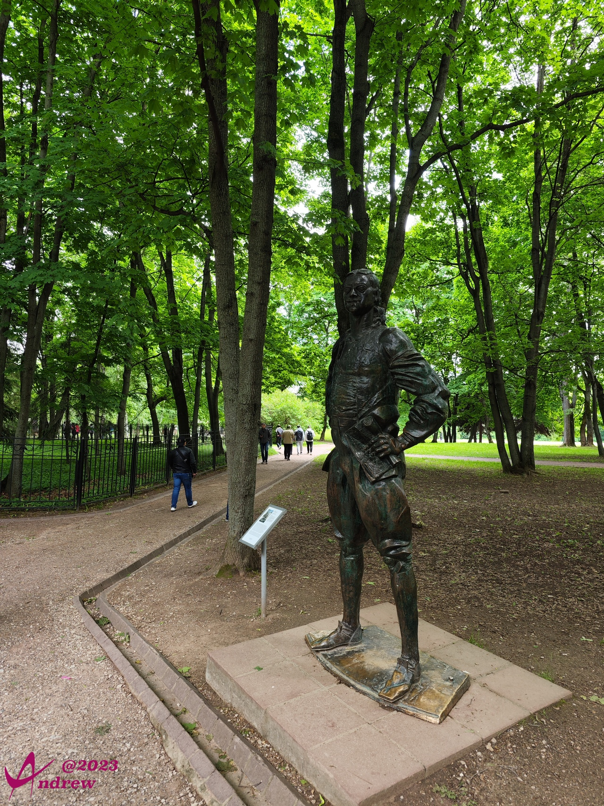
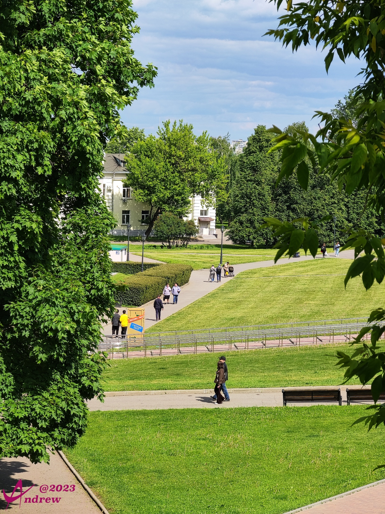

# 卡洛明斯克庄园
卡洛明斯克庄园是俄罗斯最美的庄园之一，位于莫斯科东南，坐落在莫斯科河畔，占地面积达345公顷。  
是沙皇时期的皇家别苑，14世纪时是莫斯科大伊凡王子和俄国沙皇的避暑山庄。从16世纪开始，很多帝皇，如伊凡雷帝、彼得大帝等都在这里修建过别墅。  
  

庄园里有很多14~17世纪建造的教堂和木质建筑，就像博物馆里的陈列品一样排列着。
  
  
  
  

沿着甬道绕过教堂，可以到达莫斯科河河畔。春天的风景秀丽宜人，是恋爱的好地方。  
  
看着男生手提的行李，似乎要远行的样子，希望不是去战场前的吻别。毕竟很多人嘴里说的再见，就是再也不见。  

庄园内的教堂都很香火鼎盛的样子，并且头一次见到了类似国内少林寺一样，根据蜡烛大小的不同，分别标价。在俄罗斯教堂内的祈祷，需要供奉香烛。就跟国内烧香意思一样。  
教堂前的小广场上，会有修女向善众布道。  
  

彼得大帝在1702年居住的房子，也称为“彼得小屋”，是从阿尔汉格里斯克（俄罗斯西北部的一座沿海城市）搬过来的。原样重建在丛林边缘。  
  
俄罗斯人民崇尚勇武，羡慕强者。作为俄罗斯第一大帝的彼得，这个起家的小房子，不时被游人光顾。  
  

庄园有面积巨大的草坪绿地，难得还保持的非常干净：  
<iframe width="100%" height="500" allowfullscreen style="border-style:none;margin-top:-20px;" src="./js/pannellum.htm#panorama=../imgs/Kolomenskoye.jpeg&amp;autoLoad=true"></iframe>

  

