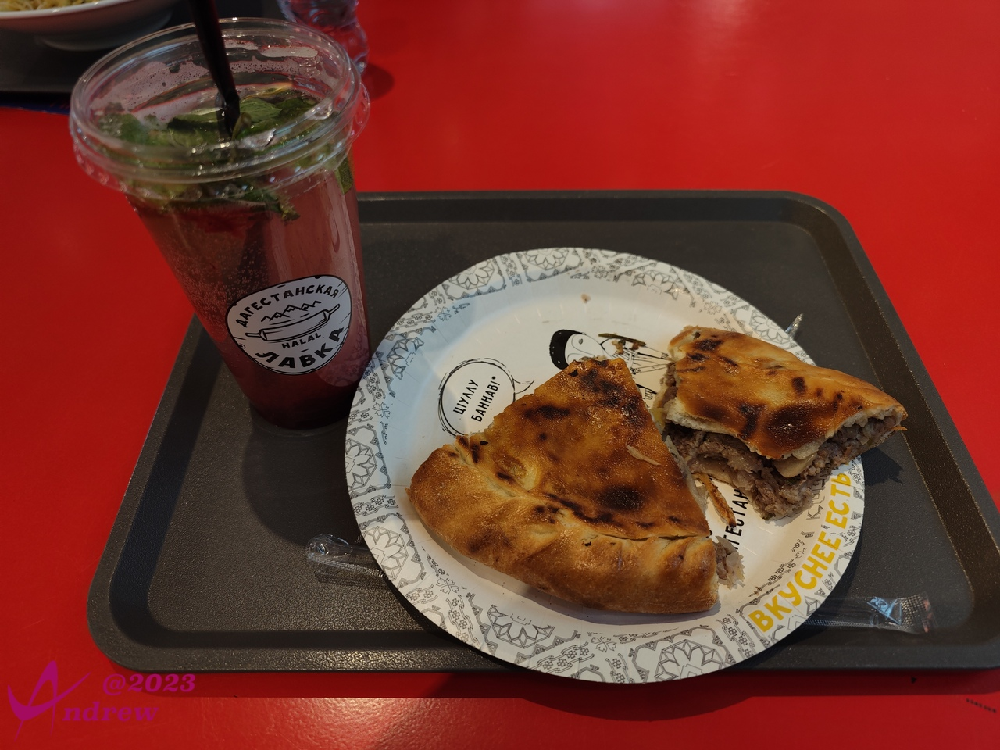
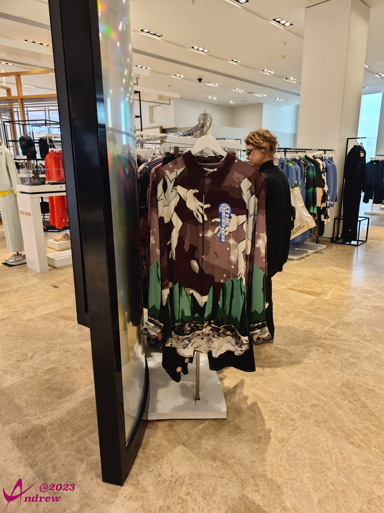
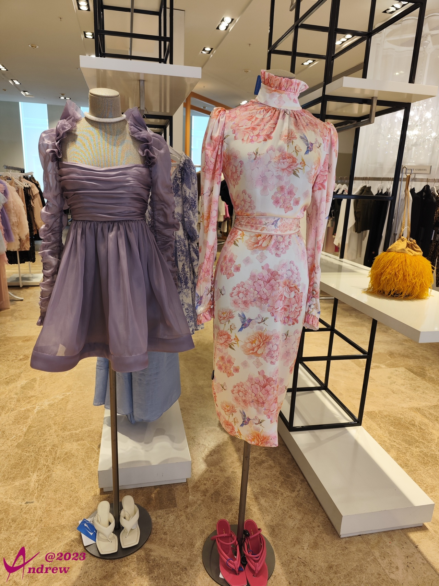
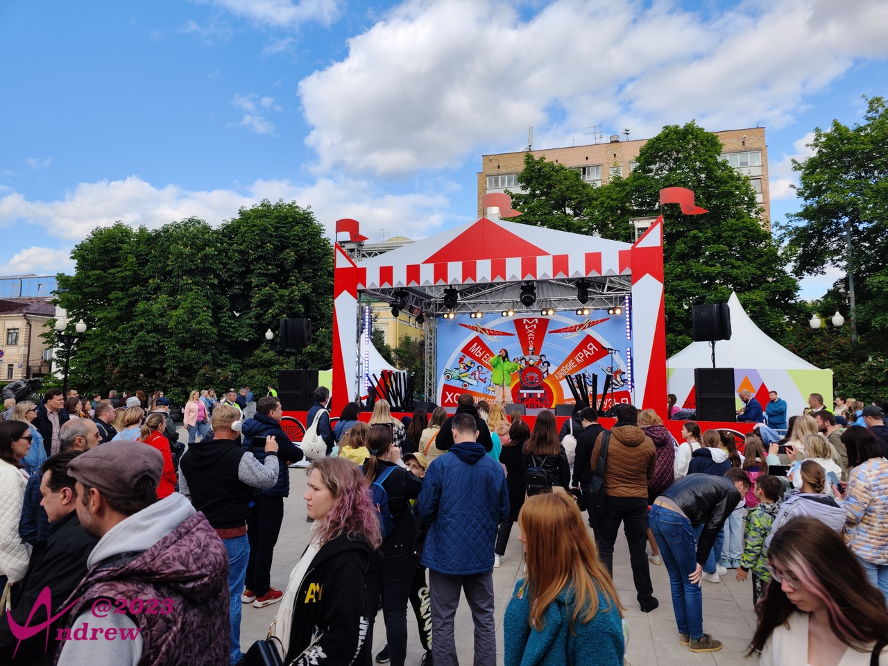
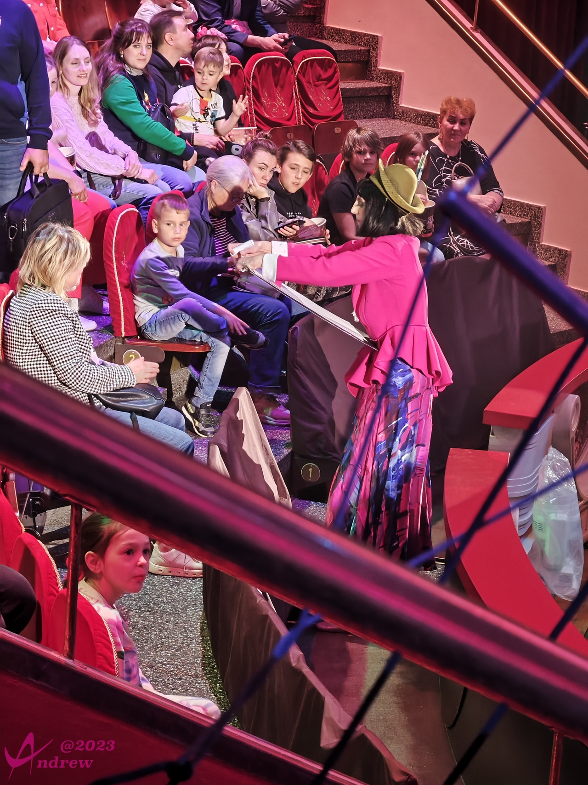
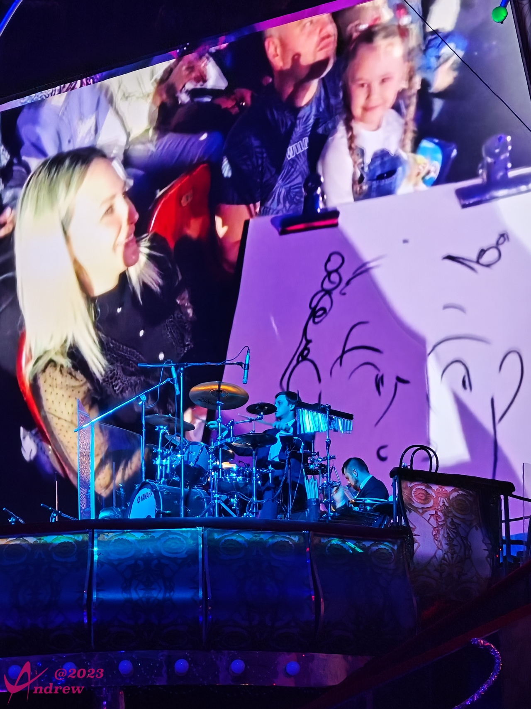
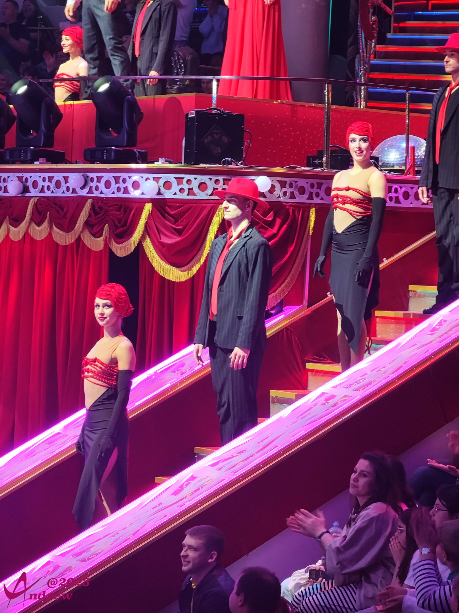
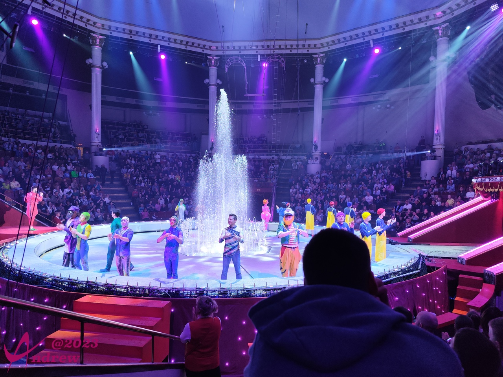
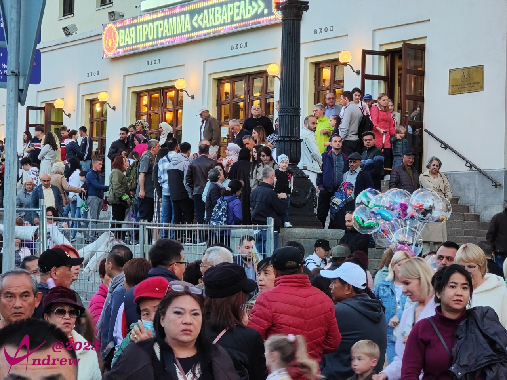

# 马戏表演

莫斯科著名的马戏团有两个，一个是国立大马戏团，还有一个是坐落于市中心的尼库林马戏团(Nikulin Circus)。  
其中后者交通方便，位于商业区。除了看马戏，也能满足逛街的爱好，因此比较受观众的追捧。这是说观众而不说游客，是因为莫斯科本地人扶老携幼来看马戏的人，远远多于外来游客，不是那种草台班子专骗游客钱的表演可比。  
马戏团晚间票的时间通常是当地时间下午六点。这个时间肯定是错过了晚餐，所以可以早一点到，在闹市区觅觅食。  
隔壁商场的顶层，跟大多商场一样，是美食中心。会有各种各样、来自各地的特色餐饮。想快的话，两角牛肉奶酪馅饼也可以饱餐一顿：  
  

吃完饭如果不到开场时间，在商场闲逛一下，也可以打发时间：  
  
  

男士通常是不爱逛店的。马路对面有一个街心公园，因为临近地铁站，人流涌动，会有很多小摊贩值得一看。如果是周末就更为热闹，通常都会有各种免费的表演。演员虽然大多是业余客串，但因为从小生长在俄罗斯这样的艺术国度，表演水平说得上非同一般。  
  
<video width='100%' controls>
    <source src='videos/VID_20230604_165125.dest.mp4' type='video/mp4'>
</video>
<video width='100%' controls>
    <source src='videos/VID_20230604_165513.dest.mp4' type='video/mp4'>
</video>

马戏表演通常由互动的暖场活动开始，本次是一个艺术家拿着画板出来，现场为小朋友做速写画像：  
  

艺术家头顶会戴着摄像头，实时把绘制结果投放在大屏幕上：  
  
大屏幕下面是乐队的位置，马戏团聘请了莫斯科国立交响乐团作为全程的伴奏乐队，水平很高，被当做卖点之一。  

马戏团舞台的设置是比较有创造力的亮点之一，结合了自动升降、音乐喷泉、高空悬吊等多种经典又结合现代化的功能，表演效果美轮美奂。剧场全景：  
<iframe width="100%" height="500" allowfullscreen style="border-style:none;margin-top:-20px;" src="./js/pannellum.htm#panorama=../imgs/circus.jpeg&amp;autoLoad=true"></iframe>

关于马戏表演，咳……全程是禁止拍照录像的。知道这个要求的时候，我大脑中首先浮现了冯德良的一句话：吃肉不吃蒜，香味儿减一半。  
不过规矩就是规矩，遵守还是必须的。只在表演开始前，以及最后谢幕的过程中，拍了几张聊胜于无。  
  
  
其实最后的照片我只是想让你看看全场的座位，已经是座无虚席。至于表演的内容，发挥想象力吧。  

马戏剧场外观，散场时刻，人是显得很多的：  
  
