# 彼得大帝夏宫花园 
占地面积四百多公顷的彼得大帝夏宫距离圣彼得堡约40公里，位于芬兰湾南岸，紧邻波罗的海。  
夏宫分为上花园和下花园，很可惜，上花园因为例行维修并没有开放。  

入口布满了卖旅游纪念品的小商铺，乍一看很有回到中国的感觉：  
  

进入夏宫也需要额外购票，可以一览建筑物内彼得大帝避暑期间日常起居的地方。排队等待进入的人也不算少：  
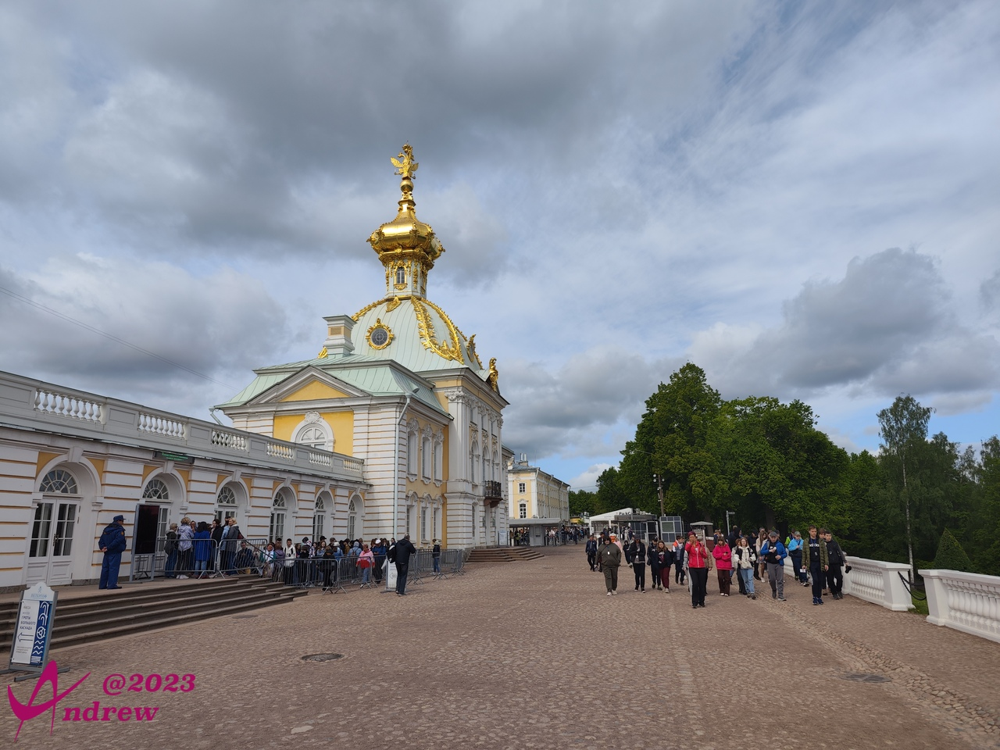  

夏宫下花园核心的大喷泉在整个欧洲的皇家园林中也十分著名：  
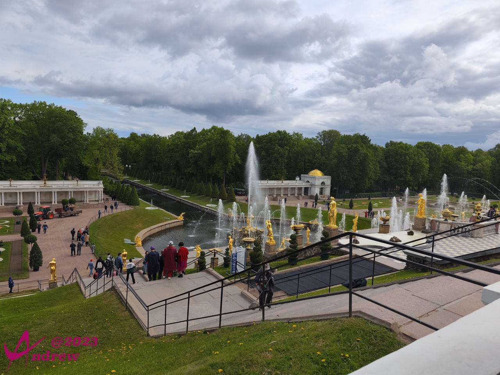  
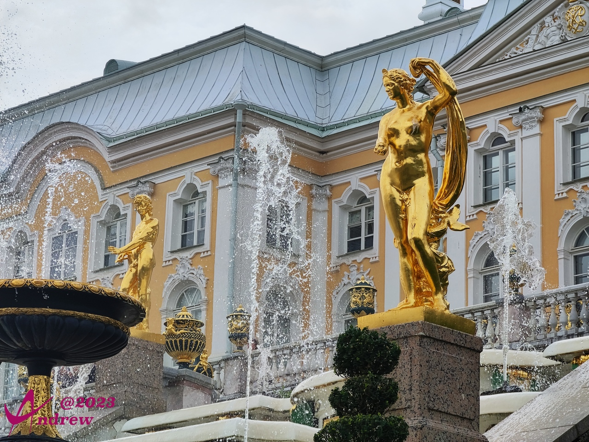  
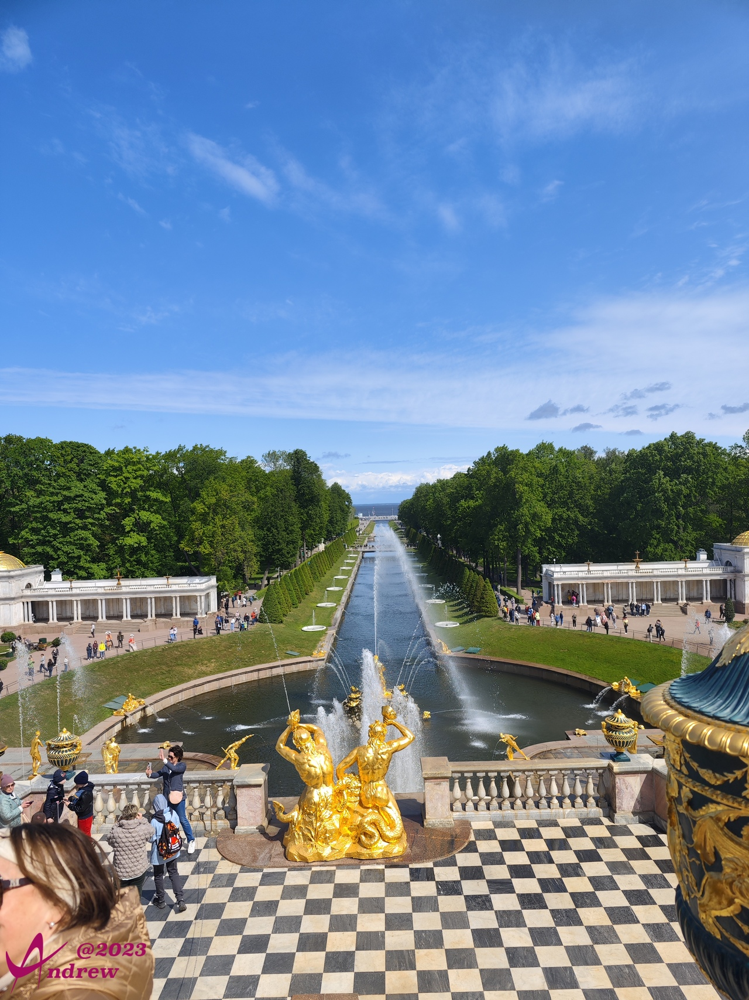  
<video width='100%' controls>
    <source src='videos/VID_20230601_101037.dest.mp4' type='video/mp4'>
</video>

沿运河直走到头就是波罗的海，小码头不大，有水翼船可以由水路返回圣彼得堡市区。  
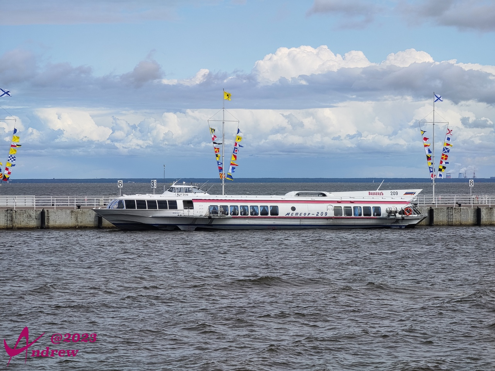  

下面的全景图是在海边所拍摄，一边是皇家园林，一边是波罗的海风光。皇家的奢华非我等可以想象。  
<iframe width="100%" height="500" allowfullscreen style="border-style:none;margin-top:-20px;" src="./js/pannellum.htm#panorama=../imgs/summerPalace.jpeg&amp;autoLoad=true"></iframe>

夏宫的地面采用了红色碎石屑铺幔在表层。俄罗斯的其它园林也多是同样的设计。其实很多国家都有类似的设计，比如日本的枯山水造园（原从中国宋朝流传至日本）。我做了认真的考证，发现实际上这是非常实用的一种方式。可以让降雨快速的渗透，不会积水。降雨也能快速补充进地下水源。  
反观我国很多广场地面采用沥青、水泥、大理石等材料，降雨只能流入下水道，当做污水排放完全浪费掉。地下水常年得不到补充，多个城市发生沉降。好在海绵城市的说法，已经受到越来越多人的重视。  

夏宫园林内的建筑：  
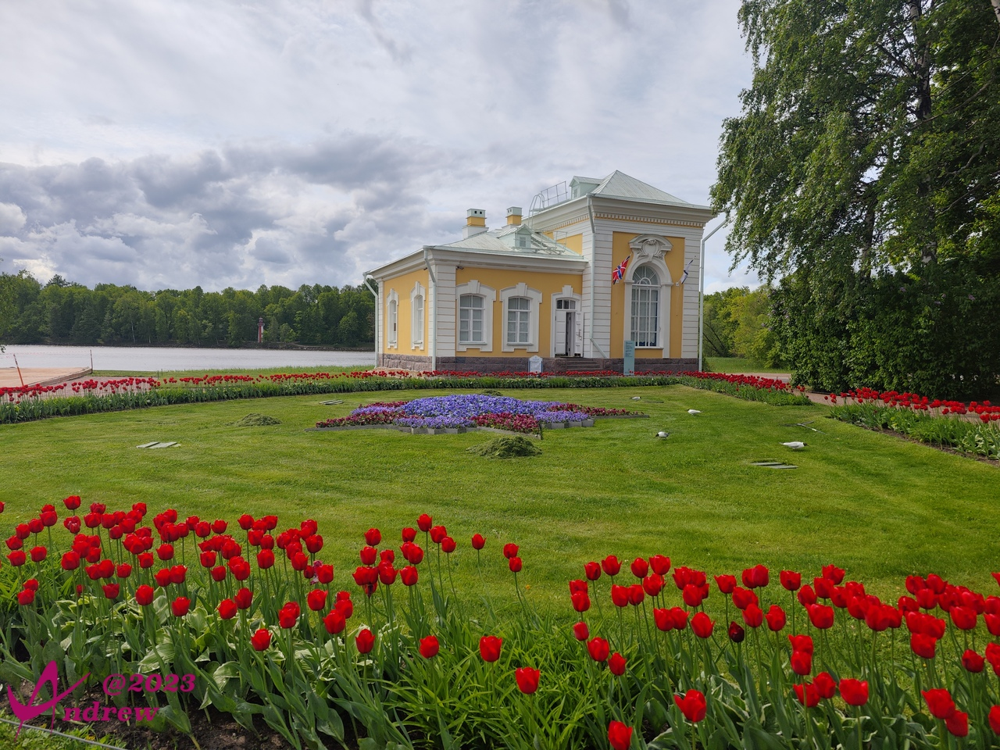  
  
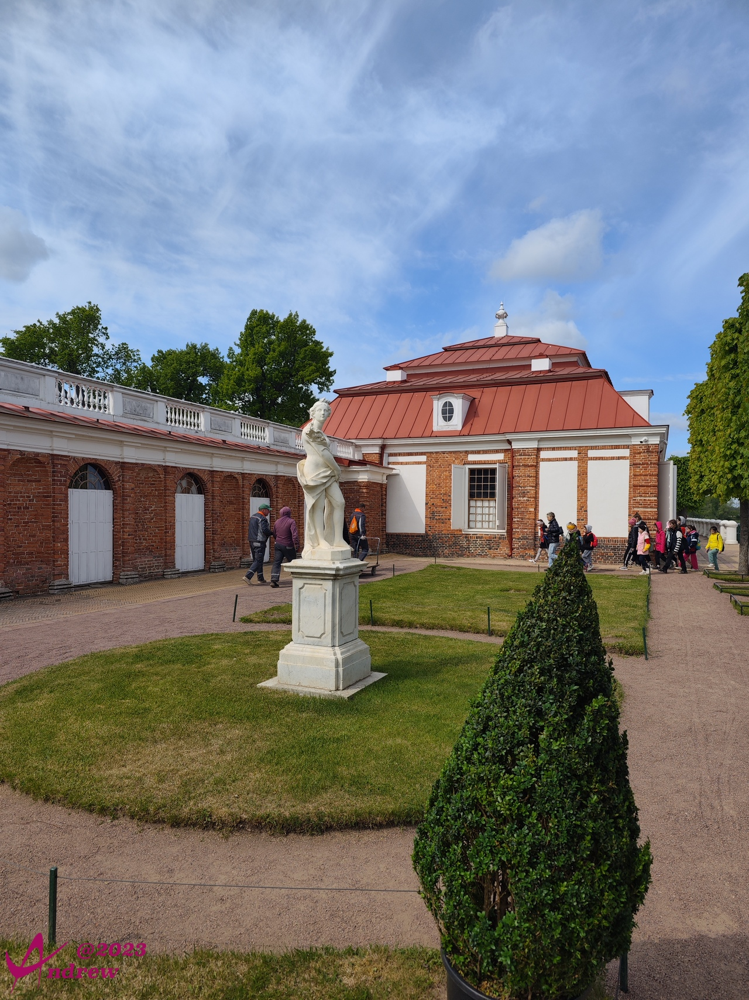  
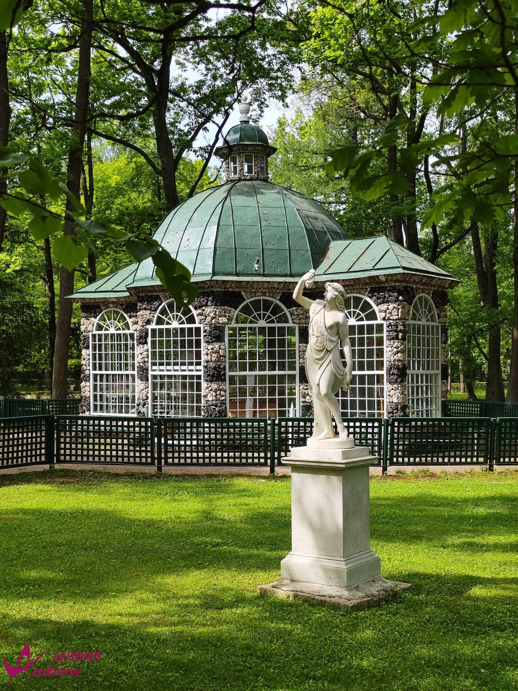  
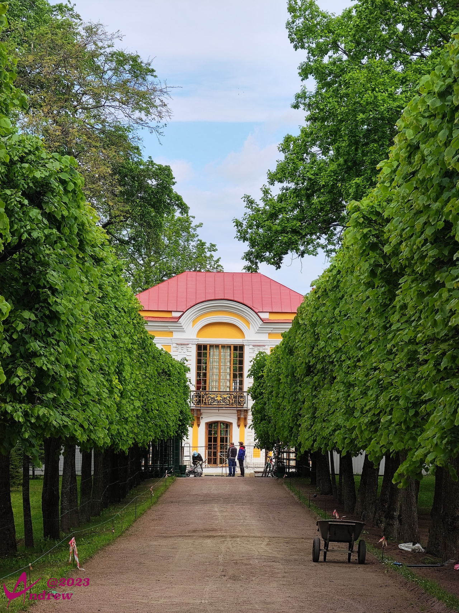  

园林的设计以迷宫型的绿植造型和喷泉有机结合为主要形式：  
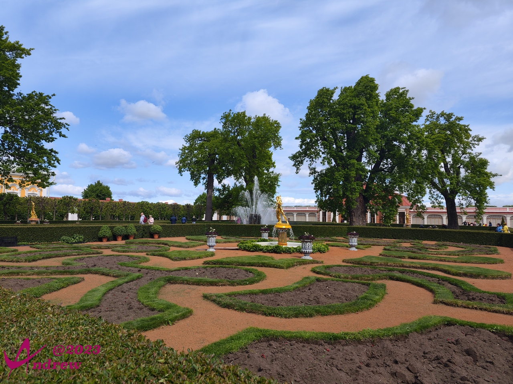  
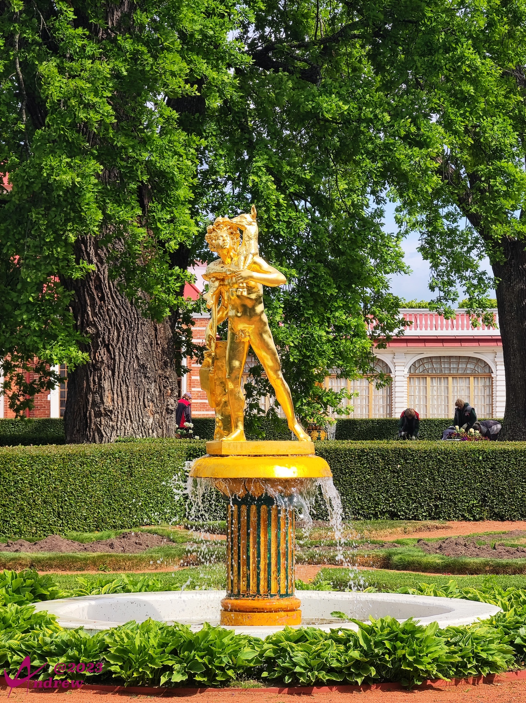  
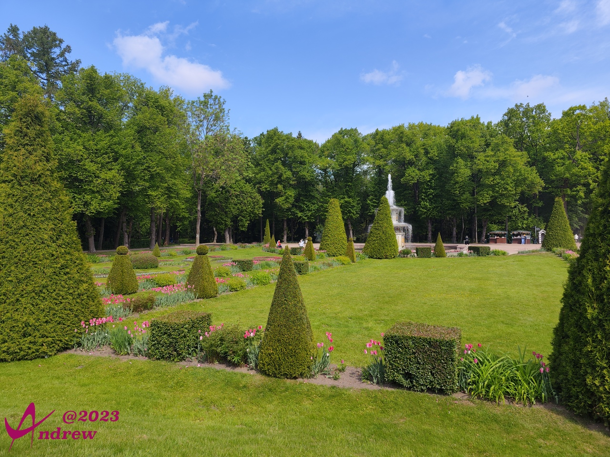  

夏宫主楼：  
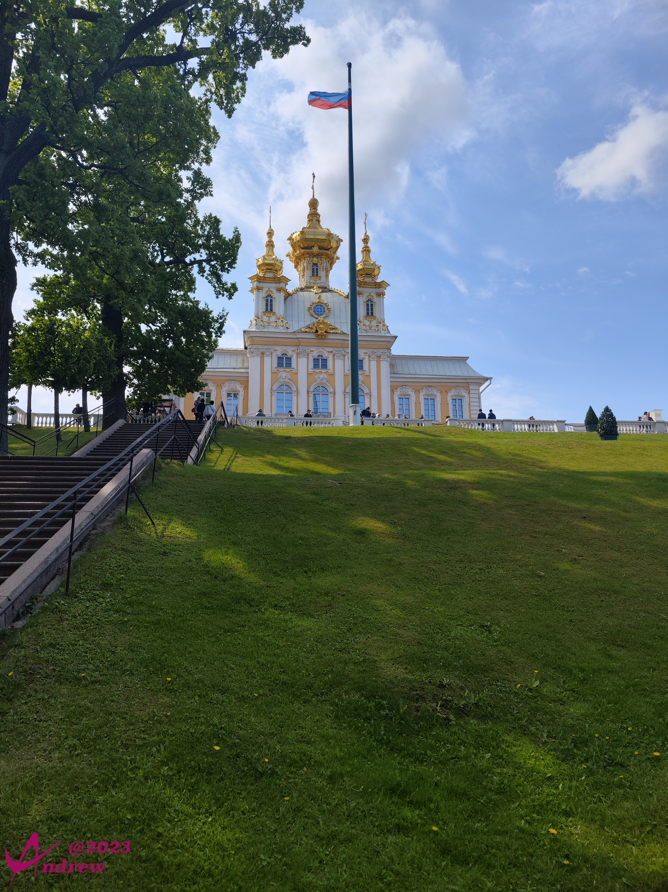  

因为彼得大帝在海边夏宫的修建，附近的土地也快速升值。很多贵族在此修建度假别墅。普京总统也曾在下图的度假别墅中短住，别墅原主人的名字我没记住，俄国人的名字对于我来说太过聱牙拗口。但楼顶的三色国旗说明建筑当前已经属于国有：  
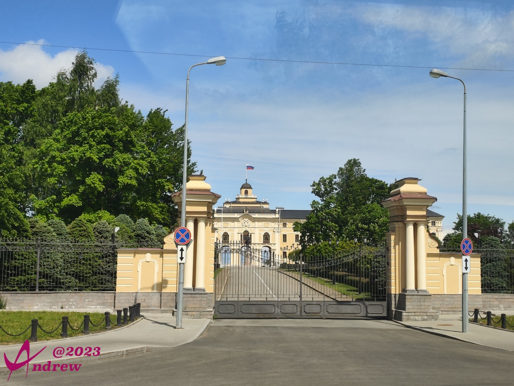  
