# 伊萨基辅大教堂 
伊萨基辅大教堂，又称圣伊撒基耶夫大教堂，坐落在圣彼得堡市区（也译圣埃萨大教堂），曾是圣彼得堡市的最高建筑，也是圣彼得堡的标志性建筑。  
与梵蒂冈的圣彼得大教堂、伦敦的圣保罗大教堂和佛罗伦萨的花之圣母大教堂并称为世界四大圆顶教堂。  
因为教堂位置正是市区交通要道，周边车流密集，经常拥堵。  
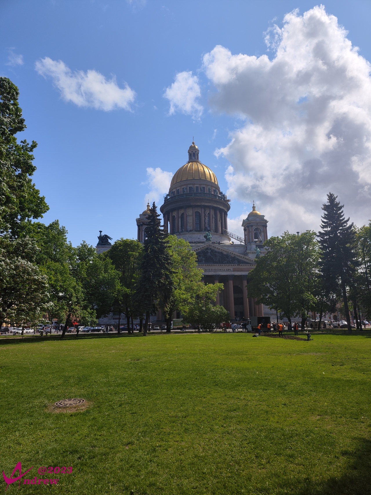  
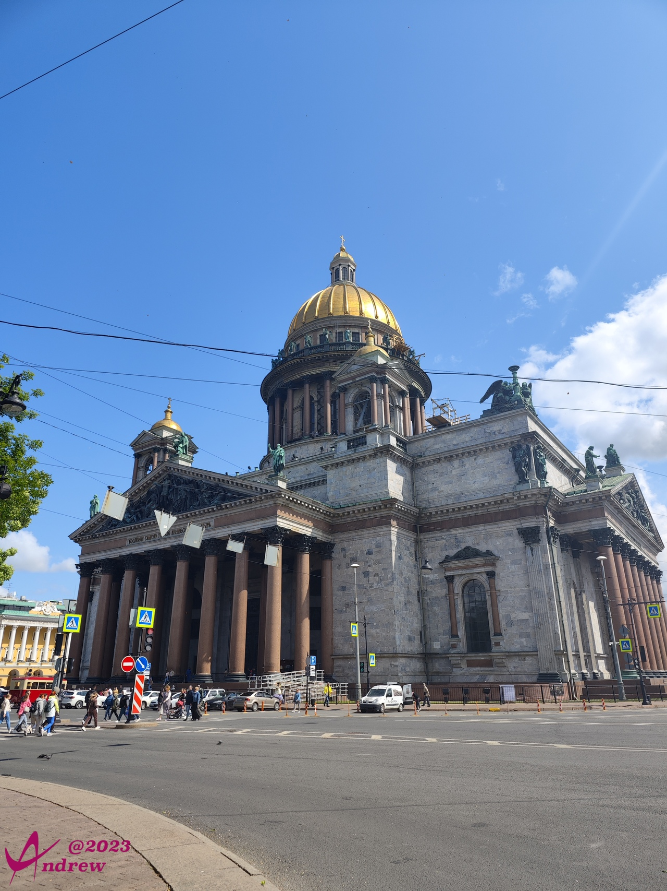  
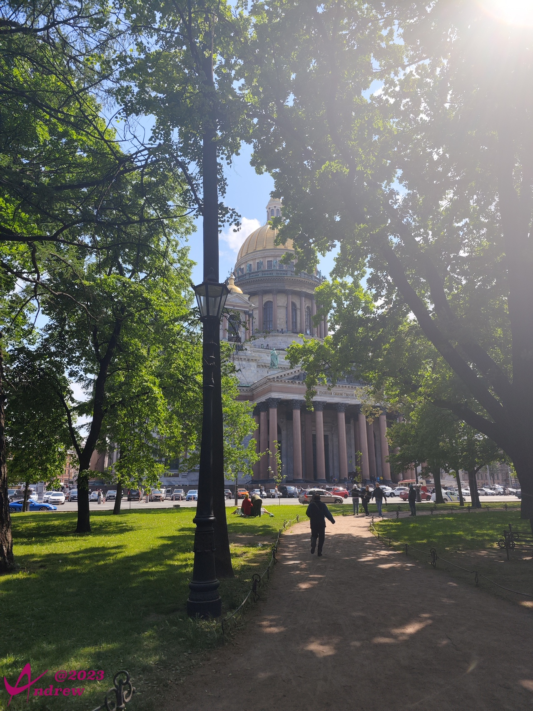  

因为教堂非常宏伟，实际上坐车、乘船，在很远处就能见到教堂的金顶：  
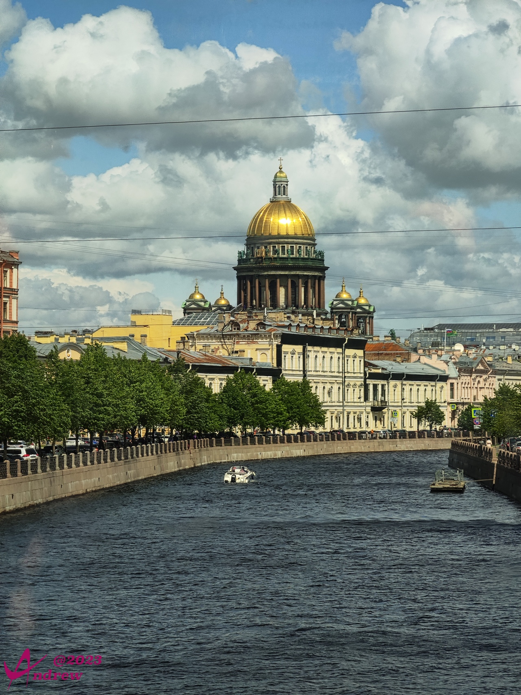  

每天来教堂的参观者众多，周边很多专门做游客生意的人，比如童话故事般的古典马车，比如遍身金粉的雕塑人：  
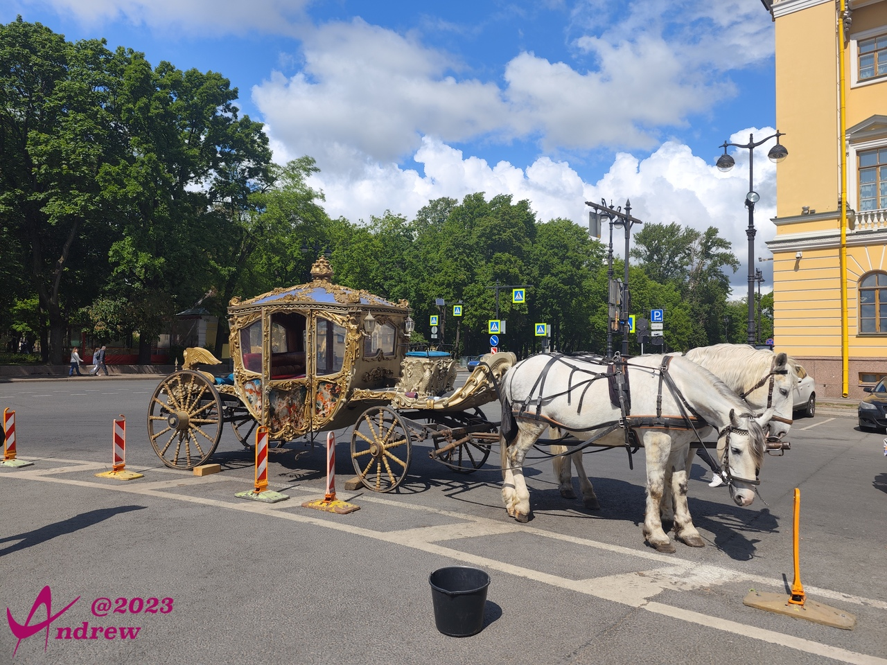  
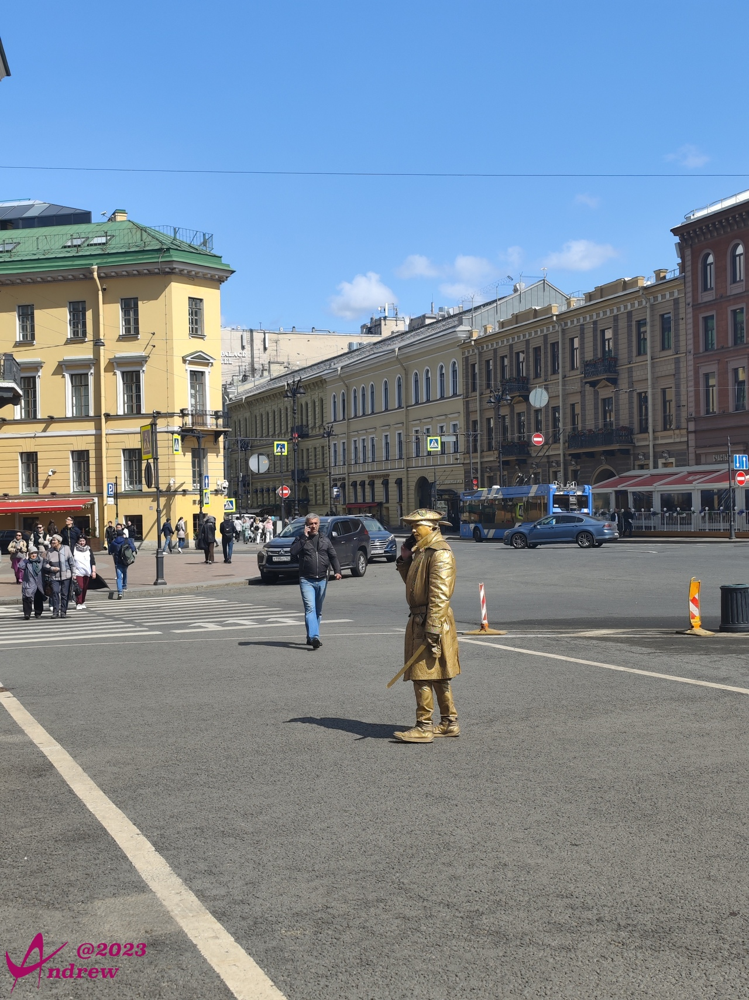  

教堂的修建当然一如既往的华丽而精致：  
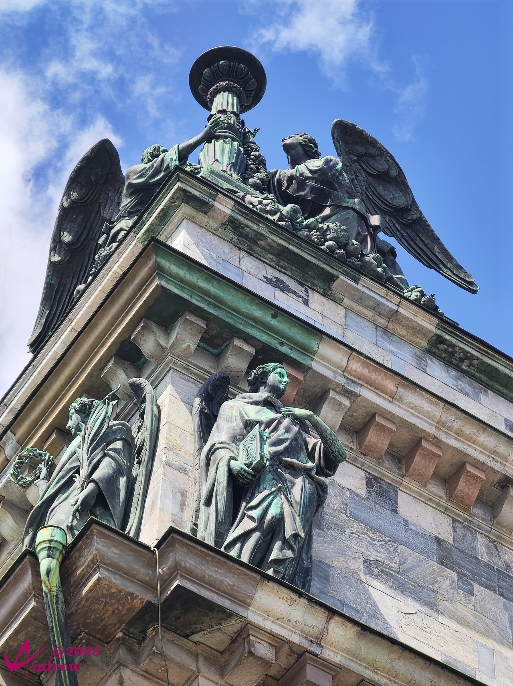  
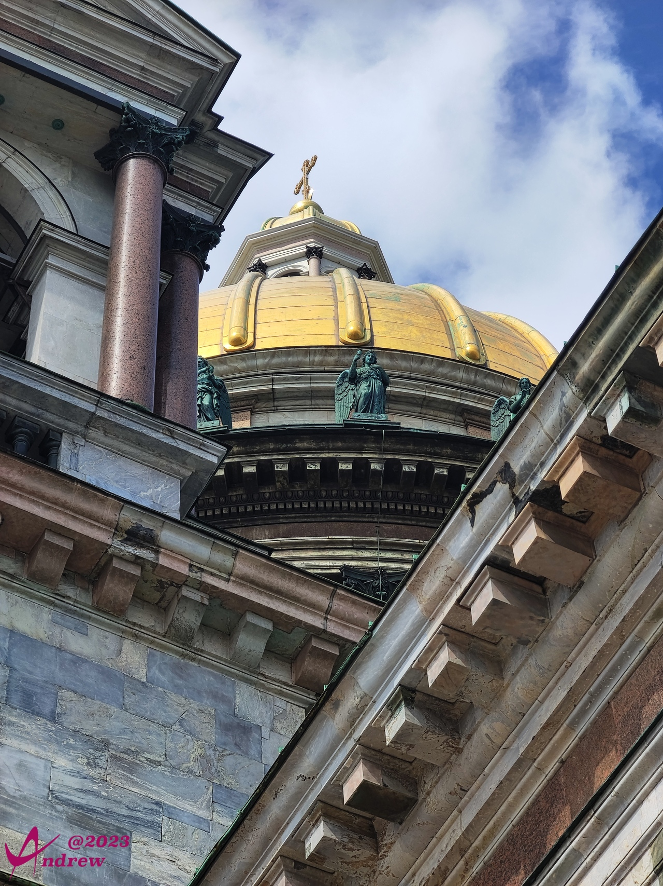  

因为教堂同圣彼得堡市一起，在卫国战争中挺过了长达900多天的列宁格勒保卫战。建筑本身被大量损坏，战后的修复中，政府保留了损害最轻的一面原样不动。至今大门、柱子上，仍能看到弹片的痕迹。  
  

教堂对面的街心公园中鲜花盛开：  
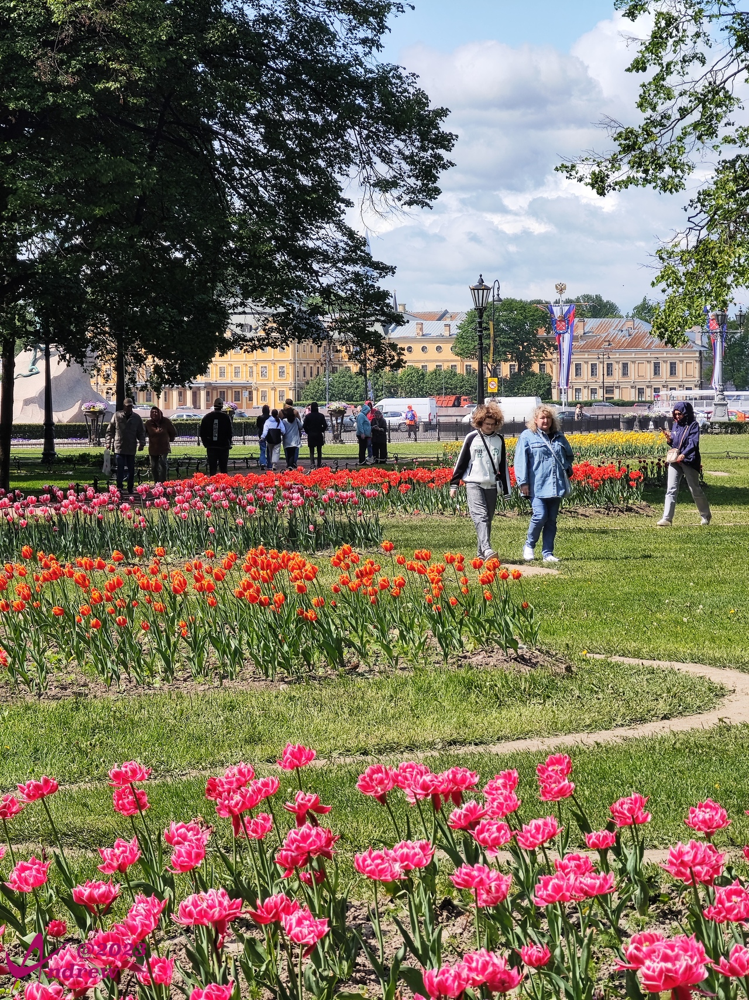  

公园内靠近涅瓦河边一侧有一座著名的彼得大帝青铜骑士像，用以展示彼得大帝的勇武：  
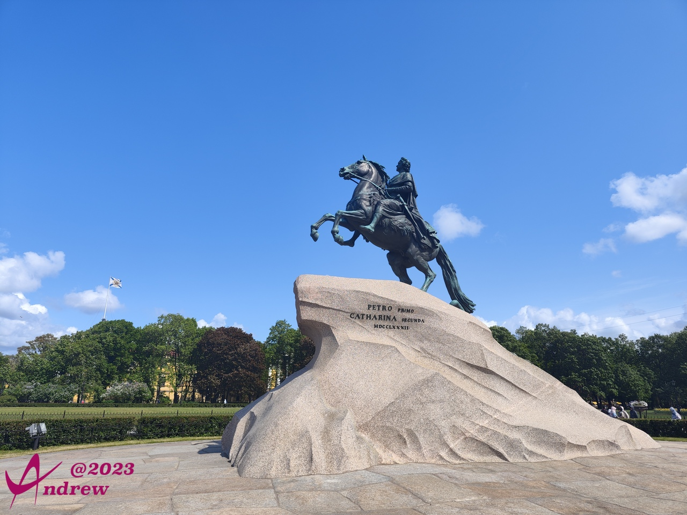  

雕像一侧对面，是俄罗斯陆军总部办公大楼：  
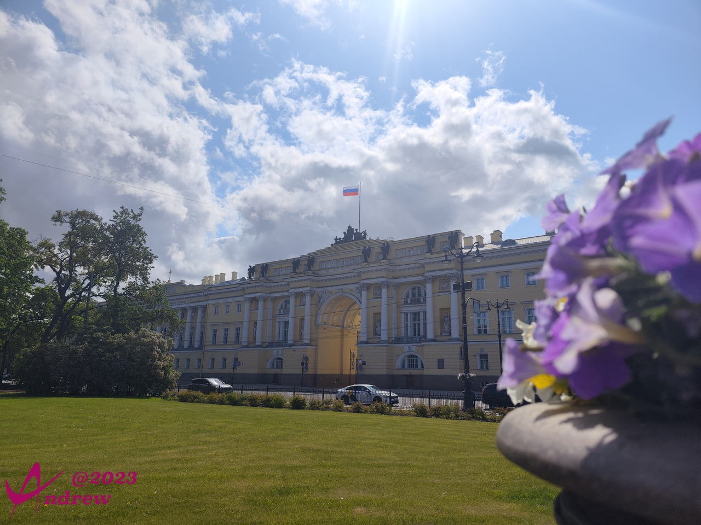  
