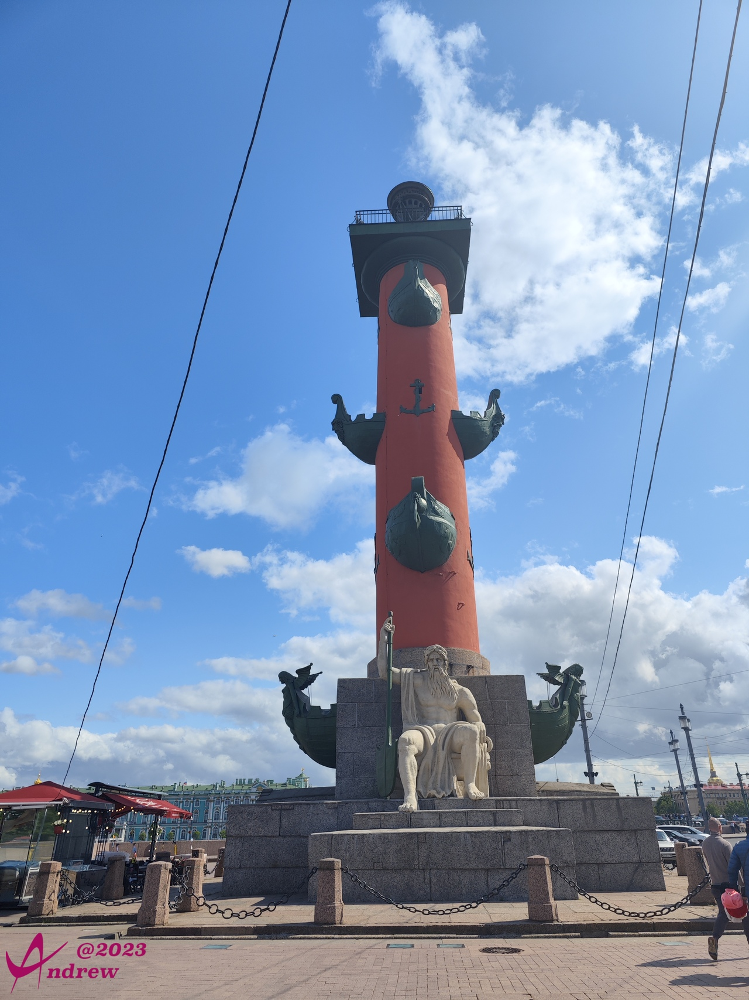
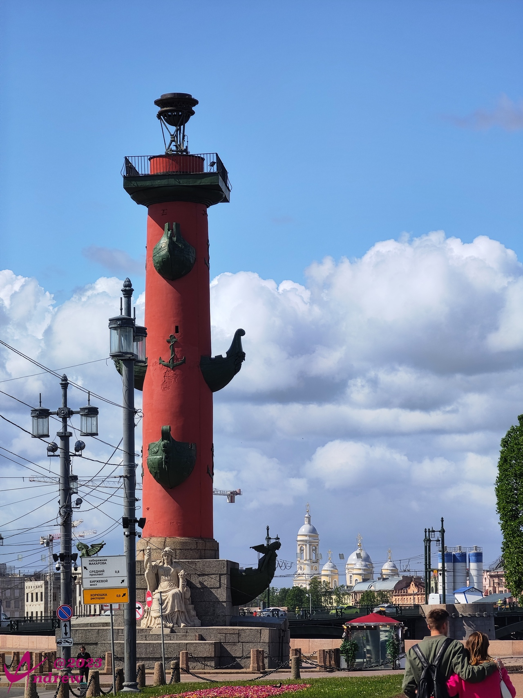
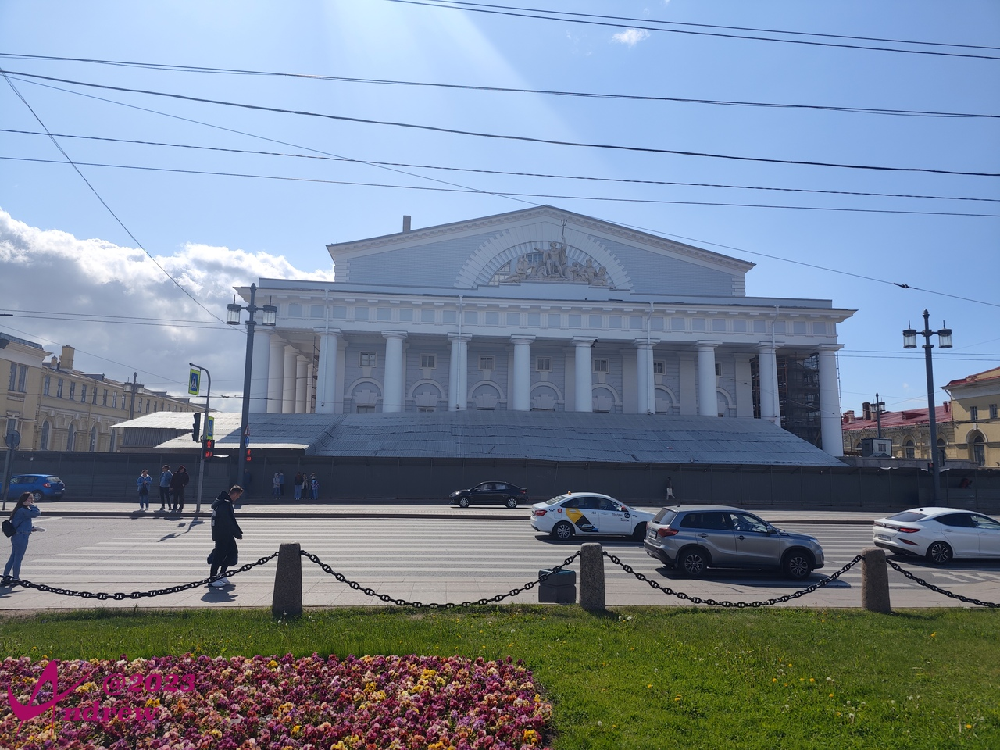
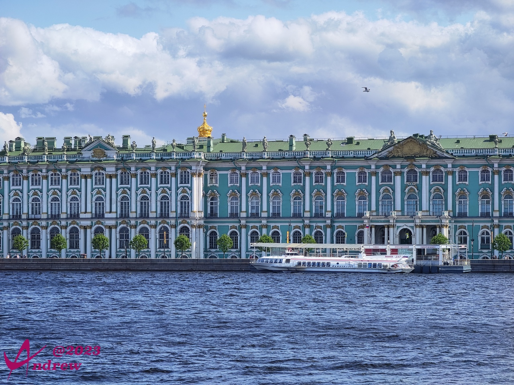
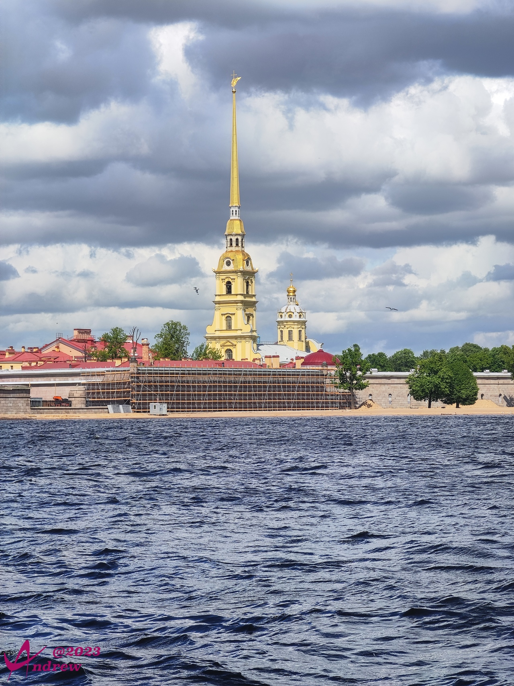
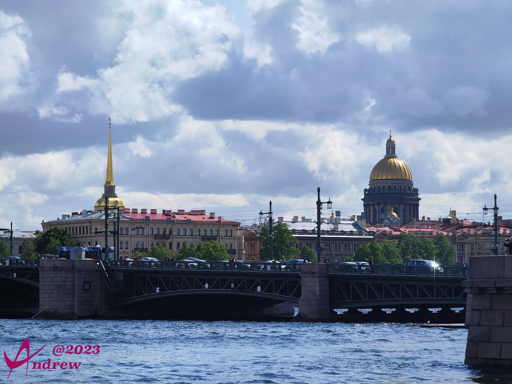

# 圣彼得堡海神柱
海神柱原来就是灯塔，两个海神柱坐落于海神交易所门前海边，塔顶的长明灯指引着来自欧洲的商船不迷失方向。  
  
  

海神交易所曾是波罗的海沿岸最大的商品交易所之一，俄罗斯的矿产、宝石由此销往欧洲：  
  

海神柱旁边有斜坡可以下到涅瓦河边，眺望沿河而建的冬宫：  
  

彼得堡罗要塞也清晰可见：  
  

还有刚刚见过的圣伊撒基耶夫大教堂金顶：  
  
