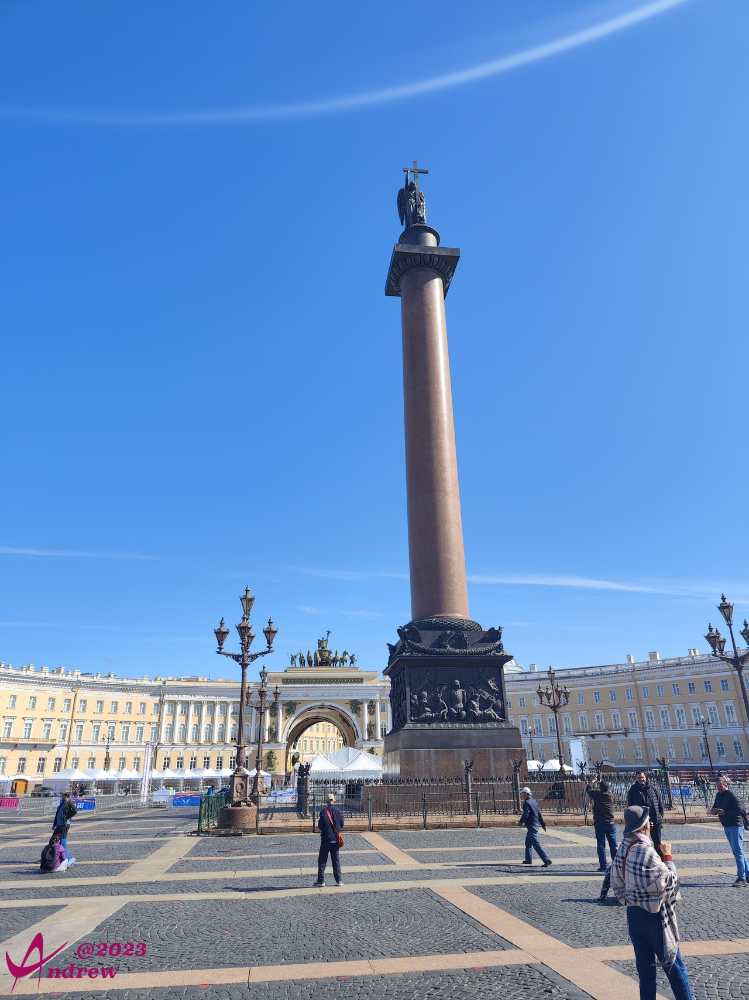
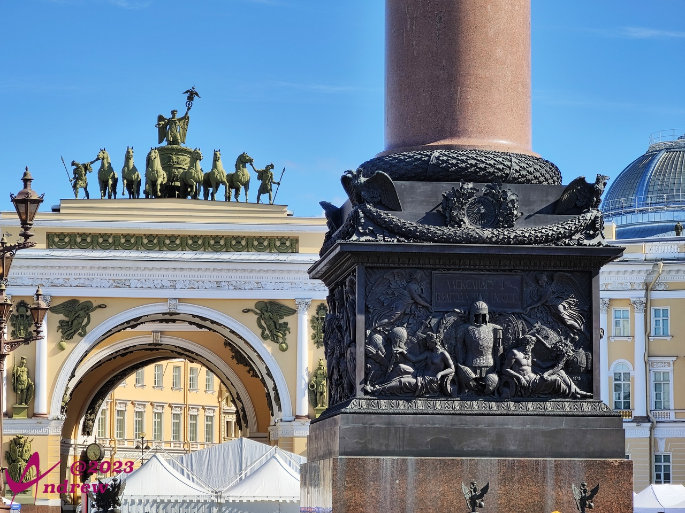
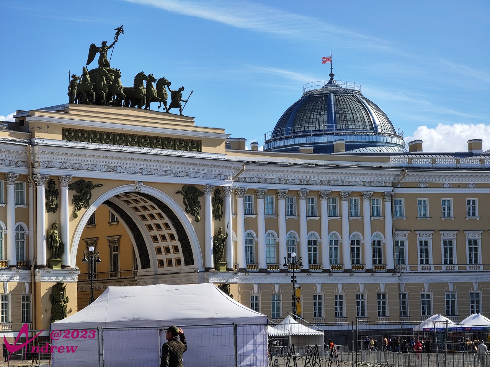
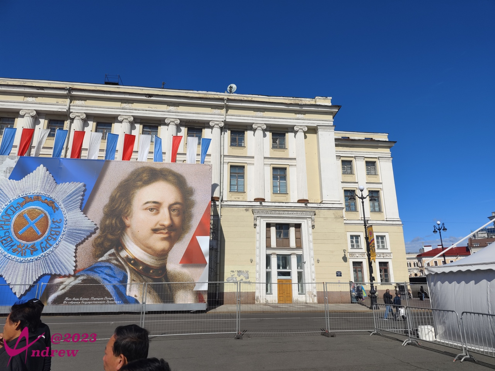
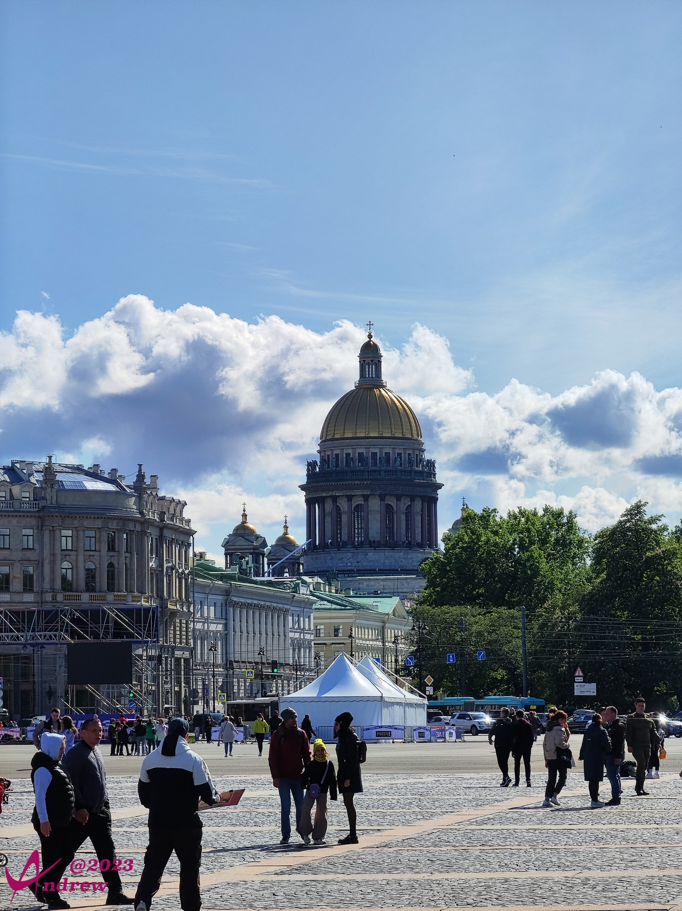
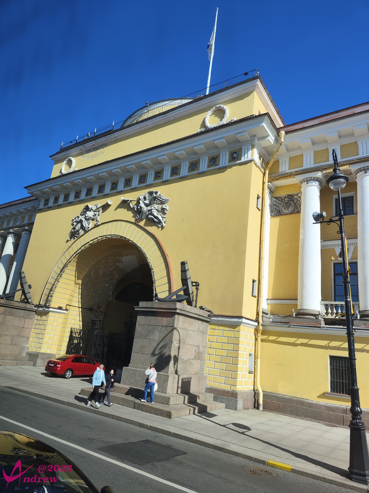
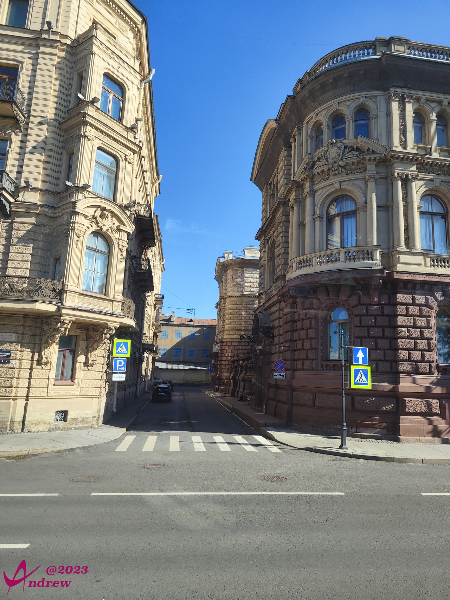

# 亚历山大柱和冬宫广场
上一篇图片太多了，还有至少2倍的照片忍痛舍弃。  
即便这样，为了网络流量，也没敢放视频和全景照。  
所以虽然是同一个游览行程，冬宫广场和位于广场中央的亚历山大柱还是单独开一篇。  

亚历山大柱是1834年沙皇亚历山大为了纪念1812年俄法战争胜利而修建的。大理石柱青铜底座的浮雕代表着荣誉，光辉和胜利。  
  
石柱高35米，净重600吨，是一块完整的大理石。在建造的过程中，没有开挖地基。大理石柱、底座和顶端的青铜天使像间也没有任何支撑点，完全靠重力保持不倒。算的上是建筑史上的一个奇迹。  
嗯，运气也是奇迹的一部分。自建成至今，圣彼得堡没有发生过一次地震。  
  

亚历山大柱后面黄白相间的建筑是俄罗斯总参谋部大楼，楼顶的胜利女神像用来保佑俄军战无不胜：  
  

广场一角，圣彼得堡建立320周年的庆典活动舞台还没有拆除。背景画像上是圣彼得堡的缔造者彼得大帝。右侧的路灯灯杆上依稀可见320周年字样的宣传画。这样的宣传画全市街道随处可见。  
  

远处依然是几乎在全城都能看到的伊萨基辅大教堂的紫金穹顶：  
  

冬宫广场的全景照片：  
<iframe width="100%" height="500" allowfullscreen style="border-style:none;margin-top:-20px;" src="./js/pannellum.htm#panorama=../imgs/winterSquare.jpeg&amp;autoLoad=true"></iframe>

俄罗斯海军总部大楼离冬宫广场隔着一条街。照片中是侧门，时间关系，没有绕道正门拍摄。  
  

冬宫一带的建筑，或者说市中心涅瓦河主干两岸，自古就是重要国家建筑或权贵豪宅，墙体装饰繁复华贵。当然即便在现代，这样的建筑也非同一般。照片中左侧的楼属于列宾美院。懂行的都知道，这是俄罗斯排名第一、世界排名第二的高等艺术学府。至于为什么没有拍到门口...我坐在车上，从发现，到取出手机快速拍摄，能拍到个边算的上反应快了...  
  
做个比较，中国中央美院全球排名第十；清华大学美术学院世界排名十九。  

