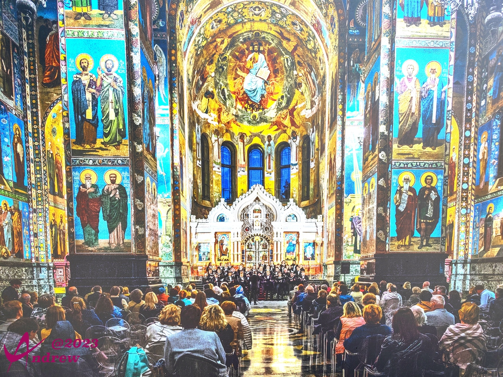
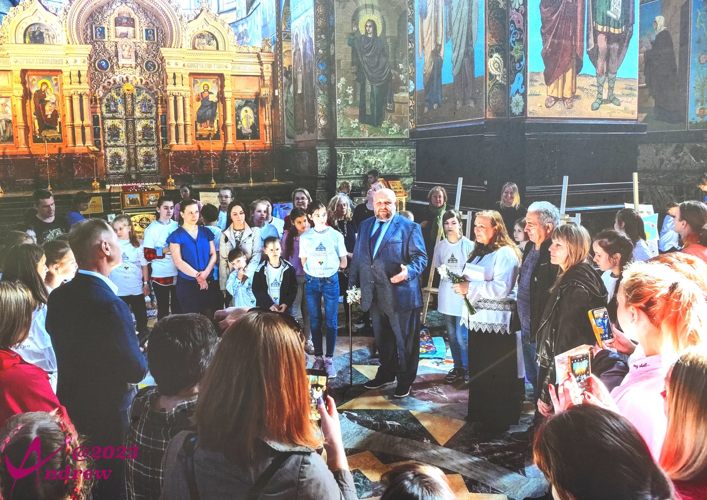
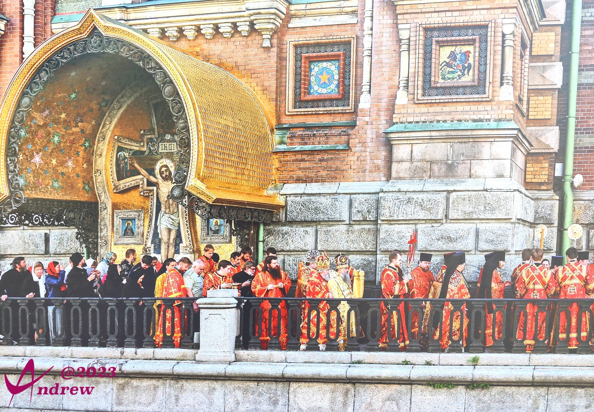
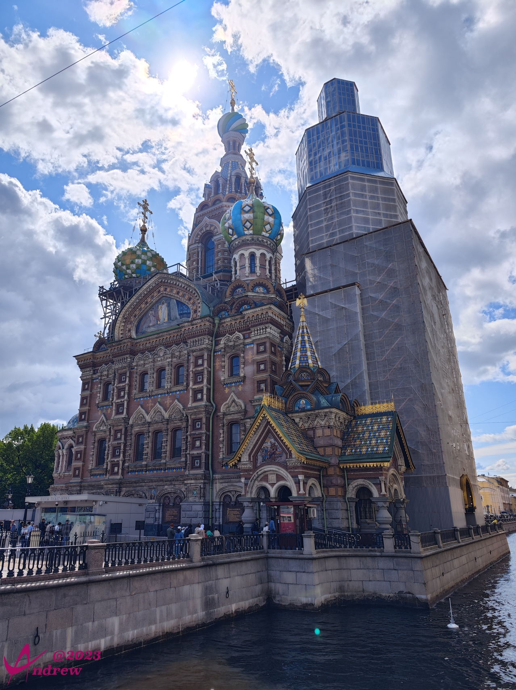
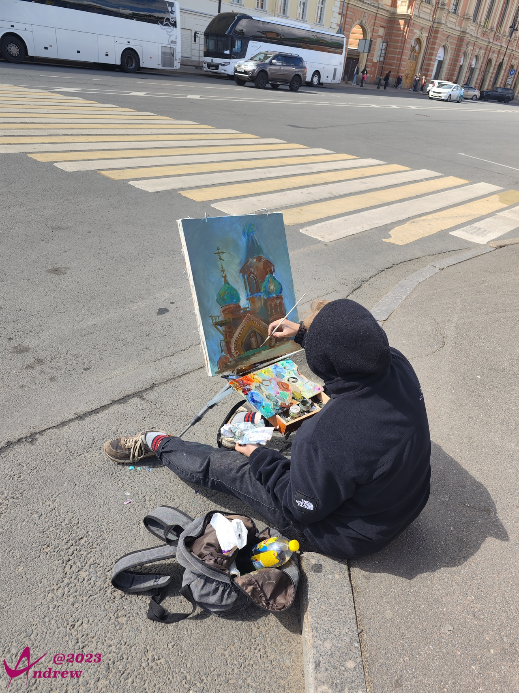
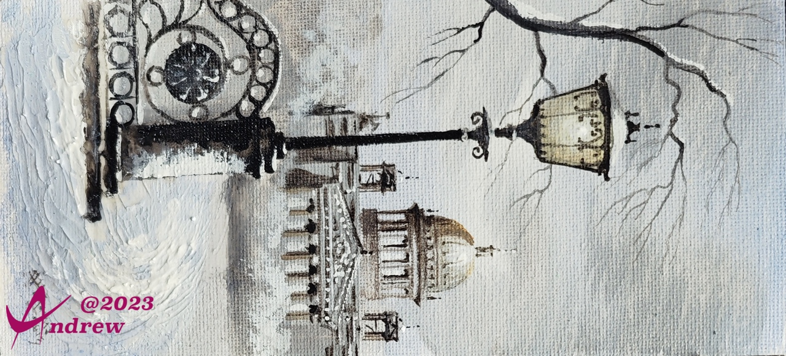
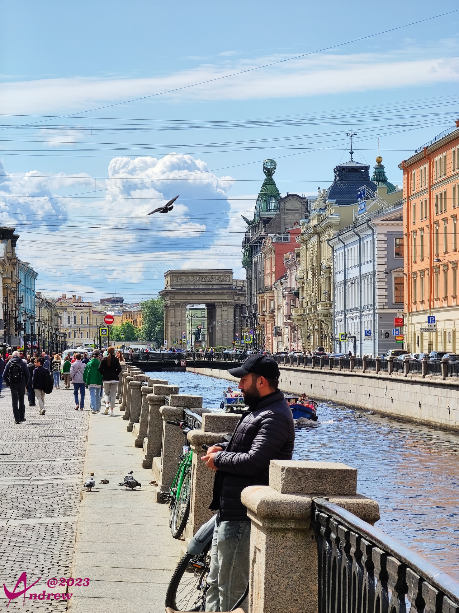
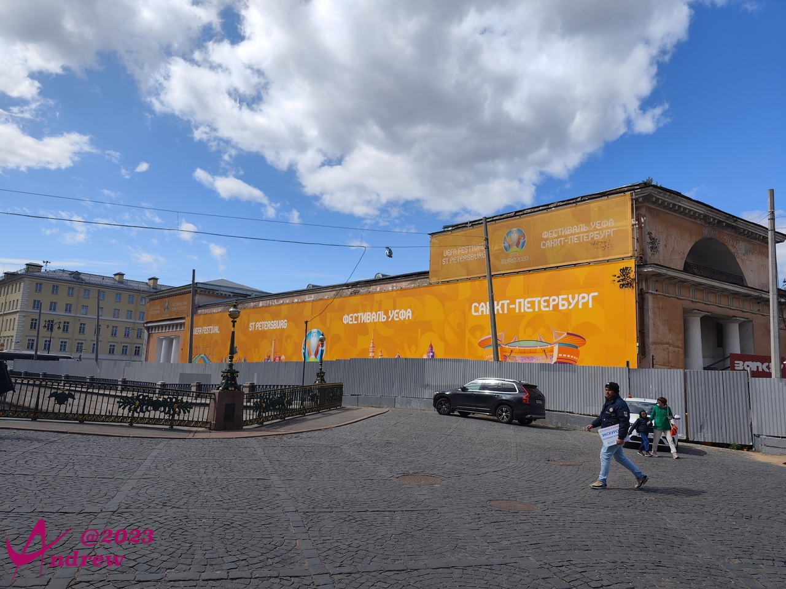

# 基督复活大教堂
基督复活大教堂通常被称为“滴血救世主大教堂”。是1883年，亚历山大三世为纪念被刺杀的亡父在此地点修建。工程进展缓慢，直到1907年尼古拉二世在位时期才最终完成。1881年3月13日，亚历山大二世的马车通过格里博耶多夫运河河堤时，被一个无政府主义者的炸弹炸伤，送回冬宫紧急抢救几个小时后宣告死亡。  
暗杀发生现场的一段街道被封闭在教堂的墙内，因此该段堤防延伸到运河中。在内部，在亚历山大遇刺的精确地点设计了一个祭坛，装饰以黄玉、琉璃和其他宝石。沙皇的血从简单的鹅卵石中溢出，溅到地板上，与周围与极为丰富的装饰形成鲜明对照。“滴血救世主大教堂”的俗称由此而来。  
祭坛的位置，据介绍就在照片中，门前的位置。第二幅照片中能看得很清楚。  
  
  

滴血救世主大教堂从未充当公众礼拜场所，只是专门用来纪念被暗杀的皇帝，和举行东正教的追思礼拜。也曾当做马赛克博物馆。现在则是圣彼得堡重要的旅游景点。  
  
因为没有能入内参观，以上三张照片，翻拍自教堂的馆藏介绍，细微偏色难以避免。  

教堂的外观极为宏伟，且风格迥异于圣彼得堡的其他教堂。形式上类似中世纪俄罗斯建筑，看起来像17世纪的雅罗斯拉夫尔教堂和前面介绍过的莫斯科红场瓦西里升天大教堂。滴血大教堂内有7500平方米的马赛克——超过世界上任何其它教堂。  
照片中，大教堂向运河中的延伸看的很清楚。  
  

因滴血大教堂不同于其它圣彼得堡教堂的建筑风格，周边有很多画家、学生写生：  
  
还有不少人兜售自己的作品，一百人民币买了一幅小品：  
  

教堂小广场上，流浪艺人用酒瓶组成的乐器表演：  
<video width='100%' controls>
    <source src='videos/VID_20230603_114158.dest.mp4' type='video/mp4'>
</video>

教堂后面人来人往，沿着格里博耶多夫运河成了一条小步行街。很多小的纪念品商店看起来都像义乌专卖，让人没有什么购买欲：  
  

教堂对面是一个柔道俱乐部，墙上刷着大幅2020年欧冠联赛的广告：  
  

