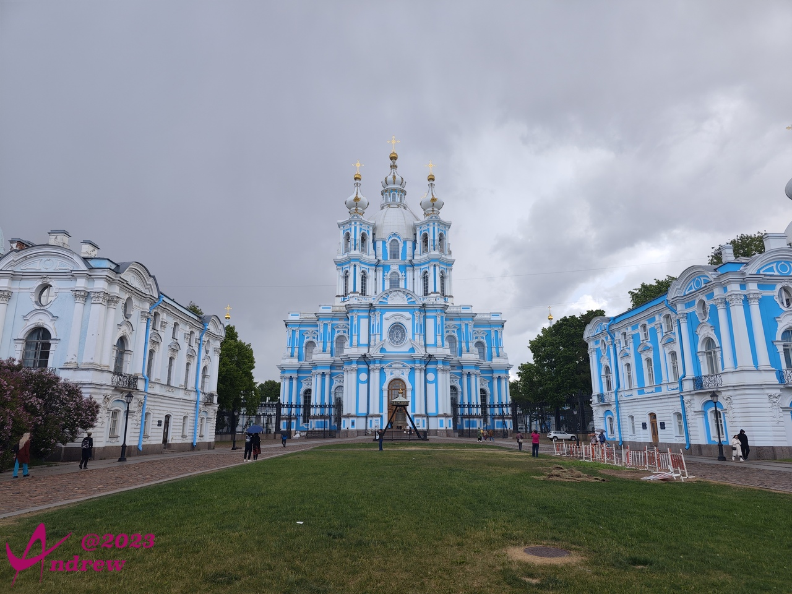
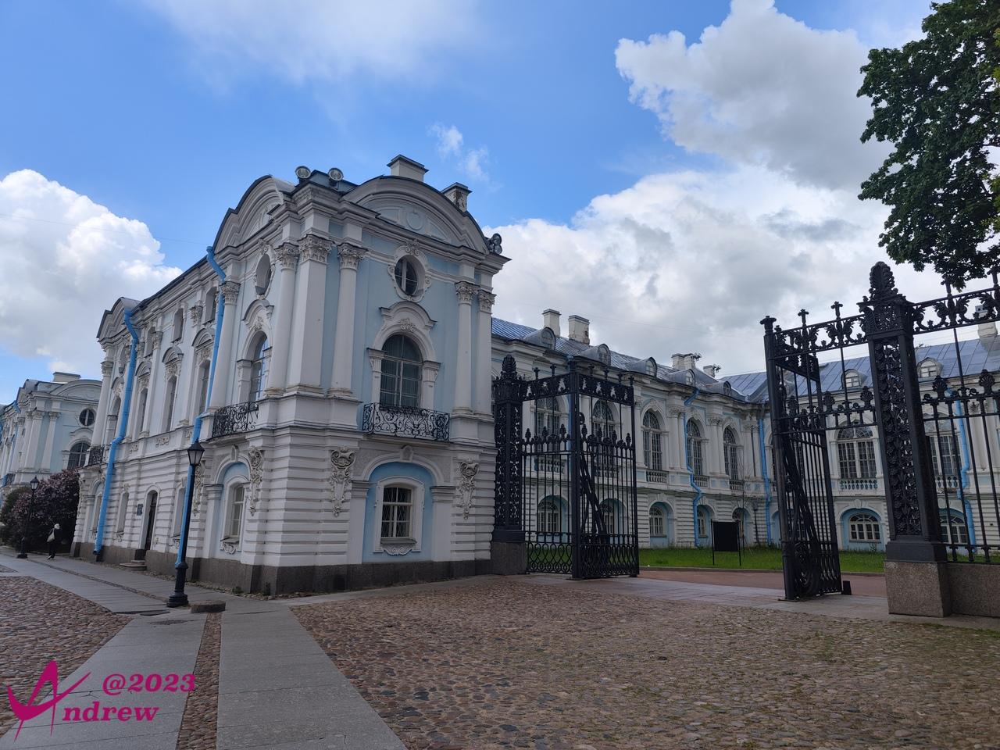
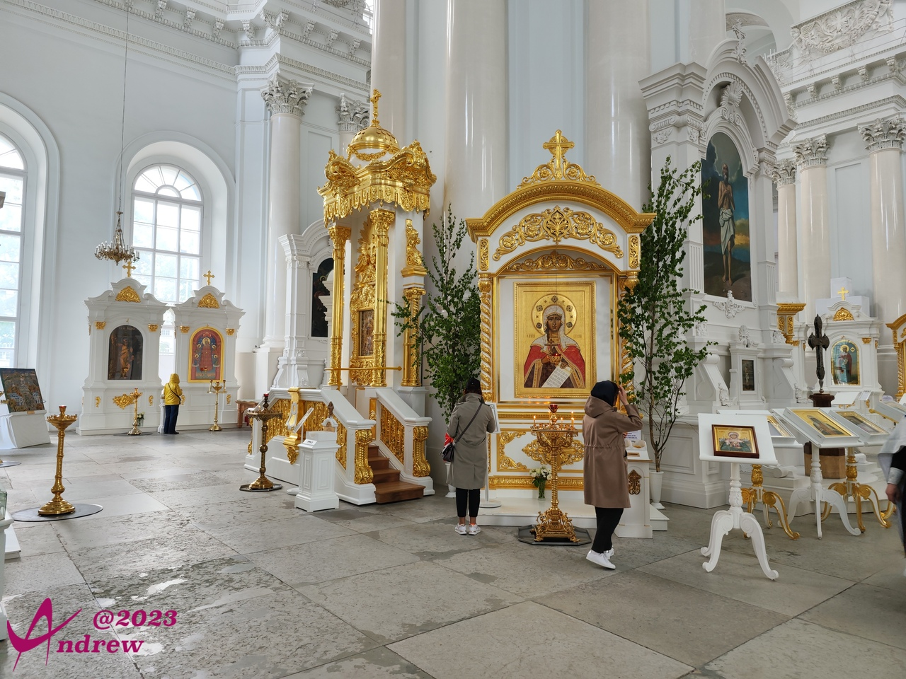
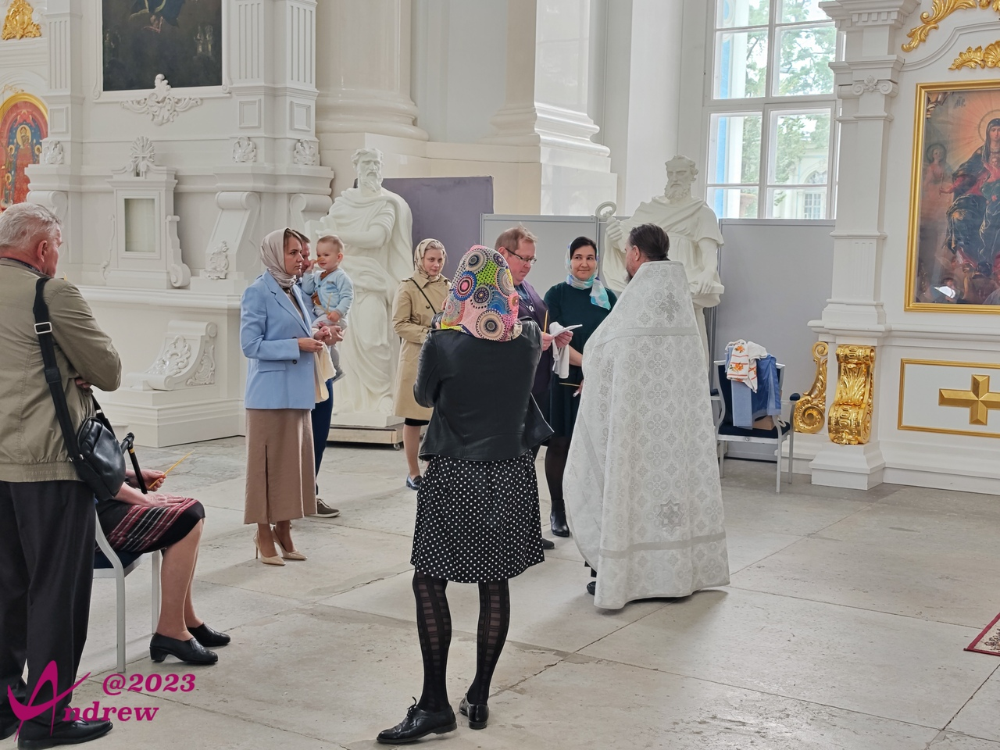
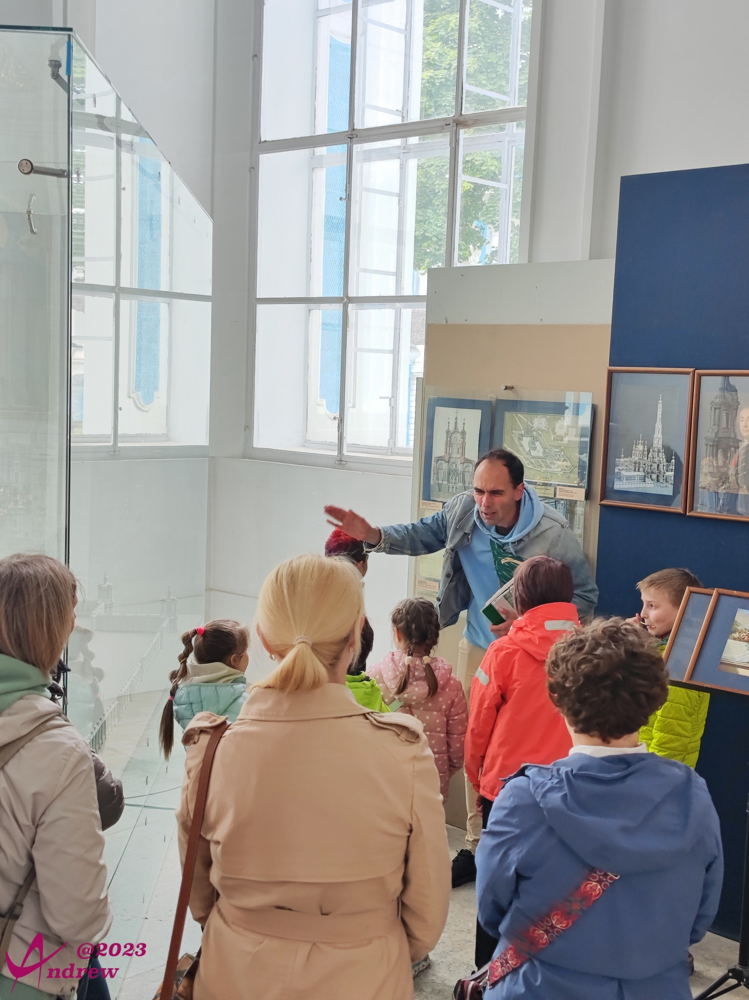
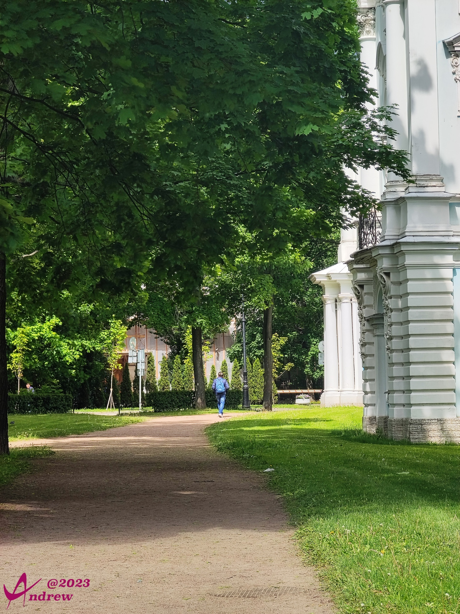
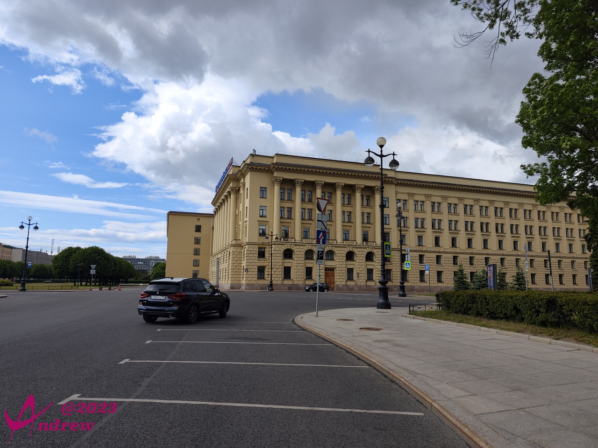
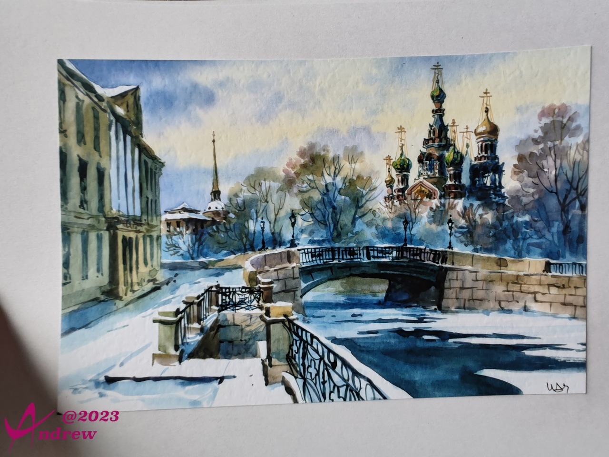

# 斯莫尔尼宫 
斯莫尔尼宫(Smolny)，位于圣彼得堡市的东北部，在涅瓦河转弯的地方，是一座外观典雅的三层建筑。  
它建于1806-1808年，原为贵族女子学院。"斯莫尔尼"一词来自俄语"沥青"，初建时这里属于沥青厂，在苏联时期作为列宁格勒市政府办公楼，现为圣彼得堡市政府，从市长到各处、陆军部、内务部仍在此办公。  
斯莫尔尼宫整体色彩和皇村的叶卡捷琳娜宫的色彩相同，为拜占庭蓝白相间，是巴洛克风格和拜占庭风格的融合，在圣彼得堡的诸多宫殿里具有相当高的代表性。  
  

而原来使得斯莫尼尔宫闻名的历史事件，因为苏联解体，已经逐渐被人有意识的遗忘。  
1917年“十月革命”期间，布尔什维克党军事革命委员会设在斯莫尔尼宫，为十月革命司令部。1917年11月中旬至1918年3月列宁曾在这里办公和居住。  
现在十月革命司令部所使用的房间，除了修道院，基本是被圣彼得堡大学的学生作为宿舍使用。圣彼得堡大学的政治经济专业、国际关系专业学生，均在此学习。国外大学很多都是“散装”的，分散在不同的地点。顺便，圣彼得堡大学在俄罗斯的排名仅次于莫斯科大学排行第二。  
  

在教堂前广场拍摄的全景：  
<iframe width="100%" height="500" allowfullscreen style="border-style:none;margin-top:-20px;" src="./js/pannellum.htm#panorama=../imgs/Smolny.jpeg&amp;autoLoad=true"></iframe>

教堂因为新修建的原因，内部空间有更高的整洁度和更明亮的玻璃窗：  
  

做礼拜的人虽然不多，但似乎看起来更喜庆，只一会儿时间就有两对新人在亲友陪伴下来教堂接受牧师的祝福：  
  
后来的一对，因为我已经走出教堂很远而没能拍到，一直感觉很遗憾。因为白西服和白婚纱的新人远远看上去靓丽帅气。  

老师带着一群小孩子前来参观，听不懂俄语，不知道他在讲解什么。  
  
新修建的教堂有新修建的气质，一角还有大屏幕电视使用3D的方式展示教堂建筑结构（没有拍照）。  

圣彼得堡大学，看起来环境很不错：  
  

相邻和对面，都是圣彼得堡市政府办公场所：  
  

路边再次碰到几个年轻的艺术家兜售自己的作品，看到一张水粉画挺喜欢，买了下来：  
  

