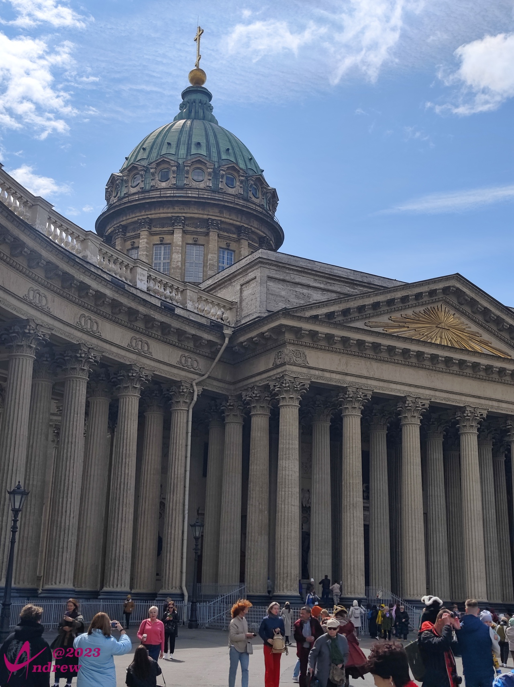
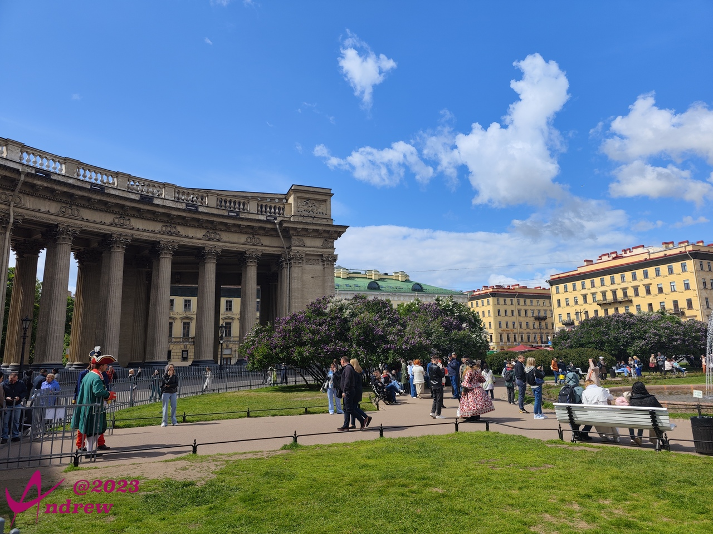
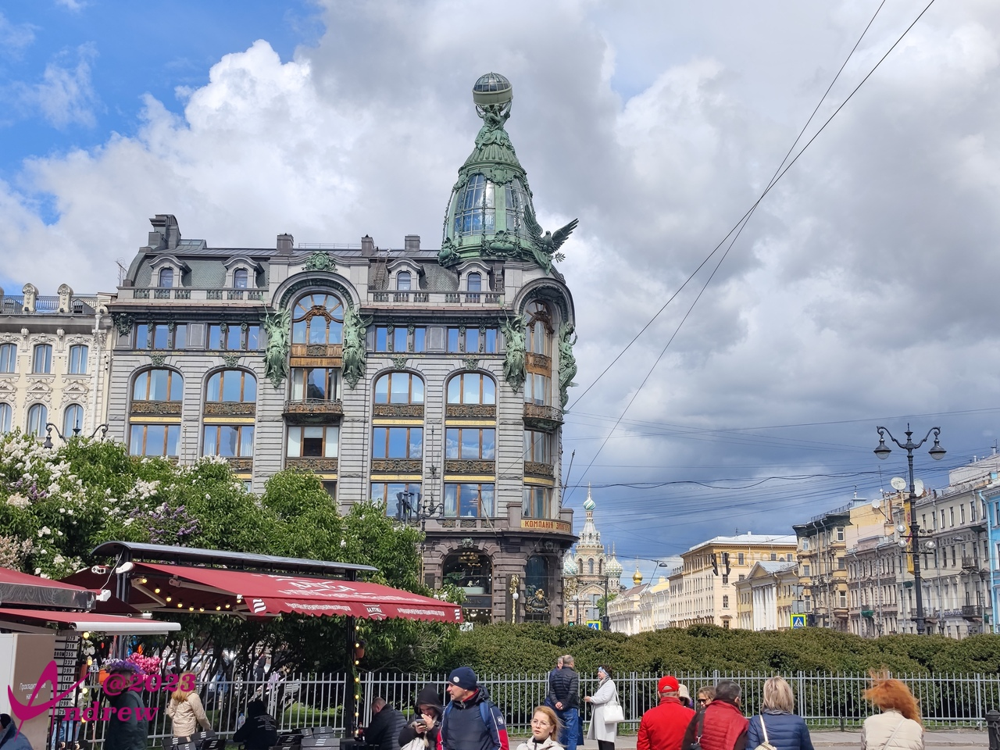
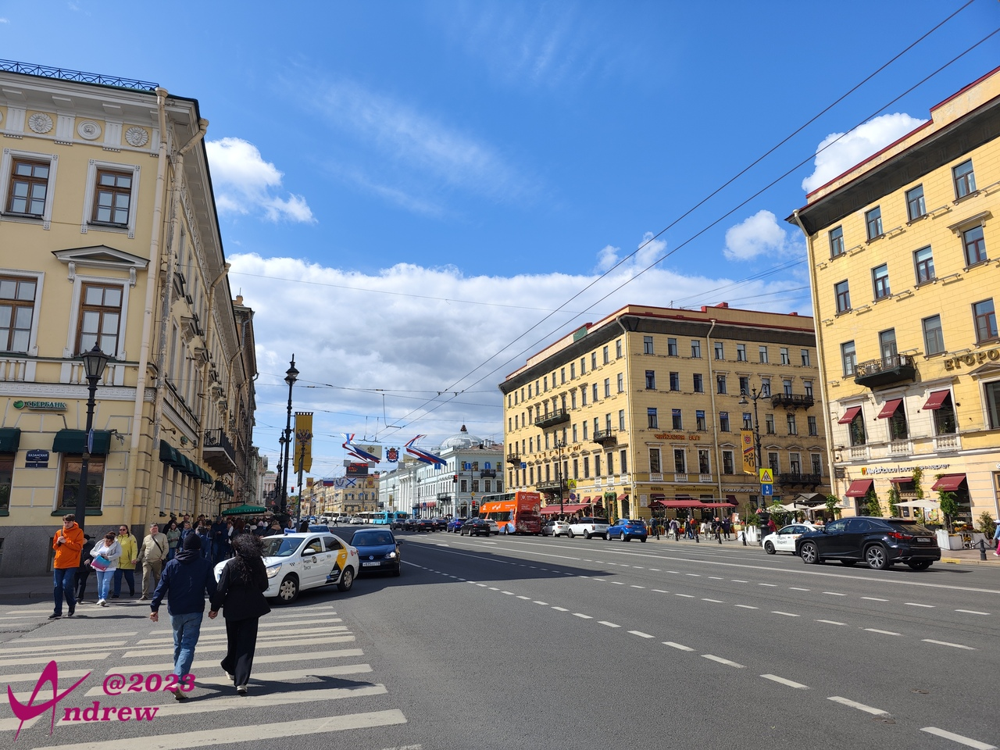
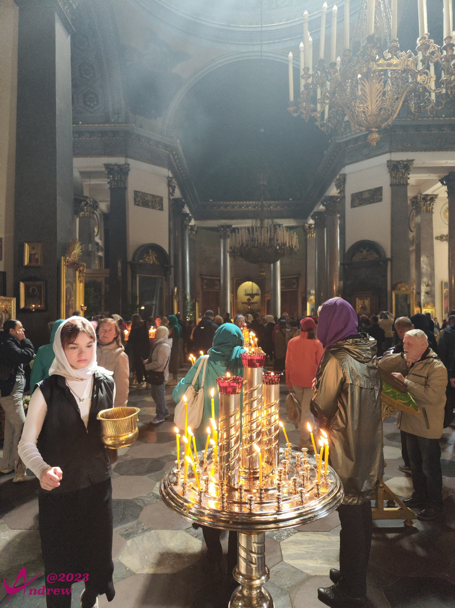
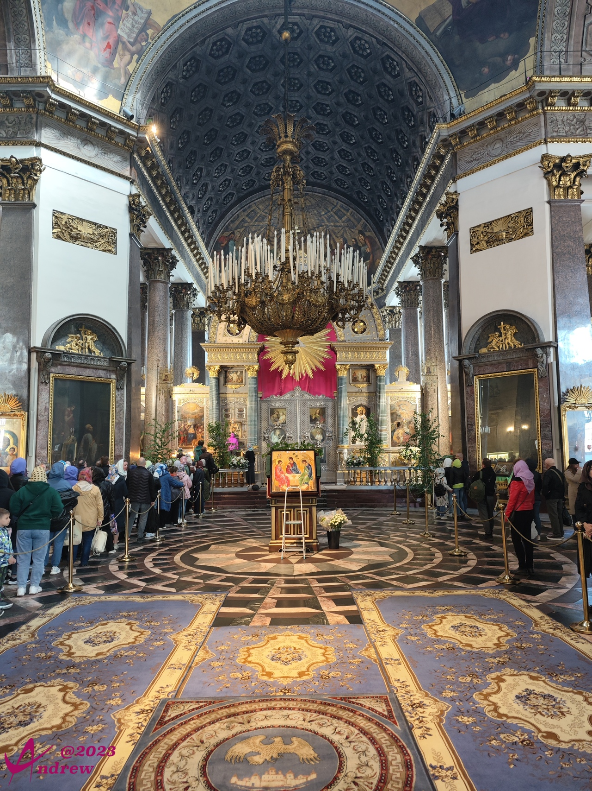
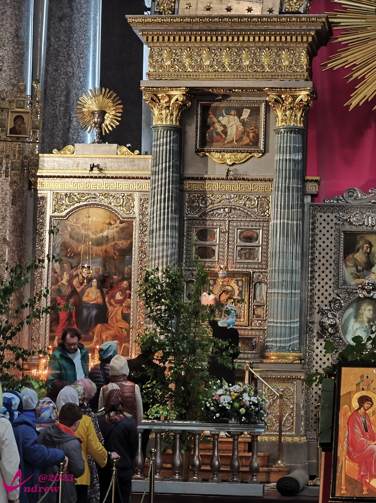
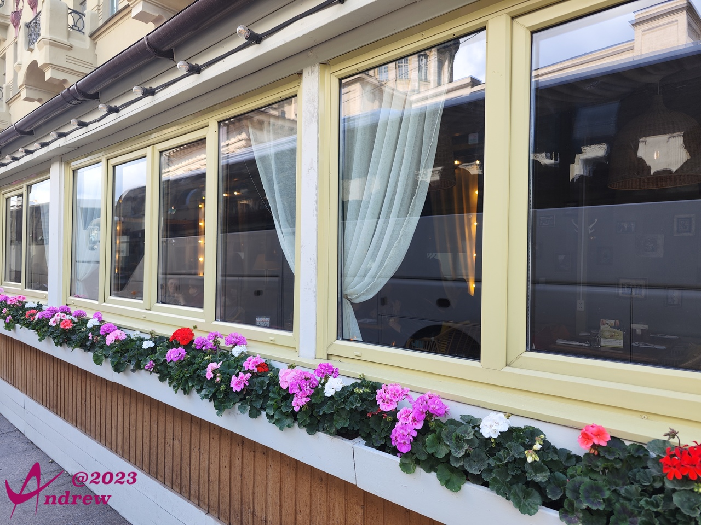
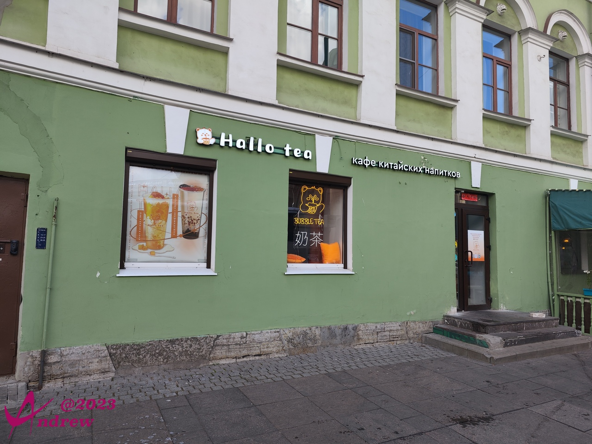

# 喀山大教堂 
喀山大教堂位于圣彼得堡的涅瓦大街，具有一个半圆形的柱廊。柯尼斯式的长柱共有94根，形成一个很大的环抱广场。  
教堂是由俄罗斯建筑师沃罗尼欣以古罗马圣彼得教堂为原本设计，于1801年8月举行奠基仪式，历经10年于1811年竣工。  
  
  

涅瓦大街上有很多商店，特别市区靠近教堂部分更是著名的商业区，因此单纯从人流看，喀山大教堂最为繁华。  
  
  
  

教堂内香火鼎盛：  
  
有大批的信众排队，到喀山圣母像前参拜：  
  

喀山圣母像据称是俄罗斯最灵验的，经多次显灵展示神迹：  
第一次于伊凡雷帝时期，在蒙古—鞑靼战争时期多次显灵使蒙古大军不战而逃。  
第二次于俄法战争，元帅库图佐夫在反攻前到喀山教堂到喀山圣母前祈祷，圣母托梦给库图佐夫将出现从没有过的寒流这次寒流使拿破仑·波拿巴军队不战而逃冻死过半而且全无战斗力使库图佐夫一战成功。  
第三次于第二次世界大战，东正教教皇向喀山圣母像祈祷，圣母再次托梦给教皇说寒流将第二次出现这次寒流使德军冻死过半坦克无法开动，飞机无法起飞手无法扣动扳机。  

遗憾的是喀山圣母像在每次显灵后都会消失。喀山圣母像现保存在美国的博物馆内，但是俄罗斯人民坚信，当俄罗斯再次出现灾难的时候，圣母像将会再次回归。  

当前供奉的是一幅摩品。受传说故事的影响，我使用手机最远的焦段拍了一张圣母像正面，即下图最左侧的部分：  
  

教堂后面的小街上有很多小餐馆：  
  
看看这个，你得相信现在中国游客还是很有规模的：  
  
