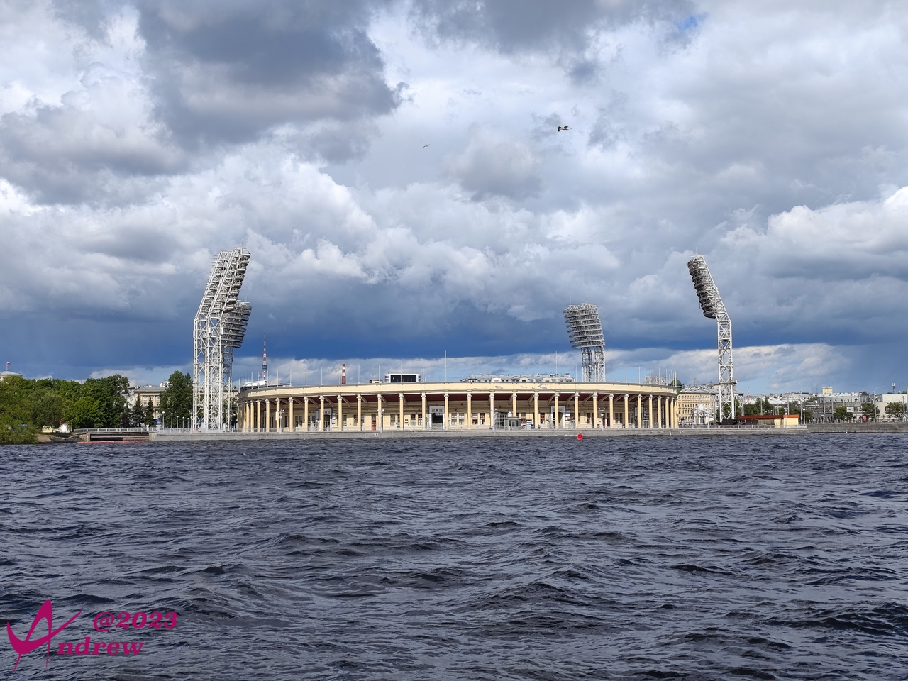
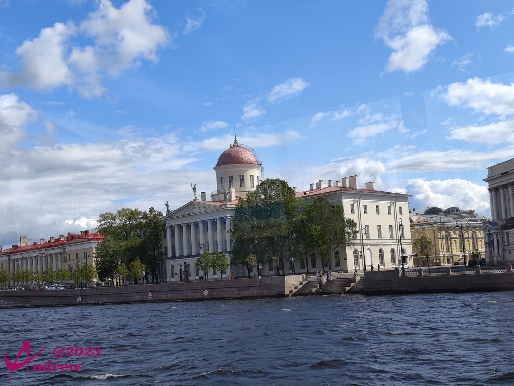
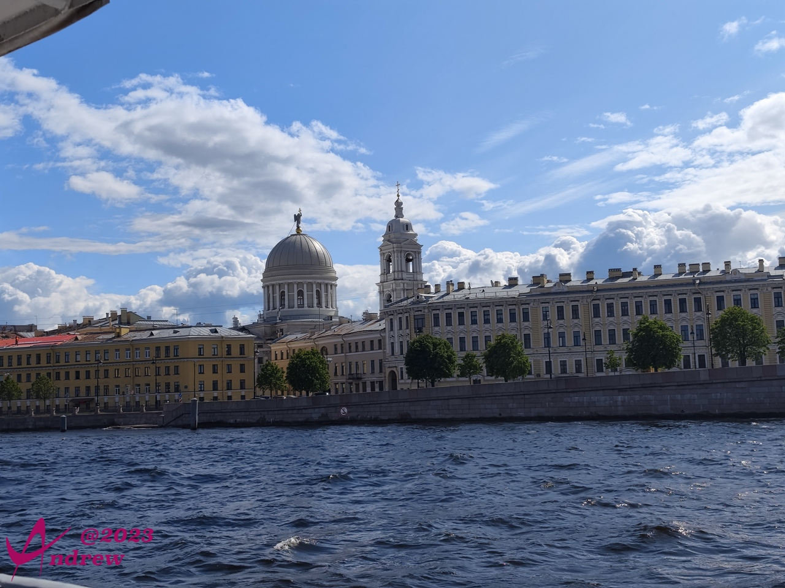
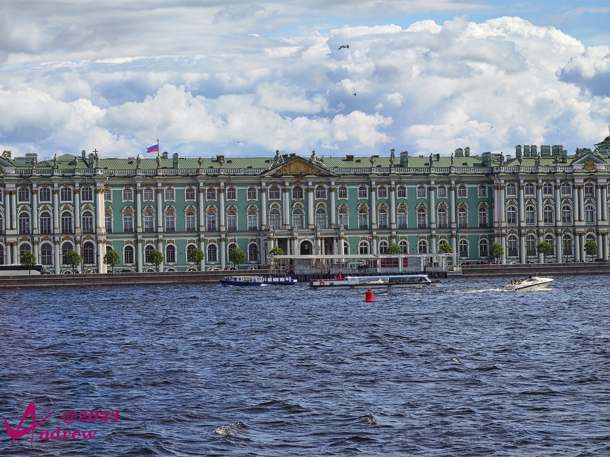
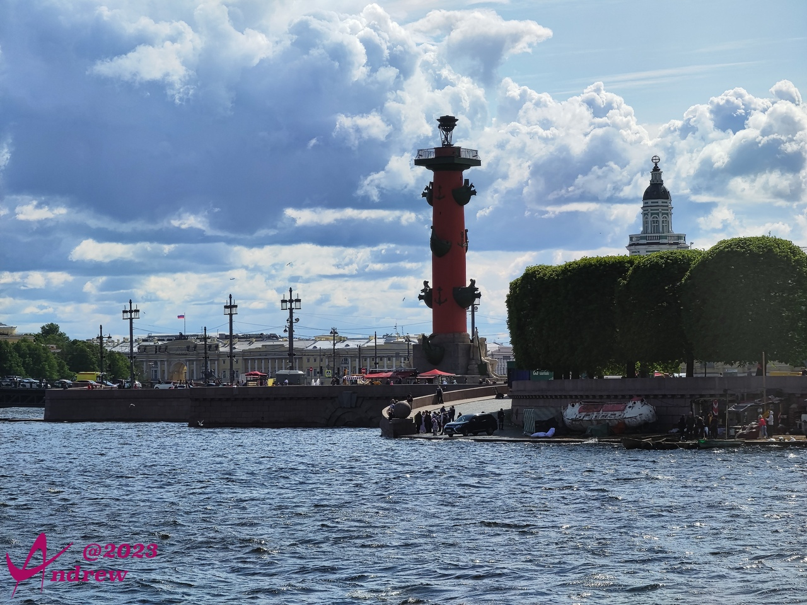
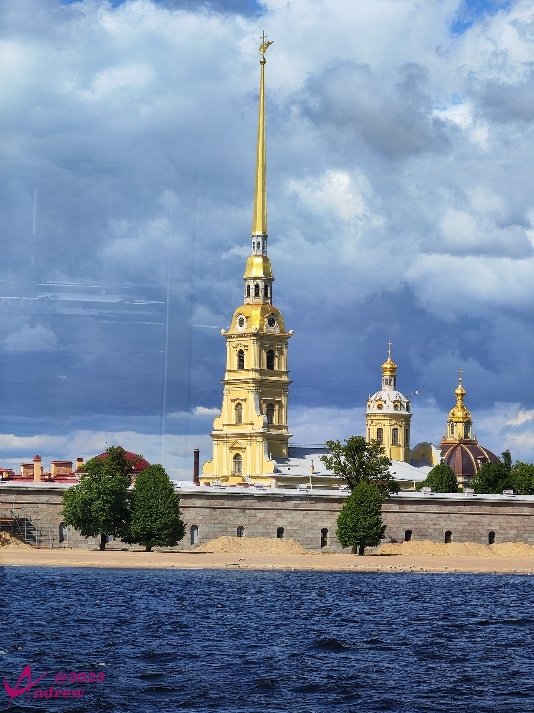
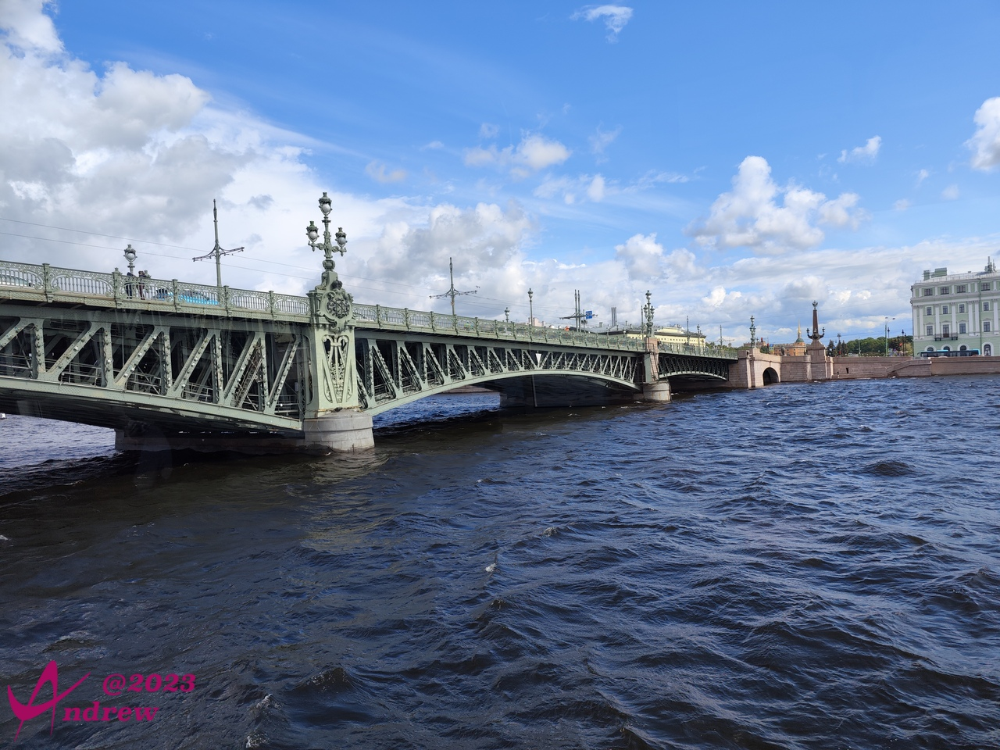
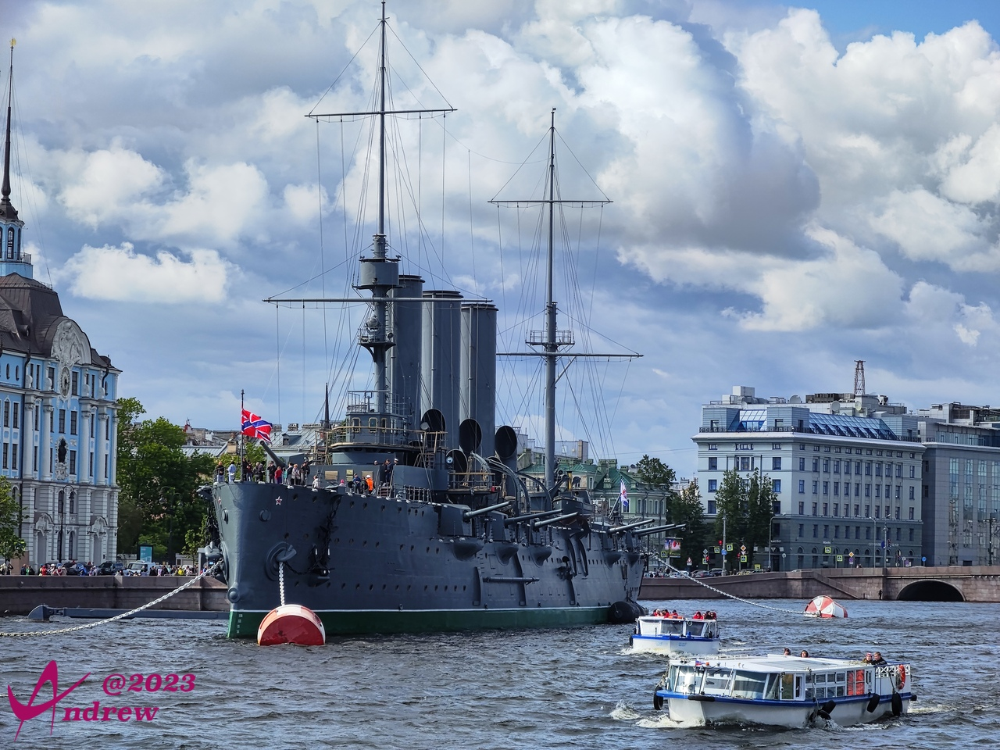
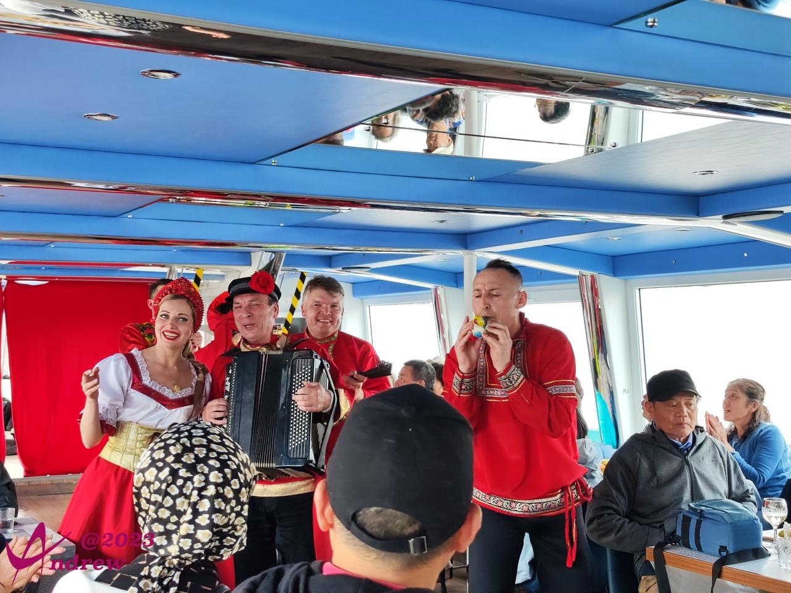
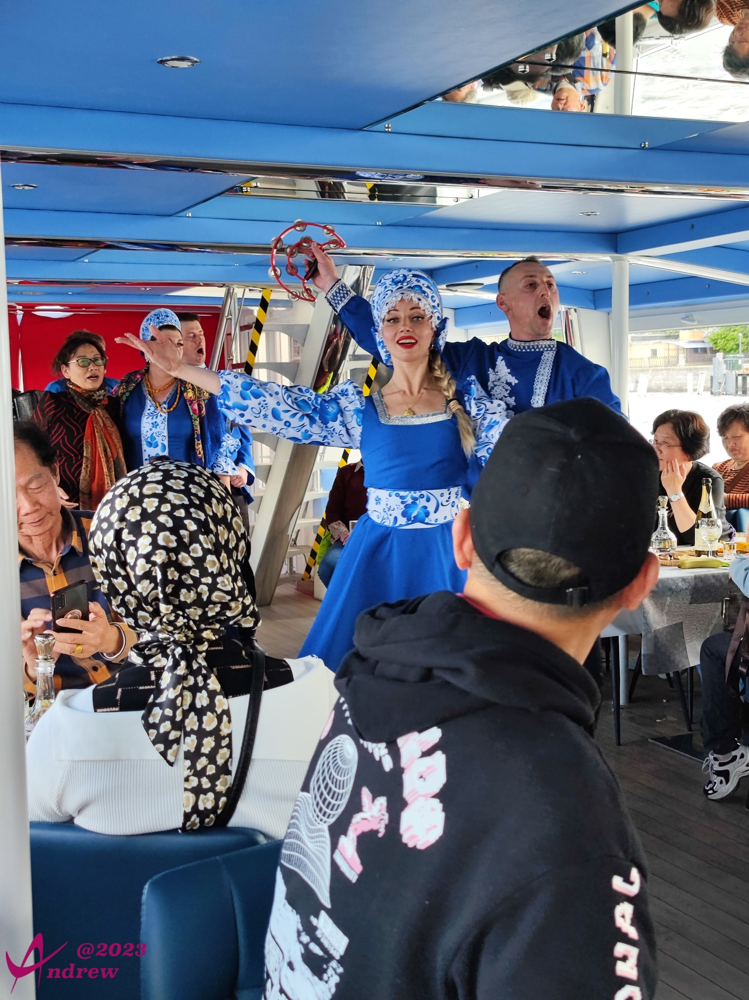

# 涅瓦河游船
河流是一个城市的灵魂。在圣彼得堡，几乎所有的重要建筑，都坐落在涅瓦河两岸，特别是主干流。  
几天的行程，也基本是围绕着涅瓦河，在河边道路和桥梁间穿梭。  
而乘坐涅瓦河游船，则是对这些游览的一个总结。  

彼得罗夫斯基体育场，2018年俄罗斯世界杯主场馆之一：  
  

两岸风光：  
  
  

冬宫：  
  

海神柱：  
  

彼得堡罗要塞：  
  

圣三一大桥：  
  

彼得大帝亲自赴欧洲学习造船术，回国后亲自参与建设的俄罗斯第一艘巡洋舰，当前已经改建为一所餐厅：  
  

海军阿芙乐尔号巡洋舰，“十月革命”一声炮响，指的就是阿芙乐尔号巡洋舰炮轰冬宫所发出的炮声。该舰现已退役，仅供游人参观：  
  

游船上提供了水果、香槟、伏特加和鱼子酱给游客：  
  

游船上有小乐队给游客表演俄罗斯民族歌曲和舞蹈.看到中国人，演员会用不太熟练的中文说：“习大大万岁！”：  
  

表演互动性很强，很多游客也被拉入，成为舞蹈的一部分：  
  
<video width='100%' controls>
    <source src='videos/VID_20230603_160713.dest.mp4' type='video/mp4'>
</video>
  
