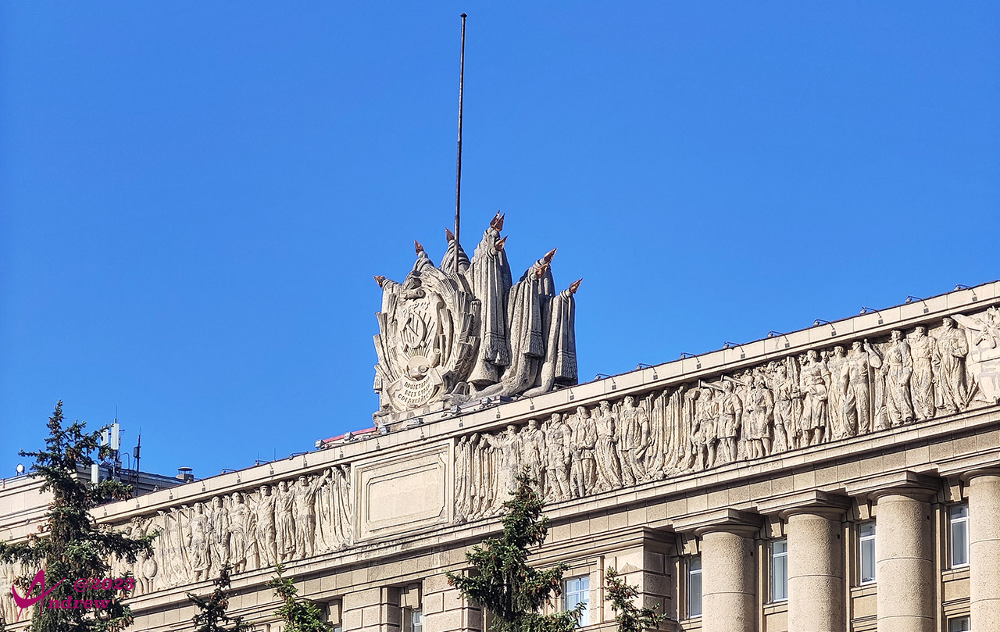

# 俄罗斯纪行 

Andrew

（题图为圣彼得堡原市政厅楼顶的雕塑,具备几乎独一无二的俄罗斯风格）

# 前序 <!-- {docsify-ignore} -->
刚刚闲暇下来，又是终于结束为期三年的静默。  
静而思动，于是在2023年5月末到6月初，赴莫斯科、圣彼得堡两个城市，来了一场9天的短游。  
这里使用文字、照片、视频、全景的形式，对本次行程做了粗略的记录。  
成文的顺序比较随性，但大体上是根据游览的次序，并没有轻重之分。  
本文建议使用电脑、平板来阅读，手机虽然也能打开，但逼仄的空间对于视频、全景图的展示非常不友好。  

